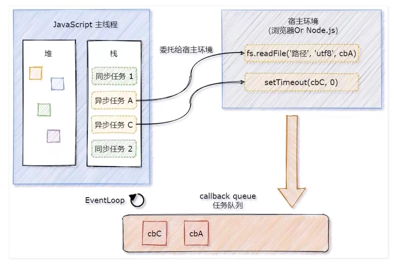
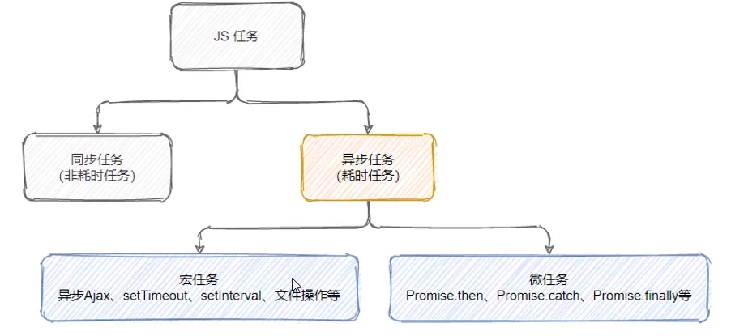
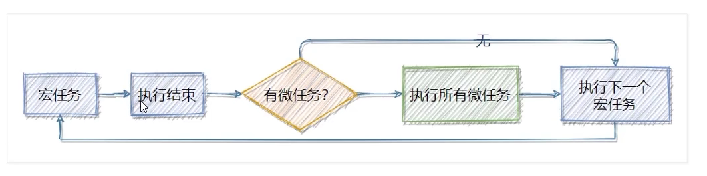

# -------------------

# ES6

# -------------------

ES 全程是 ECMAScript，它是由 ECMA 国际标准化组织指定的一项脚本语言的标准化规范。ES已经开发到第10个版本了，也就是 ES10 。ES6 是 2015年6月制定的一个版本。这一版包含了大概这个规范有史以来最重要的一批增强特性。ES6 正式支持了类、模块、迭代器、生成器、箭头函数、期约、反射、代理和众多新的数据类型。

# 1. let 声明

let 声明方式的特点：

- 变量不能重复声明
- 只在块级作用域生效
- 不存在变量提升
- 不影响作用域链

## 1.1 变量不能重复声明

使用 var 声明变量的时候，变量是可以重复声明的，如：

~~~js
var a = 10;
var a = 20;
console.log(a);
~~~

> 此时，浏览器不会报错，并且 a 被重新声明成了 20

使用 let 方式则不能重复声明

~~~js
let a = 10;
let a = 20;
console.log(a);
~~~

> 浏览器报错 Uncaught SyntaxError: Identifier 'a' has already been declared

## 1.2 只在当前作用域生效

let 声明的变量只在所处于的块级有效，块级作用域即 {} 中的作用域。变量只能在大括号中访问。

之前在 function 中用 var 定义的变量确实无法在外部访问，除非使用闭包的方式，但是在 if, for 中用 var 定义的变量，在外部是可以访问的，如：

~~~js
for (var i = 1; i <= 3; i++) {
    var a = +i;
}
if (true) {
    var b = 10;
}
console.log(a);
console.log(b);
~~~

> a 和 b 都可以访问

如果使用 let 定义变量，那么在外部就无法进行访问：

~~~js
if (true) {
    let a = 10;
}
// 程序报错，显示 a 为 undefined
console.log(a);
~~~

## 1.3 let 关键字不存在变量提升

在 var 定义的变量，在 js 执行前会将定义变量提升到脚本最前边。而 let 则没有这种机制。

使用 var 声明变量时，虽然赋值不会生效，但是已经执行了 `var a;`，将声明提前执行，如：

~~~js
// 被声明但没有赋值
console.log(a);
var a = 10;
~~~

> 输出 undefined

使用 let 声明变量，变量必须在声明之后使用

~~~js
console.log(a);
let a = 10;
~~~

> 报错信息：Uncaught ReferenceError: Cannot access 'a' before initialization

## 1.4 let 声明不影响作用域链

~~~js
function foo(){
    let a = 10;
    function fn(){
        console.log(a);
    }
    fn();
}
foo();
~~~

>  fn() 中没有声明 a，会向上一级寻找，此时 let 声明的变量不影响作用域链的传输

## 1.5. 暂时性死区

当我们在块级作用域中可以调用外部用 var 定义的变量

~~~js
var num = 10;
if (true) {
    console.log(num);
}
~~~

如果在块级作用域中定义了相同的变量名，这个变量则会与这个 {} 进行绑定，即使 console.log(num) 在定义num之前，也是无法访问外部用var定义的同名变量的。

~~~js
var num = 10;
if (true) {
    console.log(num);
    let num;
}
~~~

let 应用：

比如说 for 循环中我们的计数器 i，在 for 循环之后就没必要存在了，我们不需要访问计数器 i 的值。所以建议使用 let 定义，循环结束后就会被内存回收销毁。

~~~js
for (let i = 0; i <= 3; i++) {
    console.log(i);
}
// 报错，因为 i 已经被销毁
console.log(i);
~~~

经典面试题：代码执行结果？

~~~js
var arr = [];
for (var i = 0; i < 2; i++) {
    arr[i] = function () {
        console.log(i);
    };
}
arr[0]();
arr[1]();
~~~

当 arr[0] 和 arr[1] 两个函数运行的时候，循环已经结束，var 定义的 i 没有被销毁，因为作用域链的关系，在匿名函数中 i 并没有在该函数声明，所以去寻找上一层，i 又是一个全局变量，所以两个函数中输出的 i 其实是同一个 变量，所以这两个函数输出的结果应该是一样的，都是 2。

~~~js
var arr = [];
for (let i = 0; i < 2; i++) {
    arr[i] = function () {
        console.log(i);
    };
}
arr[0]();
arr[1]();
~~~

当 arr[0] 和 arr[1] 两个函数运行的时候，Js 引擎在后台会为每个迭代循环声明一个新的迭代变量，每个arr引用的都是不同变量的实例，这时候的 i 不是全局变量，所以 i 还是原来的值，0,1

这种每次迭代声明一个独立变量实例的行为适用于所有风格的 for 循环，包括 for...in 和 for...of 循环。

## 1.6 windows 对象属相

最后在全局作用域中使用 let 声明的变量不会称为 window 对象的属性

~~~js
var age = 18;
console.log(window.age)

// 报错
let name = 'Andy'
console.log(window.name)
~~~

# 2. const 声明

cosnt 的行为与 let 基本相同，作用是声明常量，常量就是指值（内存地址）不能变化的量。唯一一个重要的区别是用它声明的变量时必须同时初始化变量，且尝试修改 const 声明的变量会导致运行时错误。

常量特点：

- 必须要赋初始值
- 常量值不能被修改
- 常量不能被重复声明
- const声明的常量也是块级作用域

~~~js
// 报错，必须赋值
const score;

// 报错，不能改变常量值
const age = 36
age = 36;

// 也不能重复声明
const name = "Matt";
const name = "Nicolas";

// 声明的作用域也是块
const country = "China";
if (true) {
    const country = "Japan";
}
// China
console.log(name);
~~~

虽然 const 无法重新声明，但是如果在不同作用域是可以重新声明的

~~~js
const PI = 3.14;
function f1() {
    const PI = 3.1415926;
    console.log(PI);
}
f1();
console.log(PI);
~~~

const 声明的限制只适用于它指向的变量的引用（内存地址），换句话说，如果 const 变量引用的是一个对象，那么修改这个对象内部的属性并不违反 const 的限制

~~~js
const obj = {
    name: "Matt",
    age: 18,
};
obj.age = 19;
console.log(obj);
~~~

> 这是因为 const 指向的是这个对象的地址，对象并没有消失，指向对象的地址也就没有改变。改变的只是对象中的值（对象内存中的值）

# 3.  var, let, const 区别

有了 let 和 const 可以更好的限制变量的作用域，尽量使用 const 和 let，不要再使用 var

- 数组、集合可以使用 const
- 普通变量用 let

| var          | let            | const            |
| ------------ | -------------- | ---------------- |
| 函数级作用域 | 块级作用域     | 块级作用域       |
| 变量提升     | 不存在变量提升 | 不存在变量提提升 |
| 值可以更改   | 值可以更改     | 值不可以更改     |

# 4. 解构赋值

ES6 中允许从数组中提取值，按照对应位置，对变量赋值，对象也可以实现解构。

## 4.1. 数组解构

数组解构允许我们按照一一对应的关系从数组中提取值，在 ES6 之前，我们用 for 循环进行解构。

~~~js
var arr1 = [1,2,3]
var arr2 = [a,b,c]
for (var i = 0; i<3; i++){
    arr2[i] = arr1[i]
}
console.log(a)
~~~

~~~js
let [a, b, c] = [1, 2, 3]
cosnole.log(a);
cosnole.log(b);
cosnole.log(c);
~~~

如果解构不成功，变量值为 undefined，经常出现于解构数量与数组中对应数量不符：

~~~js
// 右边数组为空数组，没有对应值给 foo
let [foo] = []

// 右边数组中只有一个值，bar 为 1，没有对应数据给 foo， foo 为 undefined
let [bar, foo] = [1]

// 右边数组为多个值，左侧比右侧少，则按照左侧数量传值
let [a, b, c] = [1,2,3,4,5,6]

// 如果需要传指定位置的值，左侧需要用,分隔占位
let [a,,c]  = [1,2,3]
~~~

参数中解构数组

~~~js
// 相当于传入 x,y,z
function fn([x,y,z]){
    console.log(x+y+z)
}
var arr = [5,6,7]
f3(arr)
~~~

函数参数使用解构，必须传入对应参数，如果少传参数，没有传参数的变量为 undefined，如果多传则舍弃多余的变量，如果都不传则会报错。如：

~~~js
function fn([x,y,z] = []){
    console.log(x+y+z)
}
var arr = [5,6,7,]
fn(arr)
~~~

为了解决报错的问题，可以设置默认值，如：

~~~js
// 传入参数方法1：
function fn([x=1,y=2,z=3] = []) {
    console.log(x+y+z)
}
var arr = [5,6,7]
fn(arr)
~~~

> 如果没有传入参数，则使用默认 [1,2,3]

~~~js
// 传入参数方法2：
function fn([x,y,z] = [1,2,3]){
    console.log(x+y+z)
}
var arr = [5,6,7]
fn(arr)
~~~

通过数组解构，对于数组内部值的交换就更简单了。

~~~js
var a = 1, b = 2;
[a, b] = [b, a];
console.log(a, b);
~~~

## 4.2 对象解构

~~~js
let person = { name: "zhangsan", age: 20 };

// 使用变量匹配属性（属性名需要一致）
let { name, age } = person;
console.log(name); // 'zhangsan'
console.log(age); // 20
~~~

~~~js
let person = { name: "zhangsan", age: 20 };

// myName，myAge 属于别名
let { name: myName, age: myAge } = person;
console.log(myName); // 'zhangsan'
console.log(myAge); // 20
~~~

> 对象中属性和方法是无序的，所以如果取值数量少于对象属性和方法数量，不需要使用逗号占位。想取什么就写什么就可以了。

对象参数传递解构

~~~js
// function fn({age, sex, say}){
// function fn({age, sex, say}={}){
// function fn({age=30, sex="male", say}={}){  // 默认值 + 空对象
function fn({age, sex, say} = {"age":20, "sex":"male"}){
    console.log(age, sex, say);
}

var obj = {"age":30, "sex":"male", "say": function(){ return "hello"}};
f3(obj);
f3()
~~~

# 5. 箭头函数

ES6 新增的定义函数的方式。

~~~js
() => {} // 相当于 function () {}
const fn = () => {}  // 相当于 fn = function() {}
~~~

- () 函数参数括号
- {} 函数体

例：

~~~js
const fn = ()=>{
    console.log('hello world')
}
fn();
~~~

如果函数体重只有一句话代码，且代码的执行结果就是返回值，可以省略大括号，如：

正常书写：

~~~js
function sum (num1, num2){
    return num1+num2
}
console.log(sum(1,3))

// 或

sum = function(num1, num2){
    return num1 + num2
}
console.log(sum(1,3))
~~~

箭头函数书写：

~~~js
const (num1, num2) => {
    return num1 + num2;
}
~~~

简化版本：

~~~js
const sum = (num1, num2) => num1 + num2
console.log(sum(1,3))
~~~

如果形参只有一个，可以省略小括号，如：

~~~js
cosnt fn = v => v 

// 正常写法
function fn(v){
    return v;
}
~~~

当返回值是对象的时，需要加上小括号或者直接用 return 写法

~~~js
var fn = () => ({"name": "zhangsan", "age": 19});

var fn = () => {
    return {"name": "zhangsan", "age": 19}
};
~~~

箭头函数的应用

~~~html
<input type="button" value="点击" id="btn" />

~~~

相当于原来的

~~~js
<input type="button" value="点击" id="btn" />
    
~~~

还可以作为回调函数使用

~~~js
var f6 = (f) => {
    console.log(f(100));
}
// f6(a=>a);
var f7 = a=>a;
f6(f7);

// 100
~~~

## 5.1. 箭头函数中的 this 

箭头函数不绑定 this 关键字，箭头函数中的 this 指向的是函数定义位置的上下文 this

~~~js
const obj = { name: "张三" };
function fn() {
    // 默认函数this指向window
    // 通过 call 命令这里的this指向obj
    console.log(this);

    // 默认函数this指向window
    // 这里是箭头函数，箭头函数所在位置中，this 的指向就是箭头函数的 this 指向
    // 箭头函数被定义在 fn() 中，fn() 的 this 指向是 obj
    // 所以箭头函数的 this 也是 obj
    return () => {
        console.log(this);
    };
}
const resFn = fn.call(obj);
resFn();
~~~

对象方法中的箭头函数

~~~js
var obj = {
    age: 20,
    say: () => {
        // obj 没有作用域
        // this 指向 window
        console.log(this);
    },
    // obj 中的方法有作用域，这里的 this 指向 obj
    hi: function () {
        console.log(this);
        // 这里根据上下文，因为方法里边的函数中 this指向 obj，
        // 所以 f1 里边的箭头函数中的 this 也指向 obj
        var f1 = () => {
            console.log(this);
        };
        f1();
    },
};
obj.say();
obj.hi();
~~~

obj 是一个对象，而对象是没有作用域的，所以这里的箭头函数中的 this 实际上指向的是在全局作用域中的this，而全局作用域的 this 是 window，所以这里的 this 是 window。window 下当然没有 age 属性，所以报 undefined

如果在全局下定义一个变量 age，那么这回就会显示 100了

~~~js
var age = 100;
var obj = {
    age: 20;
    say: () => {
        console.log(this.age);
    }
}
obj.say();
~~~

箭头函数的优点：

- 书写简单
- 不绑定 this
- 支持默认参数、剩余参数、解构

~~~js
var f1 = (x=1, y) => {
    console.log(x,y);
}
f1(3,4);

var f2 = (...x)=>{
    console.log(x);
}
f2(3,4);

var f3 =([x,y]=[])=>{
    console.log(x,y);
}

~~~

箭头函数的缺点：

- 不能做构造函数
- 不能用 new 实例化
- 没有 prototype 属性
- 不能用 arguments

# 6. 剩余参数

ES5 中，可以再函数内部使用 arguments 获取函数传过来的所有参数，以伪数组形式呈现，ES6 中提供的剩余参数语法允许我们将一个不定数量的参数表示为一个数组。剩余参数用 `...args` 表示。

~~~js
function sum (first, ...args) {
    console.log(first);  // 10
    console.log(args);  // [20, 30]
}
sum(10,20,30);
~~~

例：

~~~js
const sum = (...args) => {
    let total = 0;
    args.forEach((item) => (total += item));
    return total;
};
console.log(sum(10, 20));
console.log(sum(10, 20, 40));
~~~

剩余参数和结构配合使用：

~~~js
let students = ["zs", "ls", "ww"];
let [s1, ...s2] = students;
console.log(s1); // 'zs'
console.log(s2); // ['ls', 'ww']
~~~

# 7. 函数的默认值

ES6 支持了函数默认值的写法，在 ES5 中如果我们要实现这个功能的话，可以这样写：

~~~js
function fn(username){
    var username = username || 'lisi'
    console.log(username)
}
// 如果不传参数，username 是 undefined，在函数内部重新赋值，给其值
fn();
fn('zhangsan')
~~~

ES6 中

~~~js
function fn(username = 'lisi'){
    console.log(username)
}
fn()
fn('zhangsan')
~~~

# 8. 字面量创建对象（ES6简化）

在之前的版本中用字面量创建对象，需要完整的写出属性名和对应值，在 ES6 中如果属性值已经在外部作用域定义好了，并且变量名和属性名一样，那么就可以使用简化写法：

- 属性值可以省略
- 方法可以直接使用简化写法
- 可以指定原型对象

~~~js
var name = "zx";
var age = 36;

// 传统定义方式
var obj = {
    name: name,
    age: age,
    say: function () {
        return "hello";
    },
};

// ES6 简化写法
var person = {
    coding() {
        console.log("abcde");
    },
};
var obj1 = {
    // 可以指定原型对象
    __proto__: person,
    name,
    age,
    // 方法简化写法
    say() {
        return "hello";
    },
};
console.log(obj);
console.log(obj1);
obj1.coding();
~~~

# 9. Symbol 数据类型

ES6 新增了一种数据类型：Symbol，表示独一无二的值，Symbol 最大的用途是用来定义对象的唯一属性名。

使用 Symbol() 创建 symbol 数据

~~~js
var symbol1 = Symbol();

// 参数没有意义，只是对 Symbol 加了一个标记
var symbol2 = Symbol("Alice");
console.log(symbol1);
console.log(symbol2);

// Symbol 是独一无二的
console.log(symbol1 == symbol2);
console.log(Symbol() == Symbol());

// 输出结果
Symbol()
Symbol(Alice)
false
false
~~~

创建 symbol 数据的作用就是为了防止重复，比如对象中成员名。

~~~js
var obj = {
    age: 40,
    name: "zs",
    sex: "male",
    // 创建独一无二的属性，避免和之前同名的重复
    // [] 是为了执行里边的代码
    [Symbol(score)]: "100"
};

// obj[say] = 100
~~~

# 10. Array 的扩展方法

## 10.1. ... 扩展运算符

扩展运算符可以将数组或者对象转为用逗号分割的参数序列。

 ~~~js
let arr = [1,2,3];
...arr // 1,2,3

// 逗号被当做 console.log 的参数，输出多个元素用，分割
cosnole.log(...arr);  // 1 2 3
 ~~~

扩展运算符可以应用于合并数组

~~~js
let arr1 = [1,2,3]
let arr2 = [3,4,5]
let arr3 = [...arr1,...arr2];
~~~

~~~js
let arr1 = [1,2,3]
let arr2 = [3,4,5]
let arr1.push(...arr2);
~~~

给函数传参数，将数组内变量依次传入

~~~js
function fn(x,y){
    return x+y
}
var arr = [3,4]
// 普通方法
console.log(f1(arr[0]), arr[1])

// 使用 apply
console.log(f1.apply(null, arr))

// 使用...扩展运算符
console.log(f1(...arr))
~~~

## 10.2. Array.from() 

伪数组虽然类似于数组，可以遍历，但是数组对象中的一些方法无法使用，如果想让伪数组使用数组对象中的一些方法，那么就需要将伪数组转换为真正的数组。

1. 使用...将伪数组转为数组

~~~js
let divs = document.querySelectorAll("div");
console.log(divs);
divs = [...divs];
console.log(divs);
~~~

2. 使用 Array.from()

~~~js
let arrayLike = {
    0: "a",
    1: "b",
    2: "c",
    length: 3,
};
let arr2 = Array.from(arrayLike);  // ['a', 'b', 'c']
~~~

Array.from() 还可以接受第二个参数，作用类似于数组的 map 方法，用来对每个元素进行处理，将处理后的值放入返回的数组。

~~~js
let arrayLike = {
    0: "1",
    1: "2",
    2: "3",
    length: 3,
};
let arr2 = Array.from(arrayLike, item=>item*2);   //[2,4,6]
~~~

## 10.3. find()

用于找出第一个符合条件的数组成员，如果没找到则返回 undefined。接受一个函数，通过函数后，函数返回值是布尔值，布尔值为真的 item 被储存在新的数组中。

~~~js
let ary = [{
    id: 1,
    name: 'zs'
},{
    id:2,
    name:'ls'
}]
let target = ary.find((item, index)=>item.id ==2);
~~~

## 10.4. findIndex()

用于找出第一个复合条件的数组成员的位置，如果没找到返回 -1

~~~js
let arr = [1, 5, 10, 15];
let index = arr.findIndex((value, index) => value > 9);
console.log(index);
~~~

## 10.5. includes()

表示某个数组是否包含给定的值，返回布尔值。在 ES6 之前使用的是 indexOf 来进行判断，如：

~~~js
let arr = [1, 5, 10, 15];
console.log(arr.indexOf(5));  // 1
~~~

ES6 的新方法 include() 更加简单明了，如：

~~~js
ret = [1,2,3].includes(2)  // true
ret = [1,2,3].includes(4)  // true
~~~

## 10.6. for...of 遍历

for...of 与 for...in 类似，for...in 是以下标遍历，而 for...of 是以值来遍历的。for...of 还可以遍历字符串，但是不能遍历对象。

~~~js
var team = ['zs','ls','ww']
for(var i of team){  // i 是值
    console.log(i)
}

// 输出结果
zs
ls
ww
~~~

# 9. String 的扩展方法

## 9.1 ` 模板字符串

ES6 新增的创建字符串的方式，使用反引号定义。模板字符串有很多优点：

- 可以解析变量
- 可以多行赋值
- 可以调用函数

~~~js
// 解析变量
let name = "张三";
let sayHello = `他叫${name}`;
console.log(sayHello);
~~~

~~~js
let name = "张三";

// 还可以换行，注意需要顶格写，不然空格也会被解析出来
let sayHello = `他叫${name}
还有谁？？
哈哈`;
console.log(sayHello);
~~~

例：

~~~js
let data = {
    name: "zs",
    age: 20,
    sex: "male",
};
let html = `

${data.name}
${data.age}
${data.sex}

`;
document.write(html);
~~~

模板字符串还可以调用函数：

~~~js
const fn = function () {
    return "hellow world";
};
// ` 可以调用函数
let greet = `${fn()} 你好世界`;
console.log(greet);
~~~

## 9.2. startWith 和 endWith

- startsWith() 表示参数字符串是否在原字符串的头部，返回布尔值
- endsWith() 表示参数字符串是否在原字符串的尾部，返回布尔值

~~~js
let str = "Hello world";
console.log(str.startsWith("H")); // true
console.log(str.startsWith("Hello")); // true
console.log(str.endsWith("D")); // false
console.log(str.endsWith("world")); // true
~~~

## 9.3. repeat()

repeat 方法表示将原字符串重复 n 次，返回一个新字符串

~~~js
str1 = 'x'.repeat(3)
console.log(str1)  // 'xxx'

str2 = 'hello'.repeat(2)
console.log(str2)  // 'hellohello'

~~~

# 9. Set 数据结构

ES6 提供了新的数据结构 Set，类似于数组，但是成员之都是唯一的，没有重复的值。

## 9.1. 去重

Set 本身是一个构造函数，用来生成 Set 数据结构

~~~js
const s = new Set();
~~~

Set 函数可以接受一个数组作为参数，用来初始化，如参数中有重复成员，则会去掉多余的重复成员，只保留一个

~~~js
const set = new Set([1, 2, 3, 3, 5]);
console.log(set);  // [1,2,3,5] 注意，这里 set 已经不是数组数据类型了
~~~

可以使用 Set 的属性 size 来查看集合中的成员数量（注意不是 length ）

~~~js
const set = new Set([1, 2, 3, 3, 5]);
console.log(set.size);  // 4
~~~

例：判断数组中是否有重复元素

~~~js
arr = [1,6,4,2,2,1]
const set = new Set(arr)
if (arr.length != set.size){
    console.log(true)
} else {
    console.log(false)
}
~~~

## 9.2. 将 Set 转换为数组

可以使用我们的扩展运算符 `...` 来进行转换

~~~js
const set = new Set([1,2,3])
const arr = [...set]
~~~

## 9.3. Set 方法

以下所有方法都是在原set基础上进行操作，返回值为 set 本身。

- add(value) 添加某个值，返回 Set 结构本身
- delete(value) 删除某个值，返回一个布尔值，表示删除是否成功
- has(value) 返回一个布尔值，表示是否为 Set 成员
- clear() 清除所有成员，没有返回值

~~~js
const s = new Set();

// 向 set 结构添加值
s.add(1).add(2).add(3); 

// 删除 set 结构的值
s.delete(2)

// 表示 set 结构是否有1这个值
s.has(1)

// 清除 set 结构中所有的值
s.clear()

~~~

## 9.4. 遍历 set

set 结构的实例与数组一样，也拥有 forEach 方法，用于对每个成员执行某种操作，没有返回值。

注意，这里的 forEach 没有 index

~~~js
s = new Set([6, 7, 8, 9, 0]);
s.forEach(function (value) {
    console.log(value);
});
~~~

# ES6 模块化

模块化就是将一个大程序拆分成互相依赖的小文件，再用简单的方法拼装起来。ES6中首次引入模块化开发规范ES Module，让Javascript首次支持原生模块化开发，ES Module 把一个文件当作一个模块，每个模块有自己的独立作用域。通过 import 和 export 进行模块的导入或导出。

如果之前接触过 Node.js 的话，可能已经了解过 Node 模块化的导入和导出：

node.js 遵循了 CommonJS 模块化规范，其中：

- 导入其他模块使用 require() 方法
- 模块对外共享成员使用 module.exports 对象

遵循模块化规范开发的好处：

- 大家都遵守同样的模块化规范写代码，降低沟通成本，极大方便了各个模块之间的相互调用。

在 ES6 模块化规范诞生之前， Javascript 社区已经尝试并提出了 AMD, CMD, CommonJS 等模块化规范。但是这些由社区提出的模块化标准，存在一定的差异性和局限性、并不是浏览器和服务器通用的模块化标准，如：

- AMD 和 CMD 适用于浏览器端的 Js 模块化
- CommonJS 适用于服务器端的 Js 模块化

> ES6 模块化规范是浏览器与服务器端通用的模块化开发规范，开发者不用再去学习 AMD, CMD, CommonJS 等模块化规范

ES6 模块化规范定义：

- 每个 js 文件都是一个独立的模块
- 导入其他模块成员使用 import 关键字
- 向外共享模块使用 export 关键字

## 1. Node.js 中体验 ES6 模块化

node.js 中默认仅支持 CommonJS 模块化规范，若想基于 node.js 体验与学习 ES6 模块化语法，可以按照如下两个步骤进行配置

- 确保安装了 v14.15.1 或更高版本的 node.js
  - node -v 查看版本
- 在 package.json 的根节点中添加 `"type": "module"` 节点

初始化项目，会自动创建 package.json 文件

~~~
npm init -y
~~~

添加 type 节点

~~~json
{
  "type": "module",
  "name": "vue",
  "version": "1.0.0",
  "description": "",
  "main": "index.js",
  "scripts": {
    "test": "echo \"Error: no test specified\" && exit 1"
  },
  "keywords": [],
  "author": "",
  "license": "ISC"
}

~~~

## 2. ES6 模块化基本语法

ES6 模块化主要包含如下 3种用法：

- 默认导出与默认导入
- 按需导出与按需导入
- 直接导入并执行模块中的代码

### 2.1 默认导出

默认导出的语法：

~~~
export default 默认导出的成员
~~~

例：

~~~js
let n1 = 10 // 定义模块私有成员 n1
let n2 = 20 // 定义模块私有成员 n2 （外界访问不到 n2，因为它没有被共享出去）

function show() {} // 定义模块私有方法 show

// 使用 export default 默认导出语法，向外共享 n1 和 show 两个成员
export default {
  n1,
  show,
}

~~~

> 每个模块中，只允许使用唯一一次 export default 进行导出，否则会报错

### 2.2 默认导入

~~~
import 接收名称 from '模块标识符'
~~~

例 demo.js

~~~js
// 从 showJS.js 模块中导入 export default 向外共享的成员
// 并用 m1 成员进行接收
import m1 from './showJS.js'
console.log(m1)
~~~

> 默认导入时接收的成员名可以任意命名，只要符合命名规范即可。

在控制台执行 js

~~~shell
node demo.js
~~~

输出结果

~~~
{ n1: 10, show: [Function: show] }
~~~

### 2.3 按需导出

按需导出可以多次进行成员导出

~~~js
// 向外导出指定变量与方法
// 每个变量与方法需要单独导出
export let s1 = 10
export let s2 = 20
export function say() {}

~~~

### 2.4 按需导入

按需导入时，导入的成员名称必须和按需导出的名称保持一致

~~~js
// 从 js 文件中导入所需变量或方法
import { s1, s2, say } from './02.export.js'
console.log(s1)
console.log(s2)
console.log(say)

~~~

如果有名称冲突的话，可以使用 as 关键字进行重命名

~~~js
import { s1 as str1, s2, say } from './02.export.js'
console.log(str1)
~~~

按需导出可以和默认导出一起使用，可以导出按需导出的成员，也可以直接定义

~~~js
export let s1 = 10
export let s2 = 20
export function say() {}

export default {
  s1,
  s2,
  say,
  a: 20,
}

~~~

导入时，默认导入与按需导入用逗号分隔

~~~js
import info, { s1, s2, say } from './02.export.js'
console.log(s1)
console.log(s2)
console.log(say)
console.log(info)

~~~

### 2.5 直接导入

如果只想单纯的执行某个模块中的代码，并不需要得到模块中向外共享的成员，此时，可以直接导入并执行模块代码，实例代码如下：

代码模块 loop.js

~~~js
for (let i = 1; i<3; i++){
  console.log(i);
}
~~~

在 test.js 文件中直接导入

~~~js
import loop.js
~~~

# Promise

## 1. 同步和异步

Javascirpt 是一门单线程的编程语言，也就是说同一时间只能做一件事。当执行队列任务时，如果前一个任务耗时严重，就会造成后续任务不得不等待，从而导致程序假死问题。为了防止某个耗时任务导致程序假死的问题，Javascript 把待执行的任务分为两类：

- 同步任务
- 异步任务

- 同步可以理解为顺序执行，当碰到一个耗时比较长的操作，主线程会一直等待该操作完成再执行下边的代码
- 异步可以理解为同时执行，当碰到一个耗时比较常的操作，主线程不会等待，继续执行下边的代码（同时耗时程序也在继续执行）

### 1.1 同步

同步任务 (synchronous) 又叫做非耗时任务，指主线程上排队执行的那些任务，只有前一个任务执行完毕，才能执行下一个任务。如一个进程在执行某个请求的时候，若该请求需要一段时间才能返回信息，那么这个进程将会一直等待下去，直到收到返回信息才继续执行下去；

~~~js
var a = 1
var b = 2
function add (x, y) {
    return x + y
}

function sub (x, y) {
    return x - y
}
add (a, b)
sub (a, b)
~~~

> 由上到下依次执行，add() 函数执行完毕后再执行 sub()

### 1.2 异步

异步任务(asynchronous) 又叫做耗时任务，是指进程不需要一直等下去，而是继续执行下面的操作，不管其他进程的状态。当有消息返回时系统会通知进程进行处理，这样可以提高执行的效率。当异步任务执行完成后，会通知 Javascript 主线程执行异步任务的回调函数。异步任务由 Javascript 委托给宿主环境进行执行，

~~~js
setTimeout(() => {
  console.log('程序1秒后进行输出')
}, 1000)

setTimeout(() => {
  console.log('程序2秒后进行输出')
}, 2000)

setTimeout(() => {
  console.log('程序3秒后进行输出')
}, 3000)
~~~

> 程序开时候，3个定时器同时启动，分别在第一秒，第二秒，第三秒进行了 console.log 输出

### 1.3 执行顺序

- 同步任务由 JS 主线程次序执行
- 异步任务委托给宿主环境执行
- 已完成的异步任务对应的回调函数，会被加入到任务队列中等待执行
- JS 主线程的任务栈被清空后，会读取任务列表中的回调函数，次序执行
- JS 主线程会不断重复上边第四步

面试题：

~~~js
import thenFs from 'then-fs'

console.log('A')
thenFs.readFile('./a.txt', 'utf8').then(res=>{
  console.log('B');
})
setTimeout(() => {
  console.log('C');
}, 0);
console.log('D')

~~~

执行结果

~~~
ADCB
~~~

>- A 和 D 属于同步任务，会根据代码的先后顺序依次被执行
>- C 和 B 属于异步任务，他们的回调函数会被加入到任务队列中，等待主线程空闲再执行，setTimeOut 由于是 0 秒执行，所以排在 B 前边

## 1. 回调地狱

如果想让异步代码，按照特定的顺序来执行，就需要将异步函数进行嵌套，造成了回调地狱，实例代码如下：

~~~js
setTimeout(() => {
  console.log('延迟 1 秒后输出')
  setTimeout(() => {
    console.log('再延迟 2 秒后输出')
    setTimeout(() => {
      console.log('再延迟 3 秒后输出')
    }, 3000)
  }, 2000)
}, 1000)

~~~

回调地狱的缺点：

- 代码耦合性太强，难以维护
- 大量的冗余代码互相嵌套，可读性差

为了解决回调地狱的问题，ES6 新增了 Promise 的概念

## 2. Promise 的基本概念

ES6 中出现了一个新的方法，叫做 Promise， Promise 是一个构造函数，它本身并不是异步，但是它的内部往往是异步函数。可以把 Promise 看做成一个容器：容器中存放了一个异步任务，任务有3种状态：

- pending
- resolved
- rejected

当开始执行容器内部的异步操作时，任务状态处于 pending，当任务执行完毕后，状态变为 resolved，如果任务失败，状态为 rejected

Promise 是一个构造函数，我们可以通过 new 关键字创建出一个实例，其中 Promise 构造函数的参数是一个 function，我们将具体的异步操作定义到这个 function 内部，如：

~~~js
const p = new Promise(function(resolve, reject){
    // 异步函数
})
~~~

例：

~~~js
var fs = require('fs')

var p1 = new Promise(function (resolve, reject) {
    fs.readFile('./a.txt', 'utf8', function (err, data) {
        if (err) {
            // 如果失败，将状态从 pending 改为 rejected
            reject (err)
        } else {
            // 如果成功，将状态从 pending 改为 resolved
            resolve (data)
        }
    })
})
~~~

> 创建的实例对象，代表一个异步操作

## 3. then

Promise.prototype 上包含一个 .then() 的方法

- 每一次 new Promise() 构造函数得到的实例对象，都可以通过原型链的方式访问到 .then() 方法

.then() 方法用来预先指定成功或失败的回调函数

- `p.then(成功的回调函数, 失败的回调函数)`
- `p.then(result => {}, error => {})`
- 调用 .then() 方法时，成功的回调函数是必选的，失败的回调函数是可选的

## 4. 基于 .then 按顺序读取文件

在 node.js 中，实现按顺序读取 1.txt, 2.txt, 3.txt 文件内容，代码如下：

~~~js
const fs = require('fs')

// 读取 1.txt
fs.readFile('./1.txt', 'utf8', (err1, res1) => {
  if (err1) return console.log(err1.message) // 如果失败返回，并输出错误信息
  console.log(res1) // 如果没有错误，输出
  // 然后读取 2.txt
  fs.readFile('./2.txt', 'utf8', (err2, res2) => {
    if (err2) return console.log(err2.message) // 如果失败返回，并输出错误信息
    console.log(res2) // 如果没有错误，输出
    // 然后读取 3.txt
    fs.readFile('./3.txt', 'utf8', (err3, res3) => {
      if (err3) return console.log(err3.message) // 如果失败返回，并输出错误信息
      console.log(res3) // 如果没有错误，输出
    })
  })
})

~~~

> 形成回调地狱

如果上一个 .then() 方法中返回一个新的 Promise 实例对象，则可以通过下一个 .then() 继续进行处理。通过 .then() 方法的链式调用，就解决了回调地狱问题。

~~~js
var fs = require('fs')

var p1 = new Promise(function(resolve, reject) {
    fs.readFile('./a.txt', 'utf8', function(err, data) {
        if (err) {
            // 如果失败，将状态从 pending 改为 rejected
            reject(err)
        } else {
            // 如果成功，将状态从 pending 改为 resolved
            resolve(data)
        }
    })
})

var p2 = new Promise(function(resolve, reject) {
    fs.readFile('./b.txt', 'utf8', function(err, data) {
        if (err) {
            reject(err)
        } else {
            resolve(data)
        }
    })
})

var p3 = new Promise(function(resolve, reject) {
    fs.readFile('./c.txt', 'utf8', function(err, data) {
        if (err) {
            reject(err)
        } else {
            resolve(data)
        }
    })
})

p1.then(function(data) {
    console.log(data);
  // 这里 return 什么，后边 then 中 function 参数的 data 就是什么
  // 如果 return 的是一个 promise 对象，后边 then 中的 function 就是这个 promise 对象的 resolve 方法
  // 这个 p1.then(function...) 相当于就变成了 p1.then(p2).then(p3)，使用 data 参数只是为了拿到 promise 对象中
  // 异步函数的 resolve 处理结果，即 data
    return p2
}, function(err) {
    console.log(err)
}).then(function(data) {
    console.log(data);
    return p3
}).then(function(data) {
    console.log(data);
})
~~~

封装

~~~js
var fs = require('fs')

function pReadFile(filePath) {
    return new Promise(function(resolve, reject) {
        fs.readFile(filePath, 'utf8', function(err, data) {
            if (err) {
                reject(err)
            } else {
                resolve(data)
            }
        })
    })
}

pReadFile('./a.txt').then(function(data) {
    console.log(data);
    return pReadFile('./b.txt')
}, function(err) {
    console.log(err)
}).then(function(data) {
    console.log(data);
    return pReadFile('./c.txt')
}).then(function(data) {
    console.log(data);
})
~~~

## 5. then-fs 包

刚才是我们自己封装的异步按顺序读取文件，npm 社区有一个 then-fs 包，支持基于 Promise 的方式读取文件内容，读取文件后，直接返回一个 Promise 对象。

安装 then-fs

~~~
npm i then-fs -S
~~~

调用 then-fs 提供的 readFile() 方法，可以异步的读取文件的内容，它的返回值是 Promise 的实例对象，因此可以直接调用 .then() 方法为每个 Promise 异步操作指定成功和失败之后的回调函数。实例代码如下：

~~~js
import thenFs from 'then-fs'
thenFs.readFile('./a.txt','utf8').then(res => {console.log(res)}, err=>{console.log(err.message)})
thenFs.readFile('./b.txt','utf8').then(res => {console.log(res)}, err=>{console.log(err.message)})
thenFs.readFile('./c.txt','utf8').then(res => {console.log(res)}, err=>{console.log(err.message)})
~~~

此时文件读取完成，但是依然没有按照顺序读取，这是因为没有通过 .then 将三个异步操作链式连接起来

~~~js
import thenFs from 'then-fs'
// 返回值是 .b.txt 读取文件的 Promise 对象
thenFs.readFile('./a.txt', 'utf8')
  .then(
    (res) => {
      console.log(res)
      return thenFs.readFile('./b.txt', 'utf8')
    },
    (err) => {
      console.log(err.message)
    }
  )
// 链式处理上一个返回的 Promise 对象
  .then(
    (res) => {
      console.log(res)
      return thenFs.readFile('./c.txt', 'utf8')
    },
    (err) => {
      console.log(err.message)
    }
  )
  .then(
    (res) => {
      console.log(res)
    },
    (err) => {
      console.log(err.message)
    }
  )

~~~

## 6. catch 捕获错误

在 Promise 的链式操作中如果发生了错误，可以使用 Promise.prototype.catch 方法进行捕获处理：

~~~js
import thenFs from 'then-fs'
thenFs
  .readFile('./a.txt', 'utf8')
  .then((res) => {
    console.log(res)
    return thenFs.readFile('./b.txt', 'utf8')
  })
  .then((res) => {
    console.log(res)
    return thenFs.readFile('./c.txt', 'utf8')
  })
  .then((res) => {
    console.log(res)
  })
// 通过 catch 对错误进行处理
  .catch((err) => {
    console.log(err.message)
  })

~~~

只要前边任何一个异步任务出现错误，那么 catch 就会捕获并进行处理，然后停止该任务链，如果不希望前边的错误导致后续的 .then 无法正常执行，则可以将 catch 调用提前，如：

~~~js
import thenFs from 'then-fs'
thenFs
  .readFile('./a.txt', 'utf8')
// 通过 catch 对错误进行处理
  .catch((err) => {
    console.log(err.message)
  })
  .then((res) => {
    console.log(res)
    return thenFs.readFile('./b.txt', 'utf8')
  })
  .then((res) => {
    console.log(res)
    return thenFs.readFile('./c.txt', 'utf8')
  })
  .then((res) => {
    console.log(res)
  })

~~~

> 当 a.txt 读取文件失败时，那么 catch 会处理错误，处理完成后同样会返回一个 Promise 对象，所以 .then 可以继续执行接下来的任务

## 7. Promise.all() 方法

Promise.all() 方法会发起并行的 Promise 异步操作，等所有的异步操作全部结束后才会执行下一步的 .then 操作（等待机制）。示例代码如下：

~~~js
// 1. 定义一个数组，存放 3 个读文件的异步操作
const promiseArr = [
    thenFs.readFile('./a.txt', 'utf8'), 
    thenFs.readFile('./b.txt', 'utf8'), 
    thenFs.readFile('./c.txt', 'utf8')]

// 2. 将 Promise 的数组，作为 Promise.all() 的参数
Promise.all(promiseArr)
  .then(([r1, r2, r3]) => {
    console.log(r1, r2, r3)
  })
  .catch((err) => {
    console.log(err.message)
  })

~~~

> 数组中的 Promise 实例的顺序就是最终结果的顺序

## 8. Promise.race() 方法

Promise.race() 方法会发起并行的 Promise 异步操作，只要任何一个异步操作完成，就立即执行下一步的 .then 操作（赛跑机制）。 示例代码如下：

~~~js
// 1. 定义一个数组，存放 3 个读文件的异步操作
const promiseArr = [
    thenFs.readFile('./a.txt', 'utf8'), 
    thenFs.readFile('./b.txt', 'utf8'), 
    thenFs.readFile('./c.txt', 'utf8')]

// 2. 将 Promise 的数组，作为 Promise.race() 的参数
Promise.race(promiseArr)
  .then((result) => {
    console.log(result)
  })
  .catch((err) => {
    console.log(err.message)
  })

~~~

> 只执行最先完成的异步操作

## 9. Async 和 Await

Async 和 Await 是 ES8 引入的新语法，用来简化 Promise 异步操作，在 async / await 出现之前，开发者只能通过 .then 方式链式处理 Promise 异步操作。虽然解决了回调地狱的问题，但是代码依旧冗余，阅读性较差。通过 async / await 我们可以简化代码，使代码阅读更加流畅。

~~~js
import thenFs from 'then-fs'

// 按照顺序读取文件
async function getAllFile() {
  const r1 = await thenFs.readFile('./a.txt', 'utf8')
  console.log(r2)
  const r2 = await thenFs.readFile('./b.txt', 'utf8')
  console.log(r2)
  const r3 = await thenFs.readFile('./c.txt', 'utf8')
  console.log(r3)
}

~~~

> thenFs.readFile() 返回的是一个 Promise 对象，通过 await 关键字，将 Pormise 对象中的 resolve(data) 中的 data 提取出来
>
> 如果方法内部用到了 await，那么这个方法必须使用 async 来修饰

### 9.1 执行顺序

在 async 方法中，第一个 await 之前的代码会同步执行，await 之后的代码会异步执行

~~~js
import thenFs from 'then-fs'

console.log('A')
async function getAllFile() {
  console.log('B')
  const r1 = await thenFs.readFile('./a.txt', 'utf8')
  const r2 = await thenFs.readFile('./b.txt', 'utf8')
  const r3 = await thenFs.readFile('./c.txt', 'utf8')
  console.log(r1, r2, r3)
  console.log('D');
}
getAllFile()
console.log('C');
~~~

执行结果

~~~
A
B
C
111 222 333
D
~~~

- 顺序执行代码，先输出 A
- 调用 getAllFile() 函数，输出 B （同步执行）
- 发现 await，进行异步执行（先启动任务，等执行完毕再处理）
- 跳出函数，输出 C
- 函数执行完毕得到结果，输出 r1, r2, r3
- 输出 D

# 宏任务与微任务

Javascript 把异步任务又做了进一步划分，异步任务又分为两类，分别是：

- 宏任务（macrotask）
  - 异步 Ajax 请求
  - setTimeout，setInterval
  - 文件操作
  - 其他宏任务
- 微任务（microtask）
- Promise.then, .catch 和 .finally
- process.nextTick
- 其他微任务

宏任务和微任务的执行顺序

每一个宏任务执行完毕后，都会检查是否存在待执行的微任务，如果有，则执行完所有的微任务之后再执行下一个宏任务

面试题1：

~~~js
setTimeout(() => {
  console.log('A')
}, 0)

new Promise(function (resolve) {
  console.log('B')
  resolve()
}).then(function () {
  console.log('C')
})

console.log('D')
~~~

输出结果

~~~
B D A C
~~~

>- new Promise 是一个同步任务（不要和之前的 fs.readFile 搞混了，之前的 fs 模块才是异步任务）

面试题2：

~~~js
console.log('1')
setTimeout(() => {
  console.log('2')
  new Promise(function (resolve) {
    console.log('3')
    resolve()
  }).then(function () {
    console.log('4')
  })
}, 0)

new Promise(function (resolve) {
  console.log('5')
  resolve()
}).then(function () {
  console.log('6')
})

setTimeout(() => {
  console.log('7')
  new Promise(function (resolve) {
    console.log('8')
    resolve()
  }).then(function () {
    console.log('9')
  })
}, 0)

~~~

输出结果：

~~~
156234789
~~~

> 同步任务 1,5 先执行，然后先清空微任务队列 6，再继续执行剩下的宏任务
