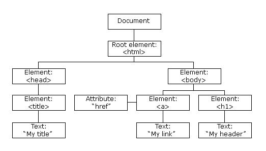
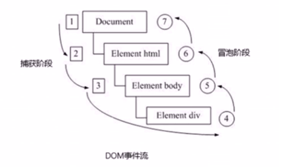
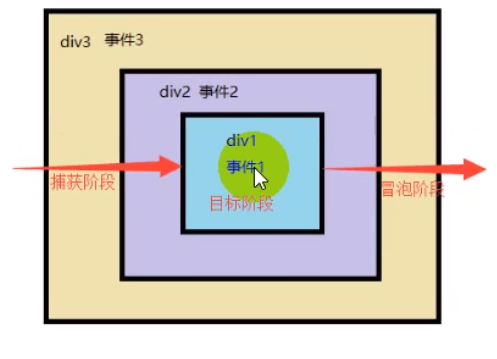
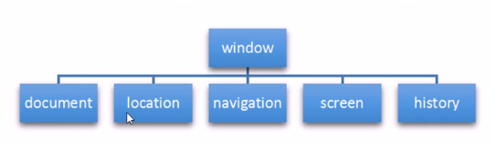
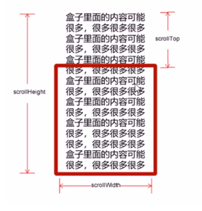

# -------------------------------

# JS 与 浏览器交互

# -------------------------------


# Javascript 与 BOM/DOM

## 1. Web API

API（Application Programming  Interface, 应用程序编程接口）是一些预先定义的**函数**，无需访问源码，或理解内部工作机制。简单的说就是API给程序员提供一种工具，以便更轻松的实现想要完成的功能。


WEB API 是浏览器的提供的一套操作浏览器功能和页面元素的API（BOM和DOM）如：

~~~js
alert('弹出窗口');
~~~


在 javascript 基本语法中，并没有 alert 这个方法，这个方法是浏览器提供给我们的 API，所以这条命令我们只能成功运行在浏览器中，离开浏览器就无法正常运行了。


## 2. BOM

BOM 即浏览器对象模型（browser object model），其提供了一系列接口供开发者使用 `JavaScript` 与浏览器窗口进行交互。


BOM 提供的是与浏览器窗口交互的能力，其包含了一些处理窗口的方法，如打开新窗口，控制新窗口大小，也提供了窗口相关的属性，如窗口尺寸。


像刚才演示的 alert 就是 bom，它的完整写法其实应该是：

~~~js
windows.alert('弹出窗口');
~~~


可以看到，其实 alert 是 window 对象下边的一个方法，而 window 对象就是我们的浏览器窗口。


## 3. DOM

DOM（Document Object Model），是 HTML 或 XML 的标准编程接口，通过DOM接口，可以改变网页的内容、结构和样式。


当网页被加载时，浏览器会创建页面的文档对象模型（Document Object Model），HTML DOM 模型被结构化为对象树：





HTML DOM 是 HTML 的标准对象模型和编程接口。它定义了：

- 作为对象的 HTML 元素
- 所有 HTML 元素的属性
- 访问所有 HTML 元素的方法
- 所有 HTML 元素的事件


文档：一个页面就是一个文档，DOM中使用 document 表示

元素：页面中所有的标签都是元素，DOM中使用element表示

节点：网页中所有内容都是节点（标签、属性、文本、注释等），DOM中使用node表示


# 查找 HTML DOM 元素

HTML DOM 能够通过 JavaScript 进行访问（也可以通过其他编程语言）。在 DOM 中，所有 HTML 元素都被定义为对象。我们可以通过 Javascript 对这些对象操作，改变 HTML 元素的内容。


- getElementById()
- getElementsByTagName()
- getElementsByClassName()
- querySelector()
- querySelectorAll()


## 1. getElementByID()

因为 id 元素是唯一的，就是为了在 js 中通过元素 id 来查找元素，document 是页面文档对象，getElementById 是 document 的方法，通过传递的参数（id字符串），是一个标签的id值。可以返回的该元素对象

~~~html
<div id="new">This is new Element</div>
<script>
    // 页面文档从上往下加载，需要将 script 代码写在下边
    var dom = document.getElementById('new');
	// 显示id为new的对象中内容
    console.log(dom);
	// 可以打印我们返回的元素对象，更好的查看里边的属性和方法
    console.dir(dom);  
</script>
~~~


## 2. getElementsByTagName()

注意是 elements 不是 element ，通过标签名来查找元素，获取元素对象的集合，以类似数组的形式存储，如果没有获取到元素，返回一个空的伪数组 

~~~html
<ul>
    <li><span>1</span></li>
    <li><span>2</span></li>
    <li><span>3</span></li>
</ul>

<script>
    var dom = document.getElementsByTagName("li");
    console.log(dom);
    console.log(dom[0]);  // 获取第一个元素
    console.log(dom.length)  // 查看对象长度
    // 遍历元素
    for (var i = 0; i < dom.length; i++) {
        console.log(dom[i]);
    }
</script>
~~~


每一个元素都是 DOM 的节点，他们都拥有相同的方法，刚才一直用 document.getElementById() 和 document.getElementsByTagName() 从根节点查找元素。其实还可以从下级元素中查找元素，如：

~~~html
<ul>
    <li><span>1</span></li>
    <li><span>2</span></li>
    <li><span>3</span></li>
</ul>
<ul>
    <li><span>4</span></li>
    <li><span>5</span></li>
    <li><span>6</span></li>
</ul>

<script>
    var ul = document.getElementsByTagName("ul");
    // 从第二个ul元素中查找li元素
    var li = ul[1].getElementsByTagName("li");
    console.log(li);
</script>
~~~


## 3. getElementsByClassName()

注意是 elements 不是 element，通过类名查找元素，这里返回集合

~~~html
<div class="box">
    <p>This is a box</p>
</div>

<script>
    var box = document.getElementsByClassName("box");
    console.log(box);
</script>
~~~


## 4. getElementsByName()

通过 name 属性获取元素，也是以集合的方式返回

~~~html
<div name="w"></div>
<input type="text" name="username" value="" placeholder="请输入用户名" />
<script>
    // 获取普通 name 属性标签元素
    var w = document.getElementsByName("w");
    
    // 获取 input 标签
    var username = document.getElementsByName("username");
    console.log(w);
    console.log(username);
</script>
~~~


## 4. querySelector()

H5 选择器，使用 CSS 选择器查找元素，只返回第一个元素查找结果

~~~js
// 查找类名为box的元素
var firstBox = document.querySelector('.box');

// 查找id名为box的元素
var nav= document.querySelector('#box');

// 查找li标签元素
var li= document.querySelector('li');

// 查找 name 属性值为 username 的标签元素
var input = document.querySelector("input[name=username]");
~~~


## 5. querySelectorAll()

H5 选择器，使用 CSS 选择器查找元素，返回所有元素集合

~~~js
var doms = document.querySelectorAll('.box');  
~~~


## 6. 查找 HTML 对象

| 属性                         | 描述                                        | DOM  |
| :--------------------------- | :------------------------------------------ | :--- |
| document.anchors             | 返回拥有 name 属性的所有 <a> 元素。         | 1    |
| document.applets             | 返回所有 <applet> 元素（HTML5 不建议使用）  | 1    |
| document.baseURI             | 返回文档的绝对基准 URI                      | 3    |
| document.body                | 返回 <body> 元素                            | 1    |
| document.cookie              | 返回文档的 cookie                           | 1    |
| document.doctype             | 返回文档的 doctype                          | 3    |
| document.documentElement     | 返回 <html> 元素                            | 3    |
| document.documentMode        | 返回浏览器使用的模式                        | 3    |
| document.documentURI         | 返回文档的 URI                              | 3    |
| document.domain              | 返回文档服务器的域名                        | 1    |
| document.domConfig           | 废弃。返回 DOM 配置                         | 3    |
| document.embeds              | 返回所有 <embed> 元素                       | 3    |
| document.forms               | 返回所有 <form> 元素                        | 1    |
| document.head                | 返回 <head> 元素                            | 3    |
| document.images              | 返回所有  元素                         | 1    |
| document.implementation      | 返回 DOM 实现                               | 3    |
| document.inputEncoding       | 返回文档的编码（字符集）                    | 3    |
| document.lastModified        | 返回文档更新的日期和时间                    | 3    |
| document.links               | 返回拥有 href 属性的所有 <area> 和 <a> 元素 | 1    |
| document.readyState          | 返回文档的（加载）状态                      | 3    |
| document.referrer            | 返回引用的 URI（链接文档）                  | 1    |
| document.scripts             | 返回所有 <script> 元素                      | 3    |
| document.strictErrorChecking | 返回是否强制执行错误检查                    | 3    |
| document.title               | 返回 <title> 元素                           | 1    |
| document.URL                 | 返回文档的完整 URL                          | 1    |


# 改变 HTML 元素

| 方法                                       | 描述                   |
| :----------------------------------------- | :--------------------- |
| element.innerHTML = *new html content*     | 改变元素的 HTML 内容   |
| element.innerTEXT = new text               | 改变元素的文本内容     |
| element.attribute = *new value*            | 改变 HTML 元素的属性值 |
| element.setAttribute(*attribute*, *value*) | 改变 HTML 元素的属性值 |
| element.hasAttribute(attribute)            | 判断元素是否有该属性   |
| element.removeAttribute(attribute)         | 删除元素属性           |
| element.style.property = *new style*       | 改变 HTML 元素的样式   |


## 1. element.innerHTML

元素属性 innerHTML 就是元素的 HTML 代码，当查找到元素后，可以对其 innerHTML 属性进行重新赋值修改。

~~~html
<div>
    <h1>Hello World</h1>
</div>
<script>
    var h1 = document.querySelector("div");
    // 将原本的div里边的所有HTML内容更改，如果没有子元素，InnerHTML 就会修改该元素下的 Text 内容
    h1.innerHTML = "<h2>2020-05-05</h2>";
</script>

// 输出结果
2020-05-05
~~~


## 2. element.innerText

~~~html
<h1>Hello World</h1>
<script>
    var h1 = document.querySelector("h1");
    // 只更改文本，HTML 不解析，同时去除空格和换行
    h1.innerText = "<h2>2020-05-05</h2>    ABC";
</script>

// 输出结果
<h2>2020-05-05 ABC</h2>
~~~


## 3. element.attribute 改变元素属性值

这里的 attribute 是代词，具体要看元素有什么属性，比如 a 链接就有 href 属性，所以使用的时候需要用 element.href 来改变。

~~~html
<div>
    <a href="https://www.163.com">网址</a>
</div>

<script>
    var a = document.querySelector("a");
    a.href = "https://www.qq.com";
</script>
~~~


## 4. element.setAttribute 改变元素属性值

还可以通过 element.setAttribute 方法来改变元素属性值

~~~js
element.setAttribute(attribute, value)
~~~

- attribute：属性名

- value：属性值


~~~html
<div>
    <a class="hightlight" href="https://www.163.com">网址</a>
</div>

<script>
    var a = document.querySelector("a");
    a.setAttribute("href", "https://www.qq.com");
    // 用 .属性方法更改 class 属性使用 className
    // 注意空格，这里是增加一个class
    a.className += " hidden";  
    // 用 setAttribute 更改 class 属性直接用 class
    // 也可以直接写上两个属性
    a.setAttribute("class", "hightlight hidden");
</script>
~~~


常用元素属性

- innerText
- innerHTML
- src
- href
- id, alt, title


## 5. element.hasAttribute

通过 element.hasAttribute 判断元素是否有指定属性

~~~html
<a href="index.php" data-index="1">123</a>
<script>
var d = document.querySelector("a");
// 返回 true
console.log(d.hasAttribute("href"));
</script>
~~~


## 6. element.removeAttribute

~~~html
<a href="index.php" data-index="1">123</a>
<script>
var d = document.querySelector("a");
d.removeAttribute("data-index");
</script>
~~~


## 7. H5 新增属性

原生属性可以使用 element.属性的方法获取属性值，自定义属性需要使用 element.getAttribute() 等方法获取、修改、删除属性值

~~~html
<!-- 用 data-index 命名自定义属性 -->
<div data-index="1" data-list-name="Andy"></div>
<script>
    var div = document.querySelector("div");
    // 获取属性值
    console.log(div.getAttribute("data-index"));

    // 获取属性索引
    console.log(div.dataset.index);

    // 获取属性索引
    console.log(div.dataset["index"]);

    // 获取属性值
    console.log(div.dataset.listName);

    // 获取属性值
    console.log(div.dataset["listName"]);
</script>
~~~


## 案例：

- element.属性： 获取内置属性值（元素本身自带属性）
- element.getAttribute('属性')：主要用于获取自定义属性

~~~html
<body>
    <div id="demo" index="1" class="nav"></div>
    <script>
        var div = document.querySelector('div');
        // 1. 获取元素的属性值
        // (1) element.属性
        console.log(div.id);
        //(2) element.getAttribute('属性')  get得到获取 attribute 属性的意思 我们程序员自己添加的属性我们称为自定义属性 index
        console.log(div.getAttribute('id'));
        console.log(div.getAttribute('index'));
        // 2. 设置元素属性值
        // (1) element.属性= '值'
        div.id = 'test';
        div.className = 'navs';
        // (2) element.setAttribute('属性', '值');  主要针对于自定义属性
        div.setAttribute('index', 2);
        div.setAttribute('class', 'footer'); // class 特殊  这里面写的就是class 不是className
        // 3 移除属性 removeAttribute(属性)    
        div.removeAttribute('index');
    </script>
</body>
~~~


## 8. style.property 修改样式

使用元素中的 style 属性可以修改该元素的样式。如 `a.style.fontSize`，`a.style.display`。修改的样式直接作用在行内CSS样式中，


- 修改样式的属性名需要改写，将横杠从CSS属性名中去除，然后将横杠后第一个字母大写，如：background-color 写成 backgroundColor
- 属性值都是字符串，设置时必须包括单位


~~~html
<div>
    <a href="https://www.163.com">网址</a>
</div>

<script>
    var a = document.querySelector("a");
    a.style.fontSize = "24px";
</script>
~~~


例：Tongle 切换背景效果

- 通过类名切换背景
- 也可以通过 document.body.style.backgroundColor 属性切换背景颜色

~~~html
<style>
    .cls {
        background-color: coral;
    }
</style>
<body>
    <button>切换</button>
    <script>
        var btn = document.querySelector("button");
        btn.addEventListener("click", function () {
            if (document.body.className == "") {
                document.body.className = "cls";
            } else {
                document.body.className = "";
            }
        });
    </script>
</body>
~~~


getComputedStyle() 

接受一个节点对象，返回该节点对象最终样式信息的对象。

> getComputedStyle() 是 window 对象下的方法，不是 DOM 对象。


~~~html
<div style="width: 200px; height: 200px; background-color: cadetblue"></div>
<script>
    var div = document.querySelector("div");
    console.log(getComputedStyle(div));
</script>
~~~

> 也可以指定查看属性如： getComputedStyle(div).width


# 事件

事件是一种触发机制，给 HTML 元素加上事件，可以让元素与用户实现动态交互，即实现在某个交互动作或时间，该标签或其他标签会被改变。

事件是由三部分组成，事件源、事件类型、事件处理程序

1. 事件源：事件被触发的对象，如：DOM 元素
2. 事件类型：事件是如何被触发，如：鼠标点击，鼠标经过，还是键盘按下

3. 事件处理程序：通过一个函数赋值的方式完成

.

## 1. 常见 HTML 事件

### 1.1. 鼠标事件

~~~
onclick  		// 鼠标点击左键
ondbclick		// 鼠标双击
oncontextmenu	// 鼠标点击右键
mousedown		// 鼠标按键被按下
mouseup			// 松开鼠标按键
onselect		// 文本被选中
oncopy			// 元素内容被复制
onmouseenter	// 鼠标移动到事件监听的元素内（不区分子元素）
onmouseover  	// 鼠标移动到有事件监听的元素或它的子元素内
onmouseleave	// 鼠标离开元素外（不区分子元素）
onmouseout  	// 鼠标离开元素，或它的子元素外
onfocus  		// 获得鼠标焦点(点击input输入框)
onblur  		// 失去鼠标焦点（进入其他input输入框）
onmousemove  	// 鼠标移动
onmouseup  		// 鼠标弹起
onmousedown  	// 鼠标按下
~~~


### 1.2. 键盘事件

执行顺序：keydown - keypress - keyup

~~~js
onkeyup  // 某个按键被松开时触发
onkeydown  // 某个键被按下时触发
onkeypress  // 某个键被按下时触发（但是不识别功能键如CTRL、SHIFT、方向键等）
~~~


~~~html
<script>
    // 常用的键盘事件
    //1. keyup 按键弹起的时候触发 
    // document.onkeyup = function() {
    //         console.log('我弹起了');

    //     }
    document.addEventListener('keyup', function() {
        console.log('我弹起了');
    })

    //3. keypress 按键按下的时候触发  不能识别功能键 比如 ctrl shift 左右箭头啊
    document.addEventListener('keypress', function() {
            console.log('我按下了press');
        })
        //2. keydown 按键按下的时候触发  能识别功能键 比如 ctrl shift 左右箭头啊
    document.addEventListener('keydown', function() {
            console.log('我按下了down');
        })
        // 4. 三个事件的执行顺序  keydown -- keypress -- keyup
</script>
~~~


e.keyCode 返回 ASCII 值

~~~html
按键1  // 返回 49
~~~


- keyup / keydown 不区分大小写，返回都是大写的 ASCII 值

- keypress 返回区分大小写


### 1.3. 表单事件

表单事件需要绑定在表单上边，而不是提交按钮上

| 事件   | 说明                                 |
| ------ | ------------------------------------ |
| reset  | 点击重置按钮时，先过一遍js代码再提交 |
| submit | 点击提交按钮时                       |


### 1.4. 内容变化事件

| 事件   | 说明                                                         |
| ------ | ------------------------------------------------------------ |
| change | 当内容改变且失去焦点时触发（表单验证：邮箱、用户名长度判断） |
| input  | 当内容值改变时触发，类似键盘弹起                             |


## 2. 事件书写的方式

- 行内式
- 函数式
- 结合式


### 2.1. 行内式

```html
<h1 onclick="this.innerHTML = 'Hello!'">点击此文本！</h1>
```


### 2.2. 函数式（常用）

~~~html
<h1>点击H1文本！</h1>
<h2>点击H2文本</h2>
<h3>点击H3文本</h3>
<h4>点击H4文本</h4>
<script>
    var h1 = document.querySelector("h1");
    h1.onclick = function () {
        h1.innerHTML = "Hello";
    };
    
    // 可以省略变量部分
    document.querySelector("h2").onclick = function () {
        document.querySelector("h2").innerHTML = "Hello";
    };

    // 直接使用函数名（将匿名函数赋值给变量），需要注意函数的预编译执行顺序
    var f1 = function () {
        document.querySelector("h3").innerHTML = "Hello";
    };
    document.querySelector("h3").onclick = f1;

    // 直接使用函数名
    document.querySelector("h4").onclick = f2;
    function f2() {
        document.querySelector("h4").innerHTML = "Hello";
    }
</script>
~~~


为什么在 script 标签中绑定 onclick 事件后边函数不用加 () 

- 因为加括号就是调用函数，页面加载 js 文件后就会调用该函数，这不是我们所希望的
- 不加括号是一个函数对象就像匿名函数那样，function() {} 只是声明在那里，只有触发事件才会调用，在绑定的时候我们不需要调用该函数。
- HTML 调用一定要加 ()


### 2.3. 结合式

~~~html
<h1 onclick="sayHi()">点击此文本！</h1>
<script>
    function sayHi() {
        alert("sayHi");
    }
</script>
~~~


### 2.4. 事件中的 this

在普通函数中，this 代表 windows 对象。在对象构造函数中，this 代表这个对象本身。而在事件中的 this 是该标签对象本身

~~~js
var h1 = document.querySelector("h1");
f1 = function () {
    console.log(this);
    this.innerHTML = 'Hi~';
};
// 把一个方法赋值给 h1.onclick
// onclick 就相当于是 h1 对象的一个方法。在对象方法中的 this 指向的就是该对象本身。
h1.onclick = f1;
~~~


## 3. 案例

### 3.1. 点击按钮显示不同图片

~~~html
<button id='ldh'>刘德华</button>
<button id='zxy'>张学友</button>

<script>
    var ldh = document.getElementById('ldh');
    var zxy = document.getElementById('zxy');
    var img = document.getElementById('img');
    zxy.onclick = function(){
        img.src = "images/zxy.jpg";
        img.title = '张学友';
    }
    ldh.onclick = function(){
        img.src = "images/ldh.jpg";
        img.title = '刘德华';
    }
</script>
~~~


### 3.2. 根据时间显示不同内容

~~~html

<div>上午好</div>
<script>
    var img = document.querySelector('img');
    var div= document.querySelector('div');
    var date = new Date();
    var h = date.getHours();
    if (h<12){
        img.src = 'images/s.gif';
        div.innerHTML = '上午好';
    } else if (h<18){
        img.src = 'images/z.gif';
        div.innerHTML = '中午好';
    } else {
        img.src = 'images/w.gif';
        div.innerHTML = '晚上好';
    }
</script>
~~~


### 3.3. 点击按钮修改表单属性

~~~html
<button>按钮</button>
<input type="text" value="输入内容"></input>
<script>
    var btn = document.querySelector('button');
    var input = document.querySelector('input');
    btn.onclick = function() {
        // 注意这里不能用 inner.HTML，HTML 只适用于普通标签
        input.value = '点击了'; 
        // 点击过一次禁用按钮
        // 也可以使用 this.disabled = true;
        btn.disabled = true;         
    }
</script>
~~~


### 3.4. 实现密码框明文显示

~~~html
<style>
    .box {
        position: relative;
        width: 400px;
        border-bottom: 1px solid #cccccc;
        margin: 100px auto;
    }
    
    .box input {
        width: 370px;
        height: 30px;
        border: 0;
        outline: none;
    }
    
    .box img {
        position: absolute;
        top: 2px;
        right: 2px;
        width: 24px;
    }
</style>

<body>
    <div class="box">
        <label for="">
            
        </label>
        <input type="password" name="" id="psw">
    </div>
    
    <script>
        var eye = document.getElementById('eye');
        var psw = document.getElementById('psw');
        var flag = 0;
        eye.onclick = function() {
            if (flag == 0) {
                psw.type = 'text';
                eye.src = 'images/display.png';
                flag = 1;
            } else {
                psw.type = 'password';
                eye.src = 'images/hide.png'
                flag = 0;
            }

        }
    </script>
</body>
~~~


### 3.5. 修改背景颜色

~~~html
<html>
<style>
    div {
        width: 200px;
        height: 200px;
        background-color: pink;
    }
</style>

<body>
    <div></div>
    <script>
        var div = document.querySelector('div');
        div.onclick = function() {
            div.style.backgroundColor = 'purple';
            // this.style.backgroundColor = 'purple';
        }
    </script>
</body>

</html>
~~~


### 3.6. 显示隐藏二维码

~~~html
<div class="box">
    这是一个二维码
    
    <i class="close-btn">x</i>
</div>
<script>
    var btn = document.querySelector('.close-btn');
    var box = document.querySelector('.box');
    btn.onclick = function() {
        box.style.display = 'none';
    }
</script>
~~~


### 3.7. 循环填入小图片

~~~html
<li></li>
<li></li>
<li></li>
<li></li>
<li></li>
<script>
    var lis = document.querySelectorAll('li');
    for (var i = 0; i < lis.length; i++) {
        // 图标y坐标相隔44个像素
        var index = i * 44;
        //Position需要是负值，循环遍历更改style
        lis[i].style.backgroundPosition = '0 -' + index + 'px';
    }
</script>

~~~


### 3.8. 输入框点击，默认文字消失（利用焦点）

~~~html
<body>
    <input text="text" value="手机">
    <script>
        var input = document.querySelector('input');
        input.onfocus = function() {
            if (input.value === '手机') {
                this.value = "";
            }
            this.style.color = '#333'
        }
        input.onblur = function() {
            if (this.value === '') {
                this.value = "手机";
            }
            this.style.color = '#ccc'

        }
    </script>
</body>
~~~


### 3.9. 利用类名批量更改 CSS 换风格

~~~html
<html>
<style>
    .change {
        background-color: pink;
        color: powderblue;
        font-size: 14px;
        margin-top: 100px;
    }
</style>

<body>
    <div class="default">文本</div>
    <script>
        var div = document.querySelector('div');
        div.onclick = function() {
            div.className = 'change';
            // div.className = 'default change'; 保留原类名，直接用双类名
        }
    </script>
</body>

</html>
~~~


### 3.10. 验证密码长度

~~~html
<body>
    <div class="register">
        <input type="password" class="ipt">
        <p class="message">请输入6~16位密码</p>

    </div>
    <script>
        var ipt = document.querySelector('.ipt');
        var message = document.querySelector('.message');
        ipt.onblur = function(){
            if(this.value.length <6 || this.value.length > 16){
                message.className = 'message wrong';
                message.innerHTML = '您输入的密码位数需要6~16位';
            }
            else {
                message.className = 'message right';
                message.innerHTML = '您输入的密码符合要求';
            }
        }
    </script>
</body>
~~~


### 3.11. 排他思想（控制多个元素）

~~~html
<html>

<body>
    <button>按钮1</button>
    <button>按钮2</button>
    <button>按钮3</button>
    <button>按钮4</button>
    <button>按钮5</button>
    <script>
        var btns = document.querySelectorAll('button');
        for (var i = 0; i < btns.length; i++) {
            btns[i].onclick = function() {
                for (var i = 0; i < btns.length; i++) {
                    btns[i].style.backgroundColor = '';
                }
                this.style.backgroundColor = 'red';
            }
        }
    </script>
</body>

</html>
~~~


### 3.12. 网页背景换肤功能

~~~html
<html>

<body>
    <ul class="baidu">
        <li></li>
        <li></li>
        <li></li>
        <li></li>
    </ul>
    <script>
        var imgs = document.querySelector('.baidu').querySelectorAll('img');
        for (var i = 0; i < imgs.length; i++) {
            imgs[i].onclick = function() {
                document.body.style.backgroundImage = 'url(' + this.src + ')'
            }
        }
    </script>
</body>

</html>
~~~


### 3.13. 表格鼠标移动行表格隔行变色

~~~html
    <script>
        var trs = document.querySelector('tbody').querySelectorAll('tr');
        for (var i = 0; i < trs.length; i++) {
                trs[i].onmouseover = function() {
                    this.className = 'bg';
                }
                trs[i].onmouseout = function() {
                    this.className = '';
                }
        }
    </script>
~~~


### 3.14. 表单全选

~~~html
<script>
    // 1. 全选和取消全选做法：  让下面所有复选框的checked属性（选中状态） 跟随 全选按钮即可
    // 获取元素
    var j_cbAll = document.getElementById('j_cbAll'); // 全选按钮
    var j_tbs = document.getElementById('j_tb').getElementsByTagName('input'); // 下面所有的复选框
    // 注册事件
    j_cbAll.onclick = function() {
            // this.checked 它可以得到当前复选框的选中状态如果是true 就是选中，如果是false 就是未选中
            console.log(this.checked);
            for (var i = 0; i < j_tbs.length; i++) {
                j_tbs[i].checked = this.checked;
            }
        }
        // 2. 下面复选框需要全部选中， 上面全选才能选中做法： 给下面所有复选框绑定点击事件，每次点击，都要循环查看下面所有的复选框是否有没选中的，如果有一个没选中的， 上面全选就不选中。
    for (var i = 0; i < j_tbs.length; i++) {
        j_tbs[i].onclick = function() {
            // flag 控制全选按钮是否选中
            var flag = true;
            // 每次点击下面的复选框都要循环检查者4个小按钮是否全被选中
            for (var i = 0; i < j_tbs.length; i++) {
                if (!j_tbs[i].checked) {
                    flag = false;
                    break; // 退出for循环 这样可以提高执行效率 因为只要有一个没有选中，剩下的就无需循环判断了
                }
            }
            j_cbAll.checked = flag;
        }
    }
</script>
~~~


### 3.15. TAB栏切换


# 节点操作

## 1. 节点层级关系

除了使用 ID，标签，CSS 选择器查找元素外，我们还可以利用节点层次关系（父集、子集）来选择元素。


一般节点至少拥有 nodeType（节点类型）、nodeName（节点名称）、nodeValue（节点值）三个属性


节点类型：

- 元素节点 nodeType 为 1
- 属性节点 nodeType 为 2
- 文本节点 nodeType 为 3


节点名称：

- nodeName 是只读的
- 元素节点的 nodeName 与标签名相同
- 属性节点 nodeName 与属性名相同
- 文本节点的 nodeName 始终是 #text
- 文档节点的 nodeName 始终是 #document


节点值：

- 元素节点 nodeValue 是 undefined 或 null
- 文本节点的 nodeValue 是 文本本身
- 属性节点的 nodeValue 是属性值


使用 nodeName 和 nodeType 判断标签

~~~js
document.getElementById("btn").onclick = function () {
    var count = 0;
    var nodes = docoument.getElementById("uu").childNodes;
    for (var i = 0; i < nodes.length; i++) {
        var node = nodes[i];
        // 判断 node 是否是 li
        if (node.nodeType == "1" && node.nodeName == "LI") {
            node.style.backgroundColor = count % 2 == 0 ? "red" : "yellow";
            count++;
        }
    }
};
~~~


节点层级：

- 父节点 parentNode / parentElement
- 子节点 childNodes（注意：会同时包含文本节点和元素节点）
- 子节点 children（非标准，但是只获得元素节点）

- 第一个子节点 firstChild  / firstElementChild
- 最后一个子节点 lastChild  / lastElementChild
- 下一个兄弟节点 nextSibling / nextElementSibling
- 上一个兄弟节点 previousSibling / previousElementSibling


- 带有 Element 的节点可以操作里边的HTML内容、文本内容、属性内容，一般用来做节点内容操作

- 带有 Node 字样的一般是用来做布局插入使用，它包含了文本节点和元素节点（比如换行也算做文本节点）


很多函数是不支持 IE9 的，比如 firstElementChild，nextElementSibling，如果项目要考虑兼容性，需要自己封装函数

~~~js
function getNextElementSibling(element) {
    var el = element;
    while (el = el.nextSibling){
        if (el.nodeType === 1){
            return el;
        }
    }
    return null;
}
~~~


### 1.1. ParentElement 父节点

表示当前元素的父节点

~~~html
<div>
    <a href="#">点我</a>
</div>
<script>
    var a = document.querySelector("a");
    a.onclick = function () {
        // 改变 a 元素的父节点div中的innerHTML
        this.parentElement.innerHTML = '<a href="#">别点我</a>';
    };
</script>
~~~


### 1.2. 子节点

childNodes 选择元素所有子节点，返回一个集合，其中包含子元素，以及文本节点

~~~html
<div style="width: 200px; height: 200px; background-color: cadetblue">
    <a href="#">点我</a>
    <a href="#">点我</a>
</div>
<script>
    var div = document.querySelector("div");
    div.onclick = function () {
        console.log(this.childNodes);
        // innerHTML = '<a href="#">别点我</a>';
    };
</script>

<!-- 输出结果 
NodeList(5) [text, a, text, a, text]
0: text
1: a
2: text
3: a
4: text
length: 5  -->
~~~


children 选择元素所有子节点，返回一个集合，可以用 [索引]的方式选择其中的子元素

~~~html
<div style="width: 200px; height: 200px; background-color: cadetblue">
    <a href="#">点我</a>
    <a href="#">点我</a>
</div>
<script>
    var div = document.querySelector("div");
    div.onclick = function () {
        console.log(this.children);
        // innerHTML = '<a href="#">别点我</a>';
    };
</script>

<!-- 输出结果
HTMLCollection(2) [a, a]
0: a
1: a
length: 2
__proto__: HTMLCollection
-->
~~~


第一个/最后一个子节点

~~~html
<div style="width: 200px; height: 200px; background-color: cadetblue">
    <a href="#">点我</a>
    <a href="#">点我</a>
</div>
<script>
    var div = document.querySelector("div");
    div.onclick = function () {
        this.firstElementChild.innerHTML = '<a href="#">别点我</a>';
        // this.lastElementChild.innerHTML = '<a href="#">别点我</a>';
    };
</script>
~~~


### 1.3. 兄弟节点

~~~html
<div style="width: 200px; height: 200px; background-color: cadetblue">
    <a id="a1" href="#">点我</a>
    <a href="#">点我</a>
</div>
<script>
    var a = document.querySelector("#a1");
    a.onclick = function () {
        this.nextElementSibling.innerHTML = '<a href="#">别点我</a>';
    };
</script>
~~~


## 2. 节点操作

| 方法                                  | 描述               |
| :------------------------------------ | :----------------- |
| document.createElement(*element*)     | 创建 HTML 元素     |
| document.removeChild(*element*)       | 删除 HTML 元素     |
| document.appendChild(*element*)       | 尾部添加 HTML 元素 |
| node.insertBefore(child, targetChild) | 起始位置添加子节点 |
| document.replaceChild(*element*)      | 替换 HTML 元素     |
| node.cloneNode()                      | 复制节点           |
| document.write(*text*)                | 写入 HTML 输出流   |


### 2.1. 创建节点

~~~js
document.createElement('tagName')  // 用来生成网页元素节点，参数为元素的标签名
document.createTextNode()  // 用来生成文本节点，参数为所要生成文本节点的内容
~~~


创建标签的三种方式：

~~~
document.write()  // 直接写入页面内容流，会重写页面内容
element.innerHTML  // 直接使用会导致效率低下，如果使用数组拼接后再写入则效率更高
document.createElement()  // 添加大量标签效率要比 innerHTML 高
~~~


例：插入节点

~~~html
<div id="d1"></div>
<script>
    var d1 = document.querySelector("#d1");
    var h1 = document.createElement("h1");
    h1.innerText = "12345";
    // 插入子节点
    d1.appendChild(h1);
</script>
~~~


例：插入文本节点

~~~html
<div id="d1"></div>
<script>
    var d1 = document.querySelector("#d1");
    var divText = document.createTextNode("文本内容");
    d1.appendChild(divText);
</script>
~~~


### 2.2. 添加节点

~~~js
node.appendChild(child)  // 接受一个节点对象为参数，添加子节点（如有相同元素，则在后方插入）
node.hasChildNodes()  // 返回一个布尔值，表示当前节点是否有子节点
node.inserBefore(child, targetChild)  // 添加子节点（指定某个子节点的前方插入）
~~~


### 2.3. 删除节点

~~~js
node.removeChild(child)  // 接受一个子节点为参数，从父节点中删除一个子节点
~~~


### 2.4. 复制节点

~~~js
node.cloneNode();  // 用于克隆一个选中节点，它接受一个布尔值为参数，表示是否克隆该节点的子节点，默认 false（不会克隆节点上的事件）
~~~


例：

~~~html
<ul>
    <li id="li1">香蕉</li>
    <li>苹果</li>
    <li>大鸭梨</li>
</ul>
<script>
    var ul = document.querySelector("ul");
    var li1 = document.querySelector("#li1");
    // 文本也算是子节点，所以需要将参数设置为 true
    var newLi = li1.cloneNode(true);
    ul.appendChild(newLi);
</script>
~~~


### 2.5. 案例

#### 2.5.1

#### 2.5.2. 留言板添加留言案例

#### 2.5.3. 留言板删除留言案例

#### 2.5.4. 动态生成表格


# 高级事件（推荐使用）

传统注册方式：利用 on 开头的事件 onclick，如：

~~~html
<button onclick="alert('hi~')">按钮</button>
<script>
    var btn = document.querySelector("button");
    btn.onclick = function () {
        alert("bye~");
    };
</script>
~~~

传统注册事件的方式具有唯一性，同一个元素同一个事件只能设置一个处理函数，最后注册的处理函数将会覆盖前面的注册的处理函数。


## 1. addEventListenner 添加事件监听

eventTarget.addEventListener() 方法将指定的监听器注册到 eventTarget （目标对象）上，当该对象触发指定的事件时，就会执行事件处理函数。


- type: 事件类型字符串，如 click，mouseover 等，这里不用带 on
- listener：事件处理函数，事件触发时，会调用该监听函数
- useCapture：可选参数，默认 false


~~~html
<button>按钮</button>
<script>
    var btn = document.querySelector('button');
    btn.addEventListener('click', function() {
        alert("弹出");
    })
        btn.addEventListener('click', function() {
        alert("第二次弹出");
    })
</script>
~~~

> 同一个元素，同一个事件可以添加多个侦听器


## 2. EventTarget.attachEvent()

仅支持 IE9 以前的浏览器，不建议使用，只是为了开发兼容性，才需要使用。


语法：

~~~js
EventTarget.attachEvent(eventNameWithOn, callback)
~~~


参数：

- eventNameWithOn: 事件类型字符串，比如 onclick、onmouseover
- callback：事件处理函数


注册事件兼容性封装

~~~js
function addEventListener(element, eventName, fn) {
    // 判断当前浏览器是否支持 addEventListener 方法
    if (element.addEventListener) {
        element.addEventListener(eventName, fn);
    } else if (element.attachEvent) {
        element.attachEvent('on' + eventName, fn);
    } else {
        // 相当于 element.onclick = fn;
        element['on' + eventName] = fn;
    }
}
addEventListener(btn, 'click', function() {
    alert("弹出3");
~~~


## 3. removeEventListener 删除事件监听

传统方式：可以利用覆盖来删除事件

~~~html
<button>按钮</button>
<script>
    var btn = document.querySelector('button');
    btn.onclick = function() {
        alert('弹出');
        // 等于 null 或 '' 都可以
        btn.onclick = null;
    }
</script>
~~~


取消后续动作：

可以利用 return flase 取消后续事件，比如表单提交之前验证，如果没有通过验证就取消提交，不执行跳转。

~~~html
<form action="" id="f">
    <label for="username">用户名</label
        ><input
                type="text"
                id="username"
                name="username"
                value=""
                placeholder="username"
                />
    <input id="submit" type="submit" value="提交" />
</form>

<script>
    var input = document.querySelector("#username");
    var f = document.querySelector("#f");
    // submit 事件要给 form 标签绑定
    f.addEventListener("submit", function () {
        if (input.value === "") {
            alert("没有输入用户名");
            return false;
        }
    });
</script>
~~~


移除 addEventListener 监听绑定事件方式：

语法：

~~~html
eventTarget.removeEvenetListener(type, listener[, useCapture]);
~~~


使用：

~~~html
<button>按钮</button>
<script>
    var btn = document.querySelector('button');
    btn.addEventListener('click', fn);

    fn = function () {
        alert('弹出');
        btn.removeEventListener('click', fn);
    }
</script>
~~~

> 不能用匿名函数，需要将 function 单独写出来


## 4. eventTarget.detachEvent()              

还是旧版兼容性问题，可以使用 detachEvent() 方法解除监听


语法：

~~~js
eventTarget.detachEvent(eventNameWithOn, callback)
~~~


使用：

~~~js
btn.detachEvent('onclick' fn);
~~~


## 5. 事件流

事件流描述的是从页面接受事件的顺序。事件发生时会在元素节点之间按照特定的顺序传播，这个传播的过程即DOM事件流





addEventListener(type, listener[, useCapture]) 这第三个可选参数 Capture 如果是 true，表示在事件捕获阶段调用事件处理程序；如果是 false（默认），表示在事件冒泡阶段调用事件处理程序。


- <del>onclick 和 attachEvent 只能得到冒泡阶段，也就是说从内向外依次执行</del>
- <del>有些事件没有冒泡，比如 onblur、onfocus、onmouseenter、onmouseleft</del>


事件触发顺序：（大盒子套小盒子）




- 当事件监听方式为默认方式，没有捕获阶段，只有冒泡阶段，比如 onclick，点击小盒子会先触发小盒子上绑定的事件，然后会依次触发大盒子、document、window 上边的事件
- 当事件监听方式设置为捕获方式，会先触发外部盒子上边的事件，然后再触发小盒子，之后再按冒泡顺序触发其他事件
- 默认事件都是冒泡顺序，只有用事件监听方式将 Capture 参数开启后才能实现捕获阶段触发事件，比如将 onclick 设置 Capture = true 的话，再点击小盒子就会先触发外边的盒子上的事件


## 6. 事件对象

event 对象代表事件的状态，比如键盘的按键状态、鼠标的位置、鼠标按钮的状态等，简单理解为事件发生后，跟事件相关的一系列数据集合都存放在这个 event 对象中。它包括很多属性和方法。


~~~html
<button>按钮</button>
<script>
    var btn = document.querySelector('button');
    btn.onclick = function(event){
        console.log(event);            
    }
  // 事件对象e可以看做形参，名称可以自己命名
    btn.addEventListener('click', function(e){
        console.log(e);            
    });
</script>
~~~


IE8 浏览器兼容性处理

~~~html
<button>按钮</button>
<script>
    var btn = document.querySelector('button');
    btn.onclick = function(e){
        e = e || window.event;
        console.log(e);            
    }
</script>
~~~


事件对象常见的属性和方法

~~~js
e.target  // 返回触发事件的对象（标准）
e.srcElement  // 返回触发事件的对象（非标准 ie6-8 使用）
e.type  // 返回事件的类型，比如 click、mouseover（不带on）
e.stopPropagation()  // 阻止冒泡（标准）
e.cancelBubble  // 该属性阻止冒泡（非标准 ie6-8 使用）
e.preventDefault()  // 阻止默认事件（标准）如让连接不跳转
e.returnValue  // 阻止默认事件（非标准 ie6-8 使用）
~~~


e.target 返回触发事件的对象（点击对象）

~~~html
<button>按钮</button>
<script>
    var btn = document.querySelector('button');
    btn.onclick = function(e) {
        console.log(e.target);
    }
</script>
~~~

> e.target 是点击对象，this 是绑定对象（类似currentTarget）


阻止默认事件行为

之前用的 return false 可以阻止事件默认行为，也可以使用事件对象的方式阻止。

- 取消浏览器对当前事件的默认行为
- 比如：点击链接跳转到指定页面，按空格，页面向下滚动一段距离，组织提交数据

~~~html
<a href='#'>链接</a>
<script>
    var a = document.querySelector('a');
    a.addEventListener('click', function(e) {
        e.preventDefault();
    })
    // 传统方式
    a.onclick = function(e){
    e.preventDefault();
    }
    // 低版本浏览器 ie678  returnValue  属性
    // e.returnValue;
    // 我们可以利用return false 也能阻止默认行为 没有兼容性问题 特点： return 后面的代码不执行了， 而且只限于传统的注册方式
    // return false;
</script>
~~~


阻止事件冒泡

- 两个嵌套盒子都有自己的事件，当点击内部盒子时，由于冒泡规则，外部事件也会触发，如果不想让外部盒子绑定事件生效，就需要组织冒泡事件。

~~~html
<div class="father">
    <div class="son">son儿子</div>
</div>
<script>
    // 常见事件对象的属性和方法
    // 阻止冒泡  dom 推荐的标准 stopPropagation() 
    var son = document.querySelector('.son');
    son.addEventListener('click', function(e) {
        alert('son');
        e.stopPropagation(); // stop 停止  Propagation 传播
        e.cancelBubble = true; // 非标准 cancel 取消 bubble 泡泡
    }, false);

    var father = document.querySelector('.father');
    father.addEventListener('click', function() {
        alert('father');
    }, false);
    document.addEventListener('click', function() {
        alert('document');
    })
</script>
~~~


## 7. 事件委托

不是给每个子节点单独设置事件监听器，而是将事件监听器设置在其父节点上，然后利用冒泡原理影响设置每个子节点。


- event.target：对事件起源目标的引用，属性返回触发事件的那个节点
- event.currentTarget：属性返回事件当前所在的节点，即正在执行的监听函数所绑定的那个节点。

> currentTarget 用 console 控制台显示的时候一直显示 null ，这是因为currentTarget 只能用于事件正在处理过程中，当回调结束，会被重新赋值。


如：给 ul 注册点击事件，然后利用事件对象的 target 来找到当前点击的 li，因为点击 li，事件会冒泡到 ul 上，ul 有注册事件，就会触发事件监听器


~~~html
<ul>
    <li>知否知否，点我应有弹框在手！</li>
    <li>知否知否，点我应有弹框在手！</li>
    <li>知否知否，点我应有弹框在手！</li>
    <li>知否知否，点我应有弹框在手！</li>
    <li>知否知否，点我应有弹框在手！</li>
</ul>
<script>
    // 事件委托的核心原理：给父节点添加侦听器， 利用事件冒泡影响每一个子节点
    var ul = document.querySelector('ul');
    ul.addEventListener('click', function(e) {
        // alert('知否知否，点我应有弹框在手！');
        // e.target 这个可以得到我们点击的对象
        e.target.style.backgroundColor = 'pink';
    })
</script>
~~~


禁止鼠标右键、禁止复制文字

~~~html
我是一段不愿意分享的文字
<script>
    // 1. contextmenu 我们可以禁用右键菜单
    document.addEventListener('contextmenu', function(e) {
            e.preventDefault();
        })
        // 2. 禁止选中文字 selectstart
    document.addEventListener('selectstart', function(e) {
        e.preventDefault();

    })
</script>
~~~


## 8. 鼠标事件对象

event 对象代表事件的状态，跟事件相关的一系列信息的集合。鼠标事件对象 MouseEvent，键盘事对象 KeyboardEvent

~~~js
e.clientX  // 返回鼠标相对于浏览器窗口可视区域 X 坐标
e.clientY
e.pageX  // 返回鼠标相对于文档页面 X 坐标 IE9+
e.pageY
e.screenX  // 返回鼠标相对于电脑屏幕的 X 坐标
e.screenY
~~~


~~~html
<script>
    // 鼠标事件对象 MouseEvent
    document.addEventListener('click', function(e) {
        // 1. client 鼠标在可视区的x和y坐标
        console.log(e.clientX);
        console.log(e.clientY);
        console.log('---------------------');

        // 2. page 鼠标在页面文档的x和y坐标
        console.log(e.pageX);
        console.log(e.pageY);
        console.log('---------------------');

        // 3. screen 鼠标在电脑屏幕的x和y坐标
        console.log(e.screenX);
        console.log(e.screenY);

    })
</script>
~~~


跟随精灵

~~~html

<script>
    var pic = document.querySelector('img');
    document.addEventListener('mousemove', function(e) {
        // 1. mousemove只要我们鼠标移动1px 就会触发这个事件
        // console.log(1);
        // 2.核心原理： 每次鼠标移动，我们都会获得最新的鼠标坐标， 把这个x和y坐标做为图片的top和left 值就可以移动图片
        var x = e.pageX;
        var y = e.pageY;
        console.log('x坐标是' + x, 'y坐标是' + y);
        //3 . 千万不要忘记给left 和top 添加px 单位
        pic.style.left = x - 50 + 'px';
        pic.style.top = y - 40 + 'px';


    });
</script>
~~~


## 9. 键盘事件对象

监控按键，然后移动页面焦点

~~~html
<input type="text">
<script>
    // 核心思路： 检测用户是否按下了s 键，如果按下s 键，就把光标定位到搜索框里面
    // 使用键盘事件对象里面的keyCode 判断用户按下的是否是s键
    // 搜索框获得焦点： 使用 js 里面的 focus() 方法
    var search = document.querySelector('input');
    document.addEventListener('keyup', function(e) {
        // console.log(e.keyCode);
        if (e.keyCode === 83) {
            search.focus();
        }
    })
</script>
~~~


# 兼容性问题

## 1. 事件对象

~~~js
var e = e || window.event;
~~~


## 2. 阻止浏览器默认行为

~~~js
if (event.preventDefault) {
    event.preventDefault()
} else {
    event.returnValue = false;
}
~~~

>也可以使用 return false


## 3. 阻止事件传播（冒泡）

~~~js
if (event.stopPropagation) {
    event.stopPropagation()
} else {
    event.cancelBubble = true;
}
~~~


# BOM

BOM(Browser Object Model) 浏览器对象模型，它提供了独立于页面内容与浏览器窗口进行交互的对象，其核心对象是 window。

- BOM 缺乏标准
- BOM 包含 DOM





Window 对象是浏览器的顶级对象：

1. 它是 JS 访问浏览器窗口的一个接口

2. 它是一个全局对象。定义在全局作用域中的变量、函数都会变成 window 对象的属性和方法。


~~~js
var num = 10;
console.log(window.num);
console.dir(window);  // 查看 window 对象属性和方法
~~~

> 在调用的时候可以省略 window


## 1. window 对象的常见事件

### 对话框事件

之前使用的 alert, prompt(), confirm() 其实都是 windows 对象的方法，完整写法应该是：

~~~js
window.alert();
window.prompt();
window.confirm();
~~~


### 1.1. 窗口加载事件

~~~js
window.onload = function(){}
window.addEventListener("load", function(){})
~~~


以下三种情况都会触发 load 事件：

1. a标签链接

2. F5或者刷新按钮

3. 前进或后退


可以将 JS 代码放到 onload 中，确保所有资源（CSS、JS、图片）已经加载完毕再对页面 DOM 进行操作

~~~html
<script>
    window.onload = function() {
        var btn = document.querySelector('button');
        btn.addEventListener('click', function() {
            alert('点击操作');
        })
    }
</script>

<button>按钮</button>
~~~

>window.onload 传统注册事件方式只能写一次，如果有多个，以最后一个 window.onload 为准，而 addEventListener 没有这种限制，推荐使用


pageshow

~~~js
window.addEventListener("pageshow", function(e){
    if(e.persisted){  // 判断页面是否是缓存页面
        fn();
    }
})
~~~

> 与 load 类似，兼容火狐浏览器，防止 JS 缓存而不刷新执行


### 1.2. DOMContentLoaded 事件

仅当 DOM 加载完成，不包括样式表、图片、Flash 等（IE9+），如果页面图标较多，此时用 DOM 事件比较合适

~~~js
window.addEventListener("DOMContentLoaded ", function(){})
~~~


### 1.3. 调整窗口大小事件

~~~js
window.addEventListener("resize", function(){})
~~~


例：

~~~html
<script>
    window.addEventListener('load', function() {
        var div = document.querySelector('div');
        window.addEventListener('resize', function() {
            console.log(window.innerWidth);

            console.log('变化了');
            if (window.innerWidth <= 800) {
                div.style.display = 'none';
            } else {
                div.style.display = 'block';
            }

        })
    })
</script>
<div></div>
~~~


### 1.4. 定时器 setTimeout

setTimeout 设置一个定时器，在指定时间后执行调用函数

~~~js
window.setTimeout(调用函数, [延迟的毫秒数]);
~~~


~~~html
<script>
    setTimeout(function() {
        console.log('时间到了');
    }, 2000);
    
    function callback() {
        console.log('爆炸了');
    }
    var timer1 = setTimeout(callback, 3000);
    var timer2 = setTimeout(callback, 5000);
    // setTimeout('callback()', 3000); // 我们不提倡这个写法
</script>
~~~


例：5秒自动关闭广告

~~~html
<div></div>
<script>
    var div = document.querySelector('div');
    setTimeout(function() {
        div.style.display = 'none';
    }, 5000);
</script>
~~~


停止 setTimeout() 定时器：

~~~js
clearTimeout(timer);
~~~


~~~html
<div></div>
<button>停止定时器</button>
<script>
    var div = document.querySelector('div');
    var btn = document.querySelector('button')

    btn.addEventListener('click', function() {
        clearTimeout(timer);
    })

    timer = setTimeout(fn, 5000);

    function fn() {
        div.style.display = 'none';
    }
</script>
~~~


### 1.5. 循环定时器

每隔一段时间，就会调用函数，其他用法和 setTimeout 一样

~~~js
window.setInterval(回调函数, [间隔毫秒数]);
~~~


例：倒计时效果


停止 setInterval() 定时器

~~~js
clearInterval(定时器名字);
~~~


例：

~~~html
<button class="begin">开启定时器</button>
<button class="stop">停止定时器</button>
<script>
    var begin = document.querySelector('.begin');
    var stop = document.querySelector('.stop');
    var timer = null; // 全局变量  null是一个空对象
    begin.addEventListener('click', function() {
        timer = setInterval(function() {
            console.log('ni hao ma');

        }, 1000);
    })
    stop.addEventListener('click', function() {
        clearInterval(timer);
    })
</script>
~~~


发送短信验证按钮60秒等待效果


## 2. JS 执行队列

JS 是单线程，同一时间只能执行一件事情，为了解决这个问题，新版 HTML5 中允许 Javascript 脚本创建多个线程。于是 JS 中出现了同步和异步。

- 同步：单线程，顺序执行

- 异步：多线程，一起执行


同步任务：

同步任务都在主线程上执行，行程一个执行栈，然后顺序执行。


异步任务：

JS 异步任务是通过回调函数实现的，一般而言，异步任务有以下三种类型：

1. 普通事件，如 click、resize

2. 资源加载，如 load、error等

3. 定时器，包括 setInterval、setTimeout 等


执行机制：

先执行执行栈中的同步任务，将异步任务（回调函数）放入任务队列中，一旦执行栈中的所有同步任务执行完毕，系统就会按次序读取任务队列中的异步任务，将异步任务放入执行栈进行执行。


## 3. location 对象

window 对象给我们提供了一个 location 属性用于获取设置窗体的 URL，并且可以用于解析 URL，这个属性返回的是一个对象，所以们将这个属性也成为 location 对象


~~~
location.href  // URL
location.host  // 返回主机名（域名）
location.port  // 返回端口
location.pathname  // 返回路径
location.search  // 返回参数
location.hash  // 返回锚点
~~~


5秒后跳转页面

~~~html
<div>5秒后会自动跳转页面</div>
<script>
    var time = 5;
    var div = document.querySelector('div');
    setInterval(function() {
        if (time == 0) {
            location.href = '#';
        } else {
            div.innerText = time + '秒后会自动跳转页面'
            time--;
        }

    }, 1000)
</script>
~~~


获取提交表单参数，显示在第二个页面中

login.html

~~~html
<form action="index.html">
    用户名： <input type="text" name="uname">
    <input type="submit" value="登录">
</form>
~~~


index.html

~~~HTML
<div></div>
<script>
    console.log(location.search); // ?uname=andy
    // 1.先去掉？  substr('起始的位置'，截取几个字符);
    var params = location.search.substr(1); // uname=andy
    console.log(params);
    // 2. 利用=把字符串分割为数组 split('=');
    var arr = params.split('=');
    console.log(arr); // ["uname", "ANDY"]
    var div = document.querySelector('div');
    // 3.把数据写入div中
    div.innerHTML = arr[1] + '欢迎您';
</script>
~~~


location 对象的方法

~~~js
location.assign()  // 跟 href 一样，可以跳转页面（也成为重定向）
location.replace()  // 替换当前页面（不记录历史，不能后退）
location.reload()  // 重新加载当前页面，相当于刷新，如果参数为 true，强制刷新
~~~


例：

~~~js
location.assign('http://www.forece.net');
location.assign('http://www.forece.net');
location.reload(true);
~~~


## 4. navigator 对象

navigator 对象包含有关浏览器信息，它有很多属性，最常见的属性就是 userAgent，可以判断用户浏览器头部的参数，用来显示不同的页面。


- navigator.userAgent  浏览器类型
- navigator.platform 浏览器所在系统平台
- navigator.geolocation 地理位置定位


~~~js
console.log(navigator);
~~~


~~~js
if (navigator.userAgent.match){
    window.location.href ='';
} else{
    window.location.href =''; 
}
~~~


## 5. history 对象

history 对象与浏览器历史记录进行交互，改对象包含用户访问过的URL

~~~
back()  // 后退
forward()  // 前进
go(参数)  // 参数为数字，1为前进一个页面，-2为后退两个页面
~~~


## 6. 元素偏移量 offset

offset 属性可以动态得到该元素的位置（偏移）大小等。

- 获得元素距离带有定位父元素的位置
- 获得元素自身的大小（宽度高度）
- 返回的数值不带单温


~~~
element.offsetParent  // 返回作为该元素带有定位的父集元素，如果父集没有定位返回 body
element.offsetTop  // 返回相对父元素定位上方偏移
element.offsetLeft  // 返回相对父元素定位左方 偏移
element.offsetWidth  // 返回自身包含 padding、边框、内容区的宽度
element.offsetHeight  // 返回自身包含 padding、边框、内容区的高度
~~~


~~~html
<div class="father">
    <div class="son"></div>
</div>
<div class="w"></div>
<script>
    // offset 系列
    var father = document.querySelector('.father');
    var son = document.querySelector('.son');
    // 1.可以得到元素的偏移 位置 返回的不带单位的数值  
    console.log(father.offsetTop);
    console.log(father.offsetLeft);
    // 它以带有定位的父亲为准  如果么有父亲或者父亲没有定位 则以 body 为准
    console.log(son.offsetLeft);
    var w = document.querySelector('.w');
    // 2.可以得到元素的大小 宽度和高度 是包含padding + border + width 
    console.log(w.offsetWidth);
    console.log(w.offsetHeight);
    // 3. 返回带有定位的父亲 否则返回的是body
    console.log(son.offsetParent); // 返回带有定位的父亲 否则返回的是body
    console.log(son.parentNode); // 返回父亲 是最近一级的父亲 亲爸爸 不管父亲有没有定位
</script>
~~~


offset 与 style 的区别

| offset                                           | style                                         |
| ------------------------------------------------ | --------------------------------------------- |
| offset 可以得到任意样式表中的样式值              | style 只能得到行内样式表中的样式值            |
| offset 系列获得的数值是没有单位的                | style.width 获得的是带有单位的字符串          |
| offsetWidth 包含 padding + border + width        | style.width 获得不包含 padding 和 border 的值 |
| offsetWidth 等属性是只读属性，只能获取不能赋值   | style.width 是可读写属性，可以获取也可以赋值  |
| 所以，我们想要获取元素大小位置，用 offset 更合适 | 所以，我们想要给元素更改值，需要使用 style    |


拖动框悬浮效果

京东放大镜效果


## 7.  元素可视区 client

使用 client 系列的相关属性可以获取元素可视区的相关信息，如：元素的边框大小、元素大小等。

~~~
element.clientTop  // 返回元素上边框的大小
element.clientLeft  // 返回元素左边框的大小
element.clientWidth  // 返回自身包括 padding、内容区的宽度，不含边框，不带单位
element.clientHeight  // 返回自身包括 padding、内容区的高度，不含边框，不带单位
~~~

> clientWidth 不包含边框，offsetWidth 包含边框


## 8. 立即执行函数

~~~js
(function(){})();
(function(){}());
~~~


~~~js
(function(a,b){
    console.log(a+b);
    })(1,2);
~~~

> 立即执行函数最大的作用就是独立创建了一个作用域


## 9. 元素滚动 scroll 

~~~html
element.scrollTop  // 返回被卷去的上侧距离
element.scrollLeft  // 返回被卷去的左侧距离
element.scrollWidth  // 返回自身的实际宽度，不含边框
element.scrollHeight  // 返回自身的实际高度，不含边框
~~~





滚动事件

~~~html
div.addEvenetListener("scroll", function(){
})
~~~


页面被卷去的头部

~~~
element.pageYscrollY
element.pageXscrollX
~~~

> 一个是页面被卷曲，另外一个是元素被卷曲


侧边工具栏固定


offsetWidth、clientWidth、scrollWidth 区别

- offset 包含边框
- client 不包含边框
- scroll 会返回超出边框元素的实际大小


实际应用：

offset 常用于获取元素的位置

client 常用于获取元素大小

scroll 常用于获取滚动距离

pageXoffset 常用于页面滚动距离


获取文档高度

~~~
网页可见区域宽： document.body.clientWidth
网页可见区域高： document.body.clientHeight
网页可见区域宽： document.body.offsetWidth (包括边线的宽)
网页可见区域高： document.body.offsetHeight (包括边线的高)
网页正文全文宽： document.body.scrollWidth
网页正文全文高： document.body.scrollHeight
网页被卷去的高： document.body.scrollTop
网页被卷去的左： document.body.scrollLeft
网页正文部分上： window.screenTop
网页正文部分左： window.screenLeft
屏幕分辨率的高： window.screen.height
屏幕分辨率的宽： window.screen.width
屏幕可用工作区高度： window.screen.availHeight
屏幕可用工作区宽度： window.screen.availWidth
~~~


## 10. 动画函数

本质上设定一个定时器，然后利用CSS中的绝对定位将left值不断变化

~~~html
<div></div>
<script>
    // 动画原理
    // 1. 获得盒子当前位置  
    // 2. 让盒子在当前位置加上1个移动距离
    // 3. 利用定时器不断重复这个操作
    // 4. 加一个结束定时器的条件
    // 5. 注意此元素需要添加定位， 才能使用element.style.left
    var div = document.querySelector('div');
    var timer = setInterval(function() {
        if (div.offsetLeft >= 400) {
            // 停止动画 本质是停止定时器
            clearInterval(timer);
        }
        div.style.left = div.offsetLeft + 1 + 'px';
    }, 30);
</script>
~~~


封装动画函数

~~~html
<div></div>
<span>夏雨荷</span>
<script>
    // 简单动画函数封装obj目标对象 target 目标位置
    function animate(obj, target) {
        var timer = setInterval(function() {
            if (obj.offsetLeft >= target) {
                // 停止动画 本质是停止定时器
                clearInterval(timer);
            }
            obj.style.left = obj.offsetLeft + 1 + 'px';

        }, 30);
    }

    var div = document.querySelector('div');
    var span = document.querySelector('span');
    // 调用函数
    animate(div, 300);
    animate(span, 200);
</script>
~~~


完整动画函数

轮播幻灯图


滚动窗口到指定坐标

~~~js
window.scroll(x,y);
~~~


回到顶部


## 11. 移动端事件

移动端浏览器兼容性比较好，可以兼容桌面版的JS特效，Touch 触摸事件可以响应用户手指对屏幕的接触。


常见触摸事件如下：

~~~
touchstart  // 手指触摸到一个 DOM 元素时触发
touchmove  // 手指在一个 DOM 元素上滑动时触发
touchend  // 手指从一个 DOM 元素上移开时触发
~~~


~~~html
<div></div>
<script>
    var div = document.querySelector('div');
    div.addEventListener('touchstart', function(){
        console.log('触摸');            
    })
    div.addEventListener('touchmove', function(){
        console.log('滑动');            
    })
    div.addEventListener('touchend', function(){
        console.log('摸完');            
    })    
</script>
~~~


- touch 事件不会对桌面 click 事件有任何影响
- click 事件会和 touch 触摸事件同步执行


### 11.1. 触摸事件对象

TouchEvent 是一类描述手指在触摸屏上状态变化的事件，用于描述一个或多个触点

~~~
touches  // 正在触摸屏幕上所有手指的一个列表
targetTouches  // 正在触摸当前DOM元素上的手指的一个列表
changedTouches  // 手指状态发生了改变的列表
~~~


~~~html
<div></div>
<script>
    var div = document.querySelector('div');
    div.addEventListener('touchstart', function(e){
        console.log('e.targetTouches[0]');  // 一般常用targetTouches
    })
</script>
~~~


手机端中滑动 div 盒子

~~~html
<div></div>
<script>
    var div = document.querySelector('div');
    var startX = 0;
    var startY = 0;
    var x =0;
    var y=0;
    div.addEventListener('touchstart', function(e){
        startX = e.targetTouches[0].pageX
        startY = e.targetTouches[0].pageY
        x = this.offsetLeft;
        y = this.offsetTop;   

    })
    div.addEventListener('touchmove', function(e){
        var moveX =   e.targetTouches[0].pageX - startX;
        var moveY = e.targetTouches[0].pageY - startY;
        this.style.left = x + moveX + 'px';
        this.style.top = y + moveY + 'px';
    })  
</script>
~~~


手机端轮播图制作


### 11.2. classList 属性

classList 属性是 HTML5 新增的一个属性，返回元素的类名，只支持 ie10 以上版本，但是手机端基本上都支持。


查看 div 中所有的类

~~~js
var div = document.querySelector('div');
console.log(div.classList);        
~~~


该属性用于在元素中添加，移除以及切换CSS类

~~~js
element.classList.add('类名');  // 追加类名
element.classList.remove('类名');   // 移除类
element.classList.tongle('类名');   // 切换类（有则删除，没有则添加）
~~~


移除带有 current 类，给选中的标签加上 current 类

~~~js
ol.querySelector('.current').classList.remove('current');
ol.children[index].classList.add('current');
~~~


返回顶部手机端代码

~~~js
// 返回顶部模块制作
var goBack = document.querySelector('.goBack');
var nav = document.querySelector('nav');
window.addEventListener('scroll', function() {
    if (window.pageYOffset >= nav.offsetTop) {
        goBack.style.display = 'block';
    } else {
        goBack.style.display = 'none';
    }
});
goBack.addEventListener('click', function() {
    window.scroll(0, 0);
})
~~~


click 延迟解决方案

移动端 click 事件有 300ms 延迟，原因是移动端屏幕双击会缩放(double tap to zoom)


解决方案：

- 禁用缩放，浏览器禁用默认的双击缩放行文并且去掉 300ms 的点击延迟

~~~html
<meta name="viewport" content="user-scalable=no">
~~~


- 利用 touch 事件自己封装事件

https://www.bilibili.com/video/BV1k4411w7sV?p=155


- fastclick 插件

https://github.com/ftlabs/fastclick


~~~js
if ('addEventListener' in document) {
	document.addEventListener('DOMContentLoaded', function() {
		FastClick.attach(document.body);
	}, false);
}
var div = document.querySelector('div');
div.addEventListener('click',function(){
    alert(1);
})   
~~~


# 移动端插件

swiper 插件

https://www.swiper.com.cn/


使用方法：

1. 引入 css、js 文件

2. 引入自己 js，需要放在 swiper js 文件下方

3. 插入 div，按照 swiper 结构插入

4. 添加 js 代码


其他滑动插件：

superslide：http://www.superslide2.com/

iscroll：https://github.com/cubiq/iscroll


视频插件：

zy.media：https://github.com/ireaderlab/zyMedia


# 移动端框架

前端常用框架有 Bootstrap、Vue、Angular、React 等，既能开发 PC 端，也可以开发移动端。


Bootstrap 轮播图

~~~
https://gitee.com/xiaoqiang001/jsapis_material/tree/master/%E7%AC%AC%E4%B8%83%E5%A4%A9/06-bootstrap%E8%BD%AE%E6%92%AD%E5%9B%BE
~~~


# 本地存储

本地存储特性
1. 数据存储在用户浏览器中
2. 设置、读取方便、甚至页面刷新都不丢失数据
3. 容量较大，sessionStorage 约 5M、localStorage约20M
4. 只能存储字符串，可以将对象JSON.stringify() 编码后存储


## 1. window.sessionStorage

1. 生命周期为关闭浏览器窗口
2. 在同一个窗口（页面）数据可以共享
3. 以键值对的形式存储使用


~~~js
sessionStorage.setItem(key, value)
sessionStorage.getItem(key)
sessionStorage.removeItem(key)
~~~


sessionStorage 案例

https://gitee.com/xiaoqiang001/jsapis_material/blob/master/%E7%AC%AC%E4%B8%83%E5%A4%A9/08-%E6%9C%AC%E5%9C%B0%E5%AD%98%E5%82%A8%E4%B9%8BsessionStorage.html              


## 2. window.localStorage

1. 生命周期永久存在
2. 多窗口都可以使用
3. 以键值对形式使用

~~~
localStorage.setItem(key, value)
localStorage.getItem(key)
localStorage.removeItem(key)
localStorage.clear()
~~~


localStorage 案例

https://gitee.com/xiaoqiang001/jsapis_material/blob/master/%E7%AC%AC%E4%B8%83%E5%A4%A9/09-%E6%9C%AC%E5%9C%B0%E5%AD%98%E5%82%A8%E4%B9%8BlocalStorage.html              


