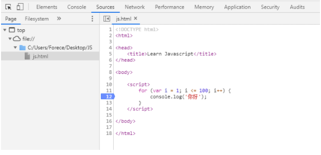

## Window Object Methods

Window Object 代表浏览器中打开的窗口，常用方法有：

```
alert("I am Wilson.");  //弹窗显示
prompt("I am Wilson.");  //弹窗可以输入

addEventListener()

setInterval(执行函数名字，间隔时间)；   //每个0.5秒执行一次sayHi
clearInterval();    // 停止interval

```

wiondow 的属性也都是object，常见的有:Console, Document, LocalStorage, SessionStorage

- console 方法

```
console.log();
console.error();
```

- document 方法

```
addEventListener()
createElement()

getElementByld("id名字")
getElementByClassName("class名字")

querySelector();    //只会抓第一个满足条件的元素
let secondH1 = document. querySelector ("h1. second") ;
console. log(secondH1);

querySelectorAlI()  //可以抓到所有满足条件的元素
```

## Arrow Function Expression
```
let sayHi = () => {
console. log("Hi");
};
```

这里使用this，指的是Window object。

## forEach
```
let luckyNumbers= [7, 15, 23, 66, 91, 10, 13];

luckyNumbers.forEach(function checkNum(n) {
        if (n › 20) {
            console.log(n);
        }
})

// forEach function takes one parameter - function

luckyNumbers.forEach( (n, index) => {
        if (n › 20) {
        console.log(n);
        console.log(n + "is at index number" + index);
});
```

~~~js
// innerHTML, innerText

let h1 = document.querySelector("h1.myH1");
h1.innerHTML = "My name is Wilson";
h1.innerHTML = ‹mark>I am Wilson.</mark>";
h1.innerTest = ‹mark>I am Wilson.</mark>";
~~~


# 一、Javascript 概述

## 1. JS 简介

Javascript，简称 JS， 是一种客户端脚本语言，主要用来向 HTML 网页添加各种动态效果。

作者是 Brendan Eich , 10天完成 Javascript 设计，网景公司初始名为 Livescript，后来和 Sun 合作，改名为 Javascript


Javascript 是一种可以在客户端运行的脚本语言，不需要进行编译

- 编译型语言需要将所有代码在编译器中进行编译再转换为机器语言让CPU运行
- 解释型语言通过解释器逐行转换为机器语言执行


Javascript 可以做什么？

- 表单动态校验（密码强度检测） 也是 JS 产生最初的目的
- 网页特效
- 服务端开发（Node.js）
- 命令行工具（Node.js）
- 桌面程序 (Electron)
- App (Cordova)
- 控制硬件-物联网 (Ruff)
- 游戏开发 (cocos2d-js)


## 2. JS 组成

- ECMAscript - Javascript 语法
- DOM - 页面文档对象模型
- BOM - 浏览器对象模型


ECMAscript

ECMAScript 是 ECMA 国际进行标准化的一门编程语言，往往被称为 Javascript 或 JScript，实际上后两者是 ECMAScript 的是实现和扩展


DOM - 页面文档对象模型

文档对象模型（Document Object Model）通过 DOM 提供接口可以对页面上的各种元素进行操作（大小、位置、颜色）


BOM - 浏览器对象模型

浏览器对象模型（Browser Object Model），可以对浏览器窗口进行互动的对象结构，通过BOM可以操作浏览器窗口，比如弹窗、控制浏览器跳转、获取分辨率等。


# 二、JS 基本使用

## 1. JS 嵌入方式

在 HTML 中使用 JS 可以用以下几种方式实现：

- 行内式
- 内嵌式
- 外部引用 js 文件


行内式，可以在 html 元素中直接用使用 js 语句，但是一般都是调用函数或简短的语句。

```
<input type="button" value="Click Me!" onclick="alert('Hellow World')">
```


内嵌式，一般用于实现比较小的功能，代码不长的情况

```
<script>
    alert('Hello World');
</script>
```


外部JS文件，最常见的方式

```
<script src="my.js"></script>
```


## 2. JS 注释

```
// 单行注释    
/*  多行注释 */
```


## 3. JS 输入输出语句

```
alert(msg)  // 浏览器弹出框
console.log(msg)  // 浏览器控制台打印输出信息
prompt(info)  // 浏览器弹出输入框，用户可以输入
```


# 三、变量

## 1. 定义

变量是程序在内存中申请的一块用来存放数据的空间。通过变量名称我们可以使用或修改保存在系统中的对应的数据。


## 2. 声明变量

Js 是一种弱类型或者说动态语言，不用提前声明变量的类型，变量的类型会自动判断。即使赋值之后，变量的类型根据重新赋值的数据类型同样进行改变。

~~~js
var age;  // 声明一个名称为age的变量
age = 12;  // 给age这个变量赋值为12
~~~


通常声明与赋值一起使用：

~~~js
var age = 12;
~~~


## 3. 初始化变量

~~~js
var age = 12
var name = 'Tom'
name = 'OO'  // 再次给相同变量赋值则不用 var 进行初始化
var a = 10, b = 20, c = 30;  // 可以同时声明多个变量
~~~


## 4. 输入存储变量

~~~js
var name = prompt('请输入你的名字')
alert(name)
~~~


## 5. 变量的命名规范

- 由字母、数字、下划线、$符号组成，不能以数字开头
- 不能是关键字和保留字，例如：for,while,this,name
- 区分大小写
- 变量名必须有意义
- 小驼峰命名法，如：`myName`  
- 建议不要用$作为变量名


## 6. 查看变量

~~~js
alert(变量名)  // 弹出框显示
console.log(变量名)  // 控制台显示
document.write(变量名)  // HTML 页面上显示
~~~


# 四、数据类型

## 1. 数字型

~~~js
3  // 十进制
010  // 八进制
0xa  // 十六进制
3.14  // 小数
NaN  // 非数字 Not a Number
~~~


数字型范围：

~~~js
console.log(Number.MAX_VALUE);  // 1.7976931348623157e+308
console.log(Number.MIN_VALUE);  // 5e-324
~~~


## 2. 字符串型

~~~js
var str1 = '这是个字符串';
~~~


字符串转义符：

~~~js
\n  // 换行
\r  // 回车
\\
\'
\"
\t
\b  // 空格
\xnn  // 16进制字符，如 \x41 代表 'A'
\unnn  // 16进制 unicode 字符， 如 \u03a3 代表∑
~~~


字符串长度：

用 `变量.length` 可以得到字符串长度，如：

~~~js
var str1 = 'hello world'
console.log(str1);  

// 输出结果：11
~~~


字符串拼接：

~~~js
var str = str1 + str2;
var str = '字符串' + 123;  // 输出字符串123，字符串拼接其他类型会自动转换为字符串
var str = 'My age is' + age + 'years old';  // 字符串+变量拼接
~~~

>只要与字符串做加法运算都会被转换成字符串


字符串中的双引号和单引号：

~~~js
var str = "他是'程序猿'";
~~~


## 3. 布尔型

布尔型 Boolean 只有两个值，一个是  true， 一个是 false

~~~js
console.log(1 + true);  // 在运算中，true代表1
console.log(1+ false);  // false 代表0
console.log('t' + true);  // 在字符串拼接，会直接以字符串形式拼接 ttrue
~~~


## 4. null 空值

~~~js
console.log(null+ 'pp');  // 会拼接字符串 nullpp
console.log(null + true);  // 会输出 1
~~~


null表示"没有对象"，即该处不应该有值。

- 作为函数的参数，表示该函数的参数不是对象。

- 作为对象原型链的终点。


## 5. undefined 未定义

一个声明后没有被赋值的变量会有一个默认值 undefined

~~~js
console.log(undefined + 'pp');  // 会拼接字符串 undefinedpp
console.log(undefined + true);  // 会输出 NaN
console.log(undefined + 1);  // 会输出 NaN
~~~


- 变量被声明了，但没有赋值时，就等于undefined。

- 调用函数时，应该提供的参数没有提供，该参数等于undefined。

- 对象没有赋值的属性，该属性的值为undefined。

- 函数没有返回值时，默认返回undefined。


**undefined 和 null 的区别**

只设置了null作为表示"无"的值。根据C语言的传统，null被设计成可以自动转为0。JavaScript的最初版本是这样区分的：null是一个表示"无"的对象，转为数值时为0；undefined是一个表示"无"的原始值，转为数值时为NaN。

- undefined和null在if语句中，都会被自动转为false


## 6. 其他类型

- 数组
- 对象


## 7. 数据类型转换

### 7.1. typeof() 查看数据类型

~~~js
var num = 1;
console.log(typeof num);
console.log(typeof(num));  // 也可以使用参数的形式查看
~~~

> null 返回的是 object


### 7.2. 转换为字符串

~~~js
var num = 1;
alert(num.toString());  // 无法用 .toString() 方法转换 undefined 和 null
alert(String(num));  // 可以转换 undefined 和 null
alert(num + '');
~~~


### 7.3. 转换为数字型

~~~js
// 转换为整型
parseInt(num);
parseInt('3.14');  // 取整为3
parseInt('90px');  // 去掉单位（只取int遇到字符串自动中断）
parseInt('rem120px')  // 字符串转换后变为 NaN
parseInt(undefined)  // undefined 转换后变为 NaN
parseInt(null)  // 转换后为0
parseInt(true)  // 布尔型转换后变为 1 或 0 

// 转换为浮点型
parseFloat(num);
parseFloat(3);  // 还是输出3，不会自带小数点，3.0也是一样

// 强制转换
Number(num);

// 隐式转换，可以用 - * / （加号正能用作正负值将字符串转为数字型，如果用在变量后边则变为拼接字符串）
console.log(+'100')
console.log('123' - 120);
console.log('t' - 120);  // 输出 NaN
~~~


### 7.4. 转换为布尔型

代表空、否定的值都会被转换为 false，如：0，''，NaN，null，undefined
其余值都会被转换为 true

~~~js
Boolen('abc');  // 返回 True
Boolean(0);  // 返回 False
~~~


# 五、Javascript 运算符

表达式：任何能代表值的式子

~~~
var a = 10, b=20;
var c = a + b; // a + b 就是表达式
~~~


## 1. 算数运算符

~~~js
+ - * / %
~~~


浮点数运算精度问题，尽量避免用浮点数直接进行运算

~~~js
console.log(0.1 + 0.2);  // 0.30000000000000004
console.log(0.07 * 100);  // 7.000000000000001

var num = 0.1 + 0.2;
console.log(num == 0.3); // false
~~~


## 2.  递增递减运算符

~~~js
++i;  // 前置递增（先自加后返回）
--i;  // 前置递减

var i = 1;
console.log(++i + 10);  // 11 （先自加，然后参与运算）

i++;  // 后置递增（先返回值，后自增）
i--;  // 后置递减

var i = 1;
console.log(i++ + 10);  // 20 （先运算，后自加）
console.log(i);  // 2
~~~


前置后置递增进阶：

~~~js
var e = 10;
var f = e++ + ++e;
consolo.log(f);  // 22（e++ 返回 10，然后e自增为11，++e 返回12）
~~~


## 3. 比较运算符

比较运算符，是两个数据进行比较时所使用的运算符，比较运算后，会返回一个布尔值（true / false）作为运算结果。

~~~js
// 普通比较运算符
<
>
>=
<=
==  // 不会比较数据类型 (18 == '18' 为真)
=== // 会比较数据类型
!=
!== // 全不等（包括数据类型）
~~~

> - 比较运算符两侧表达式先转为布尔型再进行比较
> -  '0' 用 Boolen() 做判断的时候是 true，但是用 == 比较运算符和布尔值比较的时候 '0' 是 false，但 '0' == 0 是真
> - undefined 和 null 在 Boolen() 做判断的时候是 flase，但是用 == 比较的时候他们不等于 false
> - NaN 和任何值都不相等，包括它本身，即 NaN == NaN 为假


## 4. 逻辑运算符

| 逻辑运算符 | 说明   |
| ---------- | ------ |
| &&         | 逻辑与 |
| \|\|       | 逻辑或 |
| !          | 逻辑非 |


- 如果只是普通逻辑运算（两侧都是布尔型），返回的还是布尔型
- 与 undefined, null 做 && 运算返回 undefined, null
- !1 返回 false


### 4.1. 逻辑运算短路

逻辑与运算短路

~~~js
// 当表达式1和2为真时，返回表达式2
console.log(123 && 456);  // 返回456

// 当表达式1为假时，直接返回表达式1
console.log(0 && 456);  // 返回0
~~~


逻辑或运算短路

~~~js
// 当表达式1为真，则返回表达式1
// 当表达式1为假，则返回表达式2

var num = 1;
console.log(123 || num++);
console.log(num);  // 1
~~~


## 5. 赋值运算符

~~~js
num += 2;  // 相当于 num = num + 2
num -= 1;
num *= 1;
num /= 1;
~~~


## 7. 运算符优先级

| 运算符                             | 结合性   | 优先级 |
| ---------------------------------- | -------- | ------ |
| .、[ ]、( )                        | 从左到右 | 最高   |
| ++、--、-、！、new、typeof         | 从右到左 |        |
| *、/、%                            | 从左到右 |        |
| +、-                               | 从左到右 |        |
| ＜、＜=、＞、＞=、in、instanceof   | 从左到右 |        |
| ==、!=、===、!==                   | 从左到右 |        |
| &&                                 | 从左到右 |        |
| II                                 | 从左到右 |        |
| ?:                                 | 从右到左 |        |
| =、*=、/=、％=、+=、-=、&=、^=、!= | 从右到左 |        |
| ,                                  | 从左到右 | 最低   |


任何写这种式子的人都是神经病：

~~~js
var s = 4 >= 6 || 'a' != 'b' && !(12 * 2 == 144) && true
console.log(s)  // true
~~~

- 赋值运算符优先级最低，先不用看它
- 然后是逻辑运算符 || 和 &&，从左到右开始
- 4 >= 6 为 false，所以看右侧返回值
- 右侧的三个 && 返回的都是 true，最后表达式返回 true

> 如果最右侧表达式是数值的话，则返回数值


# 六、流程控制

## 1. 顺序结构

~~~js
A -> B -> C
~~~


## 2. 选择结构

### 2.1. if 分支结构

单分支结构

~~~js
if (条件表达式) {
    // 执行语句
}
// 其他代码
~~~

- 当条件表达式为真时，程序进入分支，执行完毕后，继续执行其他代码
- 当条件表达式为假时，程序直接跳过条件分支，执行其他代码


双向分支

~~~js
if (条件表达式) {
    // 执行语句
} else {
    // 执行语句
}

// 其他代码
~~~

- 当条件表达式为真时，程序进入分支，执行完毕后，继续执行其他代码
- 当条件表达式为假时，程序执行 else 代码块中的代码，执行完毕后再执行其他代码


多分支结构

~~~js
if (条件表达式1) {
    // 执行语句1
} else if (条件表达式2) {
    // 执行语句2
} else {
    // 执行语句3
}
// 其他代码
~~~

- 如果满足条件表达式1，则执行执行语句1，直接跳出

- 如果不满足，则判断条件表达式2，为真则执行语句2，不为真则去执行 else

> 多分支语句只是多选一，最后只有一个语句执行


例：判断分数

~~~js
var score = promot('请输入分数：')
if (score >= 90) {
    alert('优')
} else if (score >= 80) {
    alert('良')
} else if (score >= 60) {
    alert('中')
} else {
    alert('差')
}
~~~


### 2.2. 三元运算符

如果条件表达式结果为真，则返回表达式1,的值，否则返回表达式2的值

~~~js
条件表达式 ? 表达式1 : 表达式2
~~~


~~~js
//输入一个 0~59 数字，如果小于10，则在数字前边补0
var time = prompt('请输入一个0~59的数字');
console.log(time<10 ? '0' + time : time);
~~~


### 2.3. Switch

~~~js
switch(表达式){
    case value1:
        // 执行语句1
        break;
    case value2:
        // 执行语句2
        break;
    default:
        // 如果无条件满足，最终执行语句
}
~~~

> 开发中表达式通常写为变量，变量值需要和 case 的 value 值全匹配，值和数据必须完全一致


**Switch 与 IF 区别**

1. switch...case 语句通常处理 case 为比较确定值的情况，if...else语句通常用于范围判断（大于、小于）
2. switch 语句进行条件判断直接跳转到case，效率更高，if 语句是顺序判断，效率低


## 3. 循环

### 3.1. for 循环

~~~js
for(初始化变量; 条件表达式; 操作表达式){
    // 循环体
}

// 初始化变量： 用 var 声明的一个普通变量，通常用于计数器使用
// 条件表达式： 用来判断每一次循环是否继续执行，是终止的条件
// 操作表达式： 是每次循环最后执行的代码，经常用于计数器变量的更新（递增或递减）
~~~


例：输出一百句你好

~~~js
for(var i = 1; i<=100; i++){
    console.log('你好');
}
~~~


例：从0加到100

~~~js
var sum =0;
for(var i = 1; i<=100; i++){
    sum+=i;
}
~~~


### 3.2. 嵌套循环

~~~js
for (外层循环初始化变量; 外层循环表条件达式; 外层操作表达式){
    for(内层循环初始化变量; 内层循环表条件达式; 内层操作表达式){
        // 循环代码
    }
}
~~~

> 外层循环一次，内层循环执行全部


例：输出 5x5 的 *

~~~js
var str = "";
for (var i = 1; i <= 5; i++) {
    for (var j = 1; j <= 5; j++) {
        str = str + "*";
    }
    str = str + "\n";
}
console.log(str);
~~~


### 3.3. while 循环

~~~js
while(条件表达式){
    // 循环体
}
~~~


例：用 while 实现从1加到100

~~~js
var num=1;
while(num<=100){
    console.log(num);
    num++;
}
~~~

> while 循环一般需要配一个计数器，然后再循环体内设置一个终止循环，否则会陷入死循环


### 3.4. do while 循环

~~~js
do {
    // 循环体
} while(条件表达式)

~~~

> 和 while 循环比，do while 循环至少需要执行一次，然后进行判断是否终止循环。


### 3.5. continue 和 break

- break 关键字用于直接跳出循环
- continue 关键字用于立即跳出本次循环，进入下一次循环


### 3.6. 断点调试

在 Chrome 中 F12 进入调试模式，进入 Sources，在代码行数下断点，然后刷新则会进入到断点




# 七、数组

数组可以把一组相关的数据一起存放，并提供方便的访问方式。


## 1. 创建数组

~~~js
// 利用对象创建数组
var arr = new Array();

// 利用 [] 快捷创建数组
var arr = [];
var arr = [1, 2, 3, 'Pink', True];
~~~


## 2. 访问数组元素

数组可以通过索引来访问、设置、修改对应的数组元素，可以通过 “数组名[索引]“ 的方式来获取数组中的元素。

~~~js
var arr1 = ['张三', '李四', '王五', '淑芬'];
// 索引号：   0       1      2      3

console.log(arr1);  // 输出整个数组所有元素
console.log(arr1[0]);  // 使用 数组名[索引号] 获取数组数组内指定元素的值
~~~


## 3. 遍历数组

~~~js
arr= ['a', 'b', 'c', 'd'];
for (var i = 0; i <= 3; i++) {
    console.log(arr[i]);
}
~~~


## 4. 数组长度属性 length

~~~js
arr= ['a', 'b', 'c', 'd'];
console.log(arr.length);  // 输出4
~~~


利用 length 添加新的数组元素

~~~js
arr = ["a", "b", "c", "d"];
arr[arr.length] = 'e';
console.log(arr[arr.length - 1]);

// 输出结果
e
~~~


## 6. 冒泡排序

~~~js
var arr = [5, 4, 3, 2, 1];
for (var i = 0; i < arr.length - 1; i++) { // 外层循环
    for (var j = 0; j <= arr.length - i - 1; j++) {
        if (arr[j] > arr[j + 1]) {
            var temp = arr[j];
            arr[j] = arr[j + 1];
            arr[j + 1] = temp;
        }
    }
}
console.log(arr);
~~~


## 八、函数

## 1. 声明函数

~~~js
// 声明函数
function 函数名(){
    // 函数内部代码，又称为函数体
}

// 调用函数
函数名();  
~~~


例：将1~100 累加封装成函数

~~~js
function sum(){
    var sum = 0;
    for(var i=1; i<=100; i++){
        sum = sum+i;
    }
    console.log(sum);
}
sum();
~~~


## 2. 函数参数

~~~js
function 函数名(形参1, 形参2){
    // 函数体
}
函数名(实参1, 实参2);
~~~


函数调用参数实例：

~~~js
function cook(arg){
    console.log(arg);
}
cook('炒米饭');
~~~


- 如果调用函数的时候，实参个数大于形参，则只会以形参个数为准
- 如果调用函数的时候，实参个数小于形参，未使用的形参值为 undefined


## 3. return 返回值

函数执行完毕后，只完成里边的代码，如果我们想要获取到函数运行中产生的数据，就需要用到返回值。

~~~js
function getResult(){
    return 666;
}
console.log(getResult());
~~~


- return 会终止函数并只会返回一个值，返回的是最后一个值

- 如果函数没有 return 则会返回 undefined


## 4. 不定参数传递

~~~js
function test(){
    console.log(arguments);
}
test(1,2,3,4,5);

// 输出结果
[1, 2, 3, 4, 5, callee: ƒ, Symbol(Symbol.iterator): ƒ]
~~~


伪数组：

1. 具有数组 length 属性

2. 按照索引方式进行存储

3. 它没有真正数组的一些方法： pop(), push()


## 5. 函数中调用函数

~~~js
function test1(){
    console.log('test1');
}

function test2(){
    test();
    console.log('test2');
}

test2();
~~~


## 6. 匿名函数

匿名函数没有名字

~~~js
function(){
    // 代码块
}
~~~


调用匿名函数：

用小括号的方法实现函数的自调用，注意，这种调用方法只能调用一次

~~~js
(function(){
    console.log('hello world');
})();
~~~


还可以将匿名函数赋值给一个变量，当给这个变量加上() 的时候，就相当于调用了这个函数

~~~js
fn = function (x, y) {
    return x + y;
};
console.log(fn(1, 2));
~~~


## 7. 将函数当做参数

~~~js
var f1 = function () {
    return 100;
};
var f2 = function (fun) {
    console.log(f1());
};
f2(f1);

// 输出结果
100
~~~


# 九、作用域

全局变量：

- 变量在`<script>`标签之内，或者是一个单独js文件
- 如果在函数内部没有声明的变量也属于全局变量（即在函数内部可以使用外部的变量）
- 浏览器关闭才会销毁


局部变量：

- 变量声明在函数内部

- 函数的形参也可以看做是局部变量

- 函数执行完毕就会销毁

  

链式作用域：

- 函数内部可以调用父集中的变量


~~~js
var num = 10;
function fn(){
    var num = 20;
    
    function fun(){
        console.log(num);  // 链式作用域，找父集中的变量，如果没有再找上级
    }
}
~~~


# 十、解析机制

## 1. 预编译

js 引擎会把 js 里边所有的 var 提升，然后再提升 function。 提升到 **当前作用域** 的最前面，不提升赋值操作。

~~~js
console.log(num);  // undefined 因为提升了声明，没有提升赋值
var num = 10; 

// 相当于
var num;
console.log(num);
num = 10;
~~~


~~~js
fun();  // 报错，同理
var fun = function(){
    console.log(22);
}
~~~


~~~js
fn();  // 函数声明已经提升到最前边，所以可以执行。
function fn(){
    console.log(1);
}
~~~


~~~js
var f1 = 100;
function(f1){
    console.log(200);
}
console.log(f1);


// 实际执行顺序
var f1;
function f1(){
    console.log(200);
}
f1 = 100;
console.log(f1);

最后输出 100
~~~


函数内部的 var 声明只会提升到函数开头，而不会跳出函数到全局。

~~~js
// console.log(num);  会报错
show();  // 可以运行，因为函数声明被提升
function show() {
    // 显示 undefined，已经声明但是没有提升赋值
    console.log(num);
    var num = 1;
    console.log(num);
}
~~~


~~~js
var a = b = c = 9; 

// 相当于 
var a = 9; b = 9; c = 9;

// 即
var a;
a = 9;
b = 9;
c = 9;
~~~


## 2. 报错机制

js 运行顺序是先进行预编译，之后代码一行一行按顺序执行，如果出现错误：

- 预编译出现错误，当前 script 标签中的整个代码都不执行，寻找下一个 script 标签
- 执行过程中出现错误，当前 Script 标签中，执行出错之前的代码，之后代码不执行。然后寻找下一个 script 标签


# 十一、对象

## 1. 创建对象

- 利用字面量创建对象
- 利用 Object 方法创建对象


使用字面量创建对象：

~~~js

var obj = {
    uname: "Tom", // 属性以键值对形式存在，不用 var 声明
    'age': 18,
    sex: "male",
    sayHi: function () {
        console.log("hi");
    }
}
console.log(obj.age);
obj.sayHi();
~~~

> 对象的属性名可以不加引号


使用 new Object 方法创建对象

~~~js
// 利用 new Object 创建对象
var obj = new Object();
obj.uname = 'Tom';
obj.saiHi = function(){
    console.log('Hi');
}
~~~


## 2. 调用对象中的属性和方法

~~~js
// 调用属性
obj.uname;
obj['age'];

// 调用方法
obj.sayHi();
~~~


给对象属性重新赋值：

~~~js
obj.uname = 'zhangsan';
obj['age'] = 18;
~~~


## 3. 构造函数创建对象

自己创建一个函数，利用传参的方式构建对象的属性和方法。

~~~js
function 构造函数名(参数1, 参数2, 方法1 ...){
    this.属性 = 值;
    this.方法 = function(){
        // 代码块
    }
}
~~~


例：

~~~js
function Star(uname, age, sex){  // 构造函数命名大驼峰
    this.name = uname;
    this.age = age;
    this.sex = sex;
}

var person = new Star('Luis', 18, 'Male');
console.log(person.name);
~~~


new 关键字创建对象的执行顺序

1. 在内存中创建一个新对象

2. 让 this 指向这个新对象，this 就是这个函数所要创建的对象

3. 执行构造函数里边的代码，给这个新对象添加属性和方法

4. 返回这个对象


this 指向

- 构造函数中，this 指向所要创建的对象实例
- 普通函数中，this 指向 window


### 4. for...in 遍历对象

~~~js
for(变量 in 对象){
    // 代码块
}
~~~

> 数组也可以使用 for..in 来进行遍历


~~~js
var obj = {
    uname: "Tom", 
    age: 18,
    sex: "male",
}
for (var k in obj) {
    console.log(k);
    // 因为 k 是变量，所以只能用 obj[k] 的方式
    // 如果使用 obj.k ，那么就会去寻找 obj 中的 k 属性（并不会自动将变量k解析成对应的字符串）
    console.log(obj[k]);
}

// 输出结果：
uname
Tom
age
18
sex
male
~~~


## 5. 内置对象

内置对象是 JS 内部已经做好的对象，方便用户调用


### 5.1. Math 数学对象 

https://developer.mozilla.org/zh-CN/docs/Web/JavaScript/Reference/Global_Objects/Math

~~~js
console.log(Math.PI);
console.log(Math.max(1,2,3,45));  // 取多个值中的最大数
Math.min(1,2,3);
Math.floor(3.4);  // 向下取整 3
Math.ceil(3.4);  // 向上取整 4
Math.round(1.1);  // 四舍五入
Math.abs(-3);  // 取绝对值 3
Math.pow(10,2)  // 10的2次方
Math.sqrt(100)  // 开平方
Math.random();  // 生成0~1之间的随机小数 [0，1) === 左闭右开区间
~~~


~~~js
// 生成一个区间的随机整数
function getRandom(min, max){
    return Math.floor(Math.floor(Math.random() * (max - min +1)) + min;
}

// 原理：
0 ~ 100
Math.random() * 100  // 乘100提升范围

100~200
Math.random() * 100 + 100  // 加100提升基数

0~200
Math.random() * (300-100)

100~300
Math.random() * (300-100) + 100
~~~


### 5.2. Date 日期对象

https://developer.mozilla.org/zh-CN/docs/Web/JavaScript/Reference/Global_Objects/Date


Date 是一个构造函数，需要使用 new 来创建对象

~~~js
var date = new Date();
console.log(date);  // Wed Apr 21 2021 19:34:46 GMT+0800
date.getFullYear();  // 返回当前年份
date.getMonth();  // 返回的月份小1月
date.getDate();  // 返回几号
date.getDay();  // 返回周几，周一是1，周日是0
date.getHours();
date.getMinutes();
date.getSeconds();

// 获得总毫秒数从1970年1月1日（时间戳）
date.valueOf();
date.getTime();  

// H5 浏览器可以直接用 date 中的方法获取时间戳
var now = Date.now()

// 不支持 HTML5 的浏览器可以使用下面的方式获得时间戳
var now = +new Date()
~~~


获得指定日期对象

~~~js
var date = new Date(1619005441955);  // 传入时间戳
var date = new Date(2015, 4, 1);  // 传入年、月、日（月份从0开始计数）
var date = new Date("2020-5-10");  // 字符串方式传入年-月-日
~~~


转换成字符串

~~~js
toString()
~~~


例：将时间对象整理为 "2020-04-15 11:47:30"的格式

~~~js
      // 2020-04-21 20:01:01
      function time() {
        var now = new Date();
        var year = now.getFullYear();
        var month = now.getMonth();
        var date = now.getDate();
        var hour = now.getHours();
        var min = now.getMinutes();
        var sec = now.getSeconds();

        // 补0仓做
        month = month < 10 ? "0" + month : month;
        date = date < 10 ? "0" + date : date;
        hour = hour < 10 ? "0" + hour : hour;
        min = min < 10 ? "0" + min : min;
        sec = sec < 10 ? "0" + sec : sec;

        return (
          "" +
          year +
          "-" +
          month +
          "-" +
          date +
          " " +
          hour +
          ":" +
          min +
          ":" +
          sec
        );
      }
      console.log(time());
~~~


### 5.3. 数组对象

https://developer.mozilla.org/zh-CN/docs/Web/JavaScript/Reference/Global_Objects/Array


#### new Array() 创建数组

~~~js
var arr1 = new Array(2);  // 创建长度为2的空数组
var arr2 = new Array(2,3);  // 创建一个[2,3]的数组
~~~


#### isArray() 验证是否是数组

~~~js
console.log(arr instanceof Array);
console.log(Array.isArray(arr));
~~~


#### push() 在数组结尾添加元素

- push 可以给数组结尾追加新的元素

- push() 参数直接写需要添加的数组元素

- push 完毕之后，返回的结果是新数组的长度

- 原数组会发生改变

  

~~~js
arr = [1, 2, 3];
t = arr.push(4, "pink");
console.log(t);
console.log(arr);

// 输出结果
5
[1, 2, 3, 4, "pink"]
~~~


例：遍历数组中大于2000的数值

~~~js
var arr = [800, 1500, 2010, 3100, 5000, 1800];
var newArr = [];
for (var i = 1; i <= arr.length; i++) {
    if (arr[i] > 2000) {
        // newArr[newArr.length] = arr[i];
        newArr.push(arr[i]); // 可以直接用 push 代替上方代码
    }
}
console.log(newArr);
~~~


#### unshift() 在数组头部添加元素

和 push 类似，只不过 unshift 是在数组开始处插入元素，返回值为新数组的长度

~~~js
arr = ["black", "white", "orange"];
t = arr.unshift("red");
console.log(t);
console.log(arr);

// 输出结果
4
["red", "black", "white", "orange"]
~~~


#### pop() 删除数组末尾元素

使用 pop() 可以删除数组最后一个元素， 返回值为删除的元素

~~~js
arr = ["black", "white", "orange"];
t = arr.pop();
console.log(t);
console.log(arr);

// 输出结果
orange
["black", "white"]
~~~


#### shift() 删除数组起始元素

~~~js
arr = ["black", "white", "orange"];
t = arr.shift();
console.log(t);
console.log(arr);

// 输出结果
black
["white", "orange"]
~~~


#### reverse() 数组逆序

~~~js
arr = ["black", "white", "orange"];
arr.reverse();
console.log(arr);

// 输出结果
["orange", "white", "black"]
~~~


#### sort() 排序

~~~js
arr = ["n", "b", "z", "a", "j", "x"];
arr.sort();
console.log(arr);

// 输出结果
["a", "b", "j", "n", "x", "z"]
~~~


sort() 对于数值的排序只按第一个字符排序，不会按值大小排序。如：

~~~js
arr = [1, 11, 4, 2, 21, 24, 3];
arr.sort();
console.log(arr);

// 输出结果
[1, 11, 2, 21, 24, 3, 4]
~~~


解决方案：

sort 方法里边可以传一个 compareFunction 匿名函数，函数中有两个参数 a, b。

- a 和 b 代表两个用于比较的元素

- 当 `compareFunction(a, b)` 小于 0 ，那么 a 会被排列到 b 之前；
- 如果 `compareFunction(a, b)` 大于 0 ， b 会被排列到 a 之前。

~~~js
arr = [1, 11, 4, 2, 21, 24, 3];
arr.sort(function (a, b) {
    return a - b;  // 升序排列
    // return b - a;  // 降序排列
});
console.log(arr);
~~~


#### indexOf(), lastIndexOf() 通过值获取索引

- indexOf() 返回在数组中可以找到一个给定元素的第一个索引，如果不存在，则返回-1

- lastIndexOf() 返回指定元素在数组中的最后一个的索引，如果不存在则返回 -1。从数组的后面向前查找

~~~js
var arr = ["Red", "Blue", "Yellow", "Orange", "PINK", "Blue"];
console.log(arr.indexOf("Blue")); // 只返回第一个找到的索引，找不到返回 -1
console.log(arr.lastIndexOf("Blue"));

// 输出结果
1
5
~~~


例：数组去重

~~~js
function unique(arr) {
    var newArr = [];
    for (var i = 0; i < arr.length; i++) {
        if (newArr.indexOf(arr[i]) === -1) {
            // 检测新数组中是否存在
            newArr.push(arr[i]); // 如不存在则 push 进新数组
        }
    }
    console.log(newArr);
}
var arr = [800, 800, 2010, 1800, 3100, 700, 3100, 5000, 1800];
unique(arr);
~~~


#### toString() 转字符串

返回一个字符串，表示指定的数组及其元素

~~~js
var arr = [1,2,3,'pink'];
console.log(arr.toString());  

//输出结果
1,2,3,pink
~~~


#### join() 连接数组元素

join() 方法将一个数组（或一个类数组对象）的所有元素连接成一个字符串并返回这个字符串。如果数组只有一个项目，那么将返回该项目而不使用分隔符。

~~~js
const elements = ['Fire', 'Air', 'Water'];

console.log(elements.join());
// expected output: "Fire,Air,Water"

console.log(elements.join(''));
// expected output: "FireAirWater"

console.log(elements.join('-'));
// expected output: "Fire-Air-Water"
~~~


#### concat() 连接数组

concat() 方法用于合并两个或多个数组。此方法不会更改现有数组，而是返回一个新数组。

~~~js
const array1 = ['a', 'b', 'c'];
const array2 = ['d', 'e', 'f'];
const array3 = array1.concat(array2);

console.log(array3);
// expected output: Array ["a", "b", "c", "d", "e", "f"]
~~~


#### slice() 截取数组

slice() 方法返回一个新的数组对象，这一对象是一个由 begin 和 end 决定的原数组的浅拷贝（包括 begin，不包括end）。原始数组不会被改变。

~~~js
const animals = ['ant', 'bison', 'camel', 'duck', 'elephant'];

console.log(animals.slice(2));
// expected output: Array ["camel", "duck", "elephant"]

console.log(animals.slice(2, 4));
// expected output: Array ["camel", "duck"]

console.log(animals.slice(1, 5));
// expected output: Array ["bison", "camel", "duck", "elephant"]

~~~


#### splice() 删除元素

splice() 方法通过删除或替换现有元素或者原地添加新的元素来修改数组,并以数组形式返回被修改的内容。此方法会改变原数组。


返回值：

由被删除的元素组成的一个数组。如果只删除了一个元素，则返回只包含一个元素的数组。如果没有删除元素，则返回空数组。


- 插入元素

~~~js
var myFish = ["angel", "clown", "mandarin", "sturgeon"];
var removed = myFish.splice(2, 0, "drum");
// 运算后的 myFish: ["angel", "clown", "drum", "mandarin", "sturgeon"]
// 被删除的元素: [], 没有元素被删除
~~~


- 删除元素

~~~js

var myFish = ['angel', 'clown', 'drum', 'mandarin', 'sturgeon'];
var removed = myFish.splice(3, 1);
// 运算后的 myFish: ["angel", "clown", "drum", "sturgeon"]
// 被删除的元素: ["mandarin"]

~~~


- 替换元素

~~~js
var myFish = ['angel', 'clown', 'drum', 'sturgeon'];
var removed = myFish.splice(2, 1, "trumpet");

// 运算后的 myFish: ["angel", "clown", "trumpet", "sturgeon"]
// 被删除的元素: ["drum"]
~~~


### 5.4. 字符串对象

https://developer.mozilla.org/zh-CN/docs/Web/JavaScript/Reference/Global_Objects/String


**包装对象**

字符串、数字、布尔值这三种原始类型的值，为什么会有对象调用方法？这是因为 JS 引擎会自动将原始类型的值转换为包装对象，使用之后会立即销毁。

- String 对象
- Number 对象
- Boolen 对象


~~~js
str = '123';

// 内部处理
var temp = new String('123');  // 实际上是将字符串对象化
str = temp;  // 然后将临时变量传递给str
temp = null;  // 销毁临时变量
str.length();  // 这时候 str 已经是对象了，可以调用方法
~~~


字符串不可变

~~~js
str = '1';
str = '2';
~~~

看似 str 变量从1变成了2，其实并不是 str 的变量改变，而是系统在内存中又开辟了一个空间存放数值2，然后将 str 的地址引向数据，但是原数据1还是存放在内存当中的。


#### indexOf(), lastIndexOf() 查找字符位置

和数组类似，可以将字符串也看做数组，第一个字符索引为0。


返回值：

查找的字符串 `searchValue` 的第一次出现的索引，如果没有找到，则返回 `-1`。


~~~js
// str.indexOf('要查找的字符', [起始的位置])
var str = '白日依山尽';
console.log(str.indexOf('山'));
console.log(str.lastIndexOf('山'));
~~~


例：求某个字符出现的次数和位置

~~~js
var str = "adfajiwerasdfjklweasdfawer";
var index = str.indexOf("a");
var num = 0;
while (index != -1) {
    console.log(index);
    num++;
    index = str.indexOf("a", index + 1);
}
console.log(num);
~~~


#### charAt() 按索引返回字符串

~~~js
var str = 'andy';
str.charAt(3);  // 返回index位置的字符
str.charCodeAt(3);  // 返回 index 位置的 ASCII 码
str[3];  // 获取指定位置处字符
~~~


例：遍历字符串中字符

~~~js
var str = "andy";
for (var i = 0; i < str.length; i++) {
    console.log(str.charAt(i));
}
~~~


例：统计字符串中出现次数最多的字符

~~~js
var str = "tqwerasdfwerqiuyasdfggyweasdf";
var o = {};
for (var i = 0; i < str.length; i++) {
    var chars = str.charAt(i); // 通过 charAt() 获取字符串每个字符
    if (o[chars]) {
        // 判断如果没有该字符属性，则初始化1，有则+1
        o[chars]++;
    } else {
        o[chars] = 1;
    }
}

var max = 0;
var max_str = "";
for (var k in o) {
    // k 是键名
    // o[k] 是值
    if (o[k] > max) {
        max = o[k];
        max_str = k;
    }
}
console.log(max_str);
console.log(max);

// 输出结果
w
3
~~~


#### concat() 拼接字符串

将一个或多个字符串与原字符串连接合并，形成一个新的字符串并返回。

~~~js
var str1 = "a";
var str2 = "b";
var str3 = "c";
var str4 = str1.concat(str2, str3);
console.log(str4);

// 输出结果
abc
~~~


#### substr()  按长度截取字符串

语法：

~~~js
substr(start, length);  // 从start索引位置开始，length 为取的个数，不输入 length，截取到末尾
~~~


~~~js
var anyString = "Mozilla";
console.log(anyString.substr(1,4));

// 输出结果
ozil
~~~


#### slice() 截取字符串

语法：

~~~js
slice(start, end);  // 从 start 位置开始，截取到 end 位置（不包括end）。不输入 end 默认截取到结尾
~~~


~~~js
var anyString = "Mozilla";
console.log(anyString.slice(1, 4));

// 输出结果
ozi
~~~

> 如果是负数索引，从 -1 开始计数


#### substring() 截取字符串

substring 提取从 indexStart 到 indexEnd（不包括）之间的字符。slice() 用法与 substring() 用法类似，

- slice() 方法也可以使用在数组中，并且支持负数索引
- substring() 只可以在字符串中使用，不支持负数索引


- 如果 `indexStart` 等于 `indexEnd`，`substring` 返回一个空字符串。
- 如果省略 `indexEnd`，`substring` 提取字符一直到字符串末尾。
- 如果任一参数小于 0 或为 [`NaN`](https://developer.mozilla.org/zh-CN/docs/Web/JavaScript/Reference/Global_Objects/NaN)，则被当作 0。
- 如果任一参数大于 `stringName.length`，则被当作 `stringName.length`。
- 如果 `indexStart` 大于 `indexEnd`，则 `substring` 的执行效果就像两个参数调换了一样。


语法：

~~~js
str.substring(indexStart[, indexEnd])
~~~


~~~js
var anyString = "Mozilla";
console.log(anyString.substring(-2,3));

// 输出结果
Moz
~~~


#### replace() 替换字符串

replace() 方法用于在字符串中用一些字符替换另一些字符，或替换一个与正则表达式匹配的子串。


语法：

~~~js
stringObject.replace(regexp/substr,replacement)
~~~


- 字符串替换只替换第一个匹配项目
- 批量替换需要使用正则


例：

~~~js
var anyString = "Hello World";
console.log(anyString.replace("World", "Javascript"));

// 输出
Hello Javascript
~~~


#### toUpperCase(), toLowerCase() 大小写转换

~~~js
console.log("aBc".toUpperCase());
console.log("Abc".toLowerCase());

// 输出结果
ABC
abc
~~~


## 5.5 instanceof 判断对象

使用 instanceof() 可以判断该数据或变量是否是某个对象的实例，如：

~~~js
console.log(1 instanceof Number);
var arr = [1, 2, 3, 4, 5];
console.log(arr instanceof Array);

function Student(name, age, score) {
    this.name = name;
    this.age = age;
    this.score = score;
}
var xiaoming = new Student("xiaoming", 18, 99);
// true xiaoming 是 Student 对象的实例
console.log(xiaoming instanceof Student);
// true xiaoming 也是 Object 对象的实例，因为 Student 算是 Object 的子类
console.log(xiaoming instanceof Object);

~~~


# 算法：

## 1. 交换变量的值

~~~js
// 使用第三个临时变量
var a = 1, b =2, var c;
c = a;
a = b;
b = c;

// 加减法交换
var a = 1, b =2;
a = a + b;  // a = 3  b = 2
b = a - b;  // a = 3  b = 1
b = a - b;  // a = 2  b = 1

~~~


## 2. 交换数组变量的值

~~~js
var a=1, b=2;
// 数组中先放a的值
// 第一个值确定后，执行表达式 a = b，此时 a = 2
// 但是数组第一个值已经确定下来，不影响整个数组，数组现在是 [1, 2]
// [a,a=b]  // [1, 2] a =2
// 最后只要拿到数组下标为0的值给b就完成了值的互换
b = [a, a=b][0]
~~~


## 3. 交换对象的值

~~~js
var a=1, b=2;
b = {"attr1":a, "attr2":a=b}.attr1;
~~~


