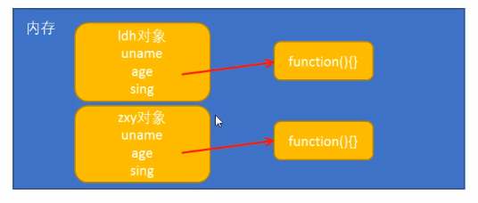
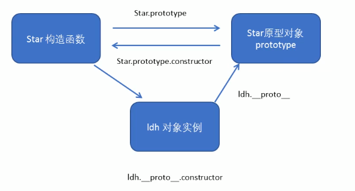
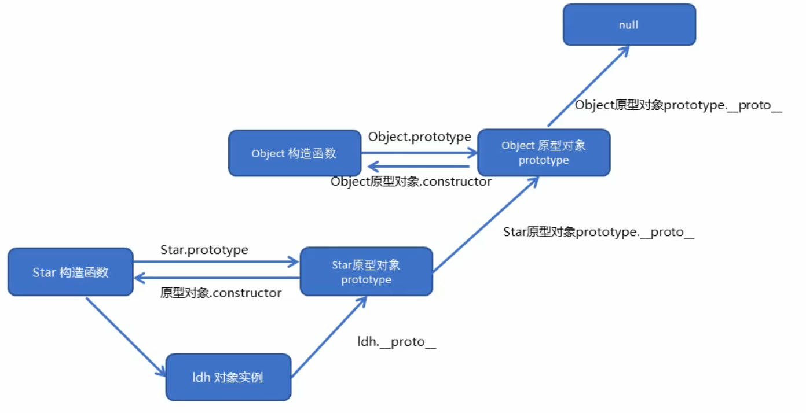
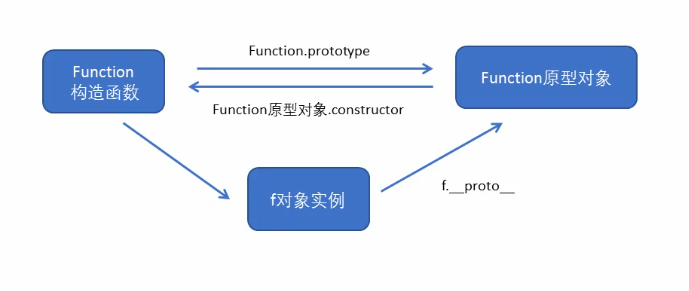
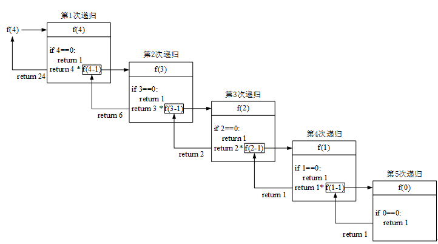
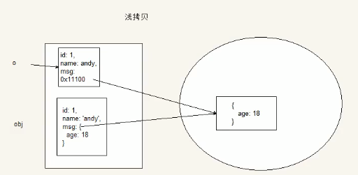
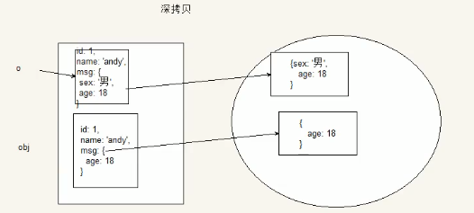
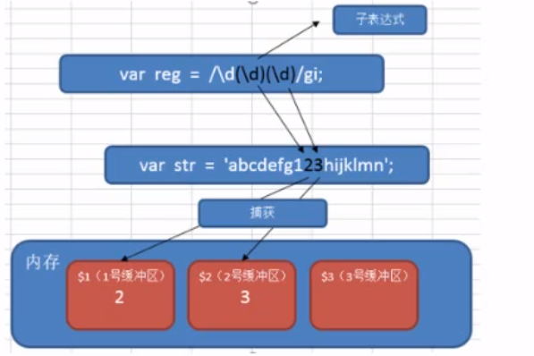
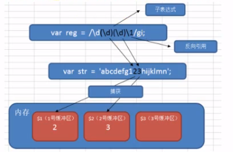

# ---------------------------------

# JS 高级编程进阶

# ---------------------------------

# 面向对象编程概念

## 1. 面向过程编程 POP

POP (Process-oriented programming) ，面向过程就是分析出解决问题所需要的的步骤，然后用函数把这些步骤一步一步实现，使用的时候在一次一次调用就可以了。

举个例子：把大象装进冰箱，面向过程的做法：

1. 打开冰箱门
2. 大象装进去
3. 关上冰箱门

## 2. 面向对象编程

面向对象是把事务分解成一个个对象，然后由对象之间分工合作。

举个例子：把大象装进冰箱，面向对象做法：

1. 大象对象
   - 进入方法

2. 冰箱对象
   - 打开
   - 关闭

3. 使用大象和冰箱的功能

面向对象想程序开发思想中，每一个对象都是功能中心，具有明确分工，面向对象具有灵活、代码可重复使用，容易维护和开发的优点，更适合多人合作。

面向对象的特性：

- 封装性（包装代码，直接调用）
- 继承性（子类拥有父类的属性和方法）
- 多态性（子类可以定义自己的独有的属性和方法，可以与父类相同方法，但不同功能）

## 3. 面向过程和面向对象的对比

面向过程

- 优点：性能比面向对象高，适合根硬件联系很紧密的东西，例如单片机就采用的面向过程编程
- 缺点：没有面向对象易维护、易复用、易扩展

面向对象

- 优点：易维护、易复用、易扩展，由于面向对象有封装、继承、多态的特性，可以设计出低耦合的系统，使系统更加灵活、更加易于维护
- 缺点：性能比面向过程低

程序简单建议使用面向过程，如果程序项目庞大，建议使用面向对象来写。

# 面向对象

面向对象更贴近我们的实际生活，可以使用面向对象描述现实世界事物，但是事物分为具体事物和抽象事物。

比如说：

- 手机就是一个抽象事物，是泛指的一个概念 
- 华为P30 PRO 128G 就是一个具体事物，特指的

 

面向对象的思维特点：

1. 抽取（抽象）对象共用的属性和行为组织（封装）成一个类（模板）
2. 对类进行实例化，获取类的对象

面向对象编程我们考虑的是有哪些对象，按照面向对象的思维特点，不断创建对象，使用对象，指挥对象做事情。

## 1. 对象

现实生活中，万物皆对象，对象是一个具体的事物，看的见摸得着的实物，例如：一本书、一个人、一辆汽车都可以是对象。一个数据库、一个网页、一个与服务器的连接对象也可以是对象

在 Javascript 中，对象是一组无需的相关属性和方法的集合，所有的事物都是对象，例如字符串、数值、数组、函数等等。

对象是由属性和方法组成的：

- 属性：事物的特征，在对象中用属性来表示（常用名词），比如手机的尺寸、重量、内存大小
- 方法：事物的行为，在对象中用方法来表示（常用动词），比如打电话、发短信

## 2. 类 class

在 ES6 中新增加了类的概念，可以使用 class 关键字声明一个类，之后以这个类来实例化对象。

- 类抽象了对象的公共部分，它泛指某一大类（class）模板

- 对象特指某一个，通过类实例化的一个具体对象

## 3. 创建类

如果多个对象拥有相同的属性和方法，一个个手动创建是实在是太累了，如：

~~~js
var student1 = {
    name: 'zx',
	age:16,
	score:80,
    sayHi:function(){
        console.log('say hi')
    }
}

var student2 = {
    name: 'ls',
	age:17,
	score:90,
    sayHi:function(){
        console.log('say hi')
    }
}
~~~

那么我们可以封装一个函数来帮助我们创建对象，如：

~~~js
function Student(name, age, score) {
    return {
        name: name,
        age: age,
        score: score,
        sayhi: function () {
            console.log("say hi");
        },
    };
}

var student1 = Student("zs", 16, 80);
var student2 = Student("ls", 17, 90);
console.log(student1);
console.log(student2);
~~~

之前学习对象的时候，我们是通过构造函数创建的对象：

~~~js
function Student(name, age, score) {
    this.name = name;
    this.age = age;
    this.score = score;
    this.sayhi = function () {
        console.log("say hi");
    };
}
var student1 = new Student("zs", 16, 80);
var student2 = new Student("ls", 17, 90);
console.log(student1);
console.log(student2);
~~~

在 ES6 中可以使用 class 关键字来创建类。

定义类：类名一般首字母大写

~~~js
class Name {
    // 定义类属性
    // 定义类方法
}
~~~

创建实例：

~~~js
class Person {
    name = 'zx';
	age = 18;
}

var xx = new Person();
~~~

> 注意，这样写只是创建普通的对象，不能够传递参数

## 4. 类 constructor 构造函数

constructor() 方法是类的构造函数（默认方法），用于传递参数，返回实例对象，通过 new 命令生成对象实例时，自动调用该方法，如果没有显示定义，类内部会自动给我们创建一个 constructor()

~~~js
class Star {
    constructor(uname, age) {
        // this.uname 是属性名，后边的 uname 是传递进来的参数
        this.uname = uname;
        this.age = age;
    }
    // 写在构造函数外部，不需要加逗号分隔
    sing(song) {
        console.log("唱" + song);
    }
}
var ldh = new Star("刘德华", 48);
console.log(ldh.uname);
ldh.sing("冰雨");
~~~

- 通过 class 关键字创建类，类名首字母大写
- 类里边有个 constructor 函数，可以接受传递过来的参数，同时返回实例对象
- constructor 函数只要使用 new 生成实例时，就会自动调用这个函数，如果不写这个函数，类也会自动生成这个函数
- 生成实例 new 不能省略
- 类名后边不需要加小括号，生成实例类名后要加小括号。

- 类里边定义的方法，不需要加 function() ，直接写上方法名，并且需要定义在构造函数外边，并且不需要加逗号分割

## 5. 静态方法

静态方法不需要实例化对象，直接使用类名.方法() 调用，只有使用类名才可以查看或调用，实例无权限查看。静态方法因为没有实例化，所以构造函数没有执行，也就是构造函数中的属性和方法没有定义。如果使用 this.age 会显示 undefined

~~~js
class Person {
    constructor() {
        this.name = "zhangsan";
        this.age = 18;
    }
    say() {
        console.log("我是zs");
    }
    // 添加静态方法
    static coding() {
        console.log("写代码");
    }
    // 添加静态属性
    static v = 10;
}

// 添加静态方法
Person.bye = function(){
    console.log('bye')
}

// 添加静态成员
Person.sex = "male";

// 只能通过类名查看和调用
Person.bye();
console.log(Person.sex);

// 实例无法查看静态属性和方法，报错
x = new Person();
x.bye();
console.log(sex)

~~~

## 5. 类的继承

现实中的继承：子承父业、比如说我们都继承了父亲的姓。

程序中的继承：子类可以继承父类的属性和方法

在 JS 中可以使用 extends 关键字继承父类

~~~js
class Father {
    constructor() {}
    money() {
        console.log(100);
    }
}
class Son extends Father {}
var son = new Son();
son.money();
~~~

### 5.1. super 关键字

当子类继承父类的方法时，还需要使用父类构造函数中的属性，那么就需要使用 super 关键字。

super 关键字用于访问和调用对象父类上的函数，可以调用父类的构造函数，也可以调用父类的普通函数。

~~~js
class Father {
    constructor() {
        this.age = 30;
    }
    say() {
        console.log(this.age);
    }
}

class Son extends Father {
    constructor() {
        // 调用父类的构造函数
        super();
        this.sex = "secret";
    }
}

var x = new Son();
x.say();
console.log(x.sex);
~~~

#### 5.1.1. super() 调用构造函数（传递参数）

~~~js
class Father {
    constructor(x, y) {
        this.x = x;
        this.y = y;
    }
    sum() {
        console.log(this.x + this.y);
    }
}
class Son extends Father {
    constructor(x, y) {
        this.x = x;
        this.y = y;
    }
}
// 这里传递的参数是子类的属性
// sum() 方法调用的是父类的属性，
// 因为子类定义了自己的构造函数，造成方法调用数据的不统一
// 使用 super() 方法让子类也调用父类的 constructor 函数
var son = new Son(1, 2);
son.sum();
~~~

> 这样写会报错

子类不用定义自己的 this.x 和 this.y ，只需要将子类中的构造函数参数中的 x 和 y 值，使用 super() 方法传递给父类中的构造函数即可。

~~~js
super(x,y)
~~~

#### 5.1.2. super() 调用普通函数

~~~js
class Father {
    say() {
        return "我是爸爸";
    }
}
class Son extends Father {
    say() {
        console.log(super.say() + "的儿子");
    }
}
var son = new Son();
son.say();
~~~

- 继承中，如果实例化子类中输出一个方法，先看子类有没有这个方法，如果子类没有就去父类去寻找
- super.方法() 可以直接调用父类中的方法

#### 5.1.3. 子类扩展方法

在子类中直接添加新的方法，就是子类独有的方法，使用 extends 同时还可以继承父类的方法。

~~~js
      class Father {
        constructor(x, y) {
          this.x = x;
          this.y = y;
        }
        sum() {
          console.log(this.x + this.y);
        }
      }
      class Son extends Father {
        constructor(x, y) {
          // 利用 super 调用父类的构造函数方法
          // super 必须在子类 this 之前调用
          super(x, y);
          this.x = x;
          this.y = y;
        }
        substract() {
          console.log(this.x - this.y);
        }
      }

      var son = new Son(1, 2);
      son.sum();
      son.substract();
~~~

> 如果子类在构造函数中使用了 super 调用父类的构造函数，那么必须放到 this 之前。先调用父类构造函数，再调用子类构造函数

## 6. 执行顺序

JS 中类不像变量和函数声明一样被预编译，所以在实例化类前，必须先定义类。

构造函数中可以直接调用类中的方法，实现当实例化类时自动执行类中的方法，如：

~~~js
class Star {
    constructor(uname, age) {
        this.uname = uname;
        this.age = age;
        // 实例化时直接调用类里边的方法
        this.sing();
    }
    sing() {
        console.log(this.uname + "唱歌");
    }
}
var ldh = new Star("刘德华", 18);
~~~

## 7. this 指向问题

constructor 里边的 this 指向实例对象，方法里边的 this 指向这个方法的调用者

如果不是对象调用类中的方法，却需要使用 this 这个对象指向的话，需要定义一个变量 that 进行引用。

~~~js
      var that;
      class Star {
        constructor(uname, age) {
          that = this;
          this.uname = uname;
          this.age = age;
          this.btn = document.querySelector("button");
          // btn.onclick 调用 sing 方法
          this.btn.onclick = this.sing;
        }
        sing() {
          // btn.onclick 调用的 sing
          // 这里的 this 实际上指向的 btn
          // 需要使用 that 才可以获得对象中的 uname 属性
          console.log(that.uname + "唱歌");
        }
      }
      var ldh = new Star("刘德华", 18);
~~~

## 案例：面向对象 TAB 栏切换

https://gitee.com/xiaoqiang001/js_advanced_material/tree/master

### 1. ES6 插入元素

之前用过 node.appendChild 和 node.inserBefore 两个方法，在插入之前先要使用 document.createElement('tagName') 创建元素，然后再用 inner.HTML 创建内容，之后再进行插入。

在 ES6 中有个新方法，insertAdjacentHTML 可以直接以字符串形式插入元素，而不用进行创建 node 节点。

语法：

~~~js
element.insertAdjacentHTML(position, text)
~~~

参数：

- position 参数
  - beforebegin 在元素前面
  - afterbegin 插入元素内部的第一个子节点之前
  - beforeend 插入元素内部的最后一个子节点之后
  - afterend 元素自身的后边

- text 是要被解析为 HTML 并插入到 DOM 树中的字符串

例：

~~~html
<ul>
    <li>测试1</li>
    <li>测试2</li>
    <li>测试3</li>
</ul>

~~~

### 2. 删除元素

element.remove() 可以直接删除元素，如：

~~~html
<ul>
    <li>测试1</li>
    <li>测试2</li>
    <li>测试3</li>
</ul>

~~~

### 3. 点击元素

element.click() 可以直接点击元素，如：

~~~js
<button>按钮</button>

~~~

### 4. && 符号的应用

判断元素是否存在，存在就执行对应方法

之前是用 if else 进行判断，其实可以用到逻辑运算符，&&。因为在&&运算时，先判断左侧表达式是否为真，如果为假则短路停止继续判断，返回 false，如果为真则继续判断右侧，返回右侧表达式值，利用这一特性，可以简单的写出判断代码。

~~~js
// 当li存在索引时（即li元素标签存在），执行 click() 
li[index] && li[index].click();
~~~

### 5. 禁止双击选中文字

~~~js
window.getSelection ? window.getSelection().removeAllRanges() : document.selection.empty();
~~~

### 6. 选中 input 文本

~~~js
<input type="text" value="测试文本" />
    
~~~

### 7. 按回车调用表单失去焦点事件

~~~html
<input type="text" value="测试文本" />

~~~

## 8. ES5 构造函数创建对象

在学 js 基础的时候，ES5 没有 class 关键字，需要使用 function 构造函数定义类。如：

~~~js
function Star(uname, age){
    this.uname = uname
    this.age = age;
    this.sing = function() {
        console.log('我会唱歌');
    }
}

// 生成实例
new ldh = new Star('刘德华', 18);
~~~

Js 构造函数创建对象过程：

1. 执行 new 创建对象时，首先创建一个空对象 var obj = {}
2. 将创建的对象，赋给 this 关键字， this  = obj
3. 将一些属性方法设置在 obj 上
4. 自动将新对象返回 return this
5. 将 return 的对象赋值给 var 变量

### 8.1.  实例成员

实例成员就是构造函数内部通过 this 添加的成员，如 this.uname, this.age 。 

- 实例成员只能通过实例化的对象来访问

~~~js
function Star(uname, age){
    this.uname = uname
    this.age = age;
    this.sing = function() {
        console.log('我会唱歌');
    }
}

// 生成实例
new ldh = new Star('刘德华', 18);

// 访问实例成员
console.log(ldh.uname)
~~~

### 8.2. 静态成员

静态成员在构造函数本身上添加的成员，如： Star.sex = 'male' 

- 静态成员只能通过构造函数来访问

~~~js
function Star(uname, age){
    this.uname = uname
    this.age = age;
    this.sing = function() {
        console.log('我会唱歌');
    }
}

// 生成实例
ldh = new Star('刘德华', 18);

// 添加静态成员
Star.sex = '男';

// 访问静态成员
console.log(Star.sex)

// 实例无法访问静态成员，显示 undefined
console.log(ldh.sex)
~~~

### 8.2. 构造函数原型 prototype

构造函数虽然很好用，但是存在浪费内存的问题，每次实例化一次对象，属性是变量，是简单数据类型。方法是函数，是复杂数据类型。所以系统会单独开辟一片空间用来存储函数。每生成一个实例，就会开一段空间给这同一个函数。

虽然可以将变量单独定义出来，用传参的方式传递进去，这样就保证了不在生成对象的同时创建函数，如：

~~~js
function Student(name, age, score, fn) {
    this.name = name;
    this.age = age;
    this.score = score;
    this.sayhi = fn;
}

fn = function () {
    console.log("say hi");
};
var student1 = new Student("zs", 16, 80, fn);
var student2 = new Student("ls", 17, 90, fn);
console.log(student1);
console.log(student2);
~~~

但是，如果每个对象都有不同的方法，如果项目很大，有多个对象，就会造成函数与对象配对困难，造成维护难度直线上升的问题。针对这个问题，我们可以通过针对每个不同构造函数，创建一个方法对象，使用这个构造函数就去对应的方法对象中取函数就可以了。

~~~js
var animalMethod = {
    say: function () {
        console.log("喵喵喵");
    },
    eat: function () {
        console.log("我吃猫粮");
    },
};

var peopleMethod = {
    say: function () {
        console.log("你好");
    },
    eat: function () {
        console.log("我吃饭");
    },
};

function Person(n, a) {
    this.name = n;
    this.age = a;
    this.say = peopleMethod.say;
    this.eat = peopleMethod.eat;
}

function Cat(n, a) {
    this.name = n;
    this.age = a;
    this.say = animalMethod.say;
    this.eat = animalMethod.eat;
}

var person1 = new Person("zx", 18);
var cat1 = new Cat("dd", 2);
person1.eat();
cat1.say();
~~~

然而 Js 已经提供了这个公共对象方法，那就是可以通过 prototype 原型来解决这个问题。Js 的每个对象都继承另一个父级对象，父级对象称为原型 （prototype），我们通过构造函数创建的实例，就继承了父级对象中的 prototype 属性。因为原型也是一个对象，原型对象上的所有属性和方法，都能被子对象（派生对象）共享。

- 每一个构造函数 Person 都自动分配了一个公共对象

- 构造函数通过 prototype 原型分配的函数是所有对象所共享的。也就是说所有通过 Person 构造函数创建的实例，都可以直接访问 Person 中 prototype 中的方法，相当于我们之前例子中为每个构造函数创建的公共方法对象。

  

JS 规定，每一个构造函数都有一个 prototype 属性，指向另一个对象，注意这个 prototype 就是一个对象，这个对象的所有属性和方法，都会被构造函数所拥有。

我们可以把那些不变的方法，直接定义在 prototype 对象上，这样所有的对象的实例就可以共享这些方法了。

~~~js
function Star(uname, age) {
    this.uname = uname;
    this.age = age;
}

Star.prototype.sing = function () {
    console.log("我会唱歌");
};

ldh = new Star("刘德华", 18);
ldh.sing();
~~~

#### 8.2.1. 构造函数原型属性  `__proto__`

任何对象都会有一个属性 `__proto__` 指向构造函数 prototype 原型对象，之所以我们对象可以是用构造函数 prototype 原型对象的属性和方法，就是因为对象有 `__proto__` 原型的存在。

`__proto__` 对象原型和原型对象 prototype 是等价的

~~~
ldh.__proto__ === Star.prototype
~~~

> 可以把 `ldh.__proto__` 看做是继承自 Star.prototype，访问 `__proto__` 就是访问父类的 Star.prototype

方法查找规则：

- 首先看 ldh 对象身上是否 有 sing 方法，如果有则执行 sing 方法 
- 如果没有，就去构造函数原型对象 prototype 身上去查看是否有 sing 方法

`__proto__` 对象原型的意义就在于为对象的查找机制提供一个方向，但是它是一个非标准属性，因此在实际开发中，不可以使用这个属性，它只是用于内部指向原型 prototype 

#### 8.2.2. constructor 构造函数

对象原型 (`__proto__`) 和构造函数（prototype）原型对象里边都有一个属性 constructor 属性，constructor 我们称为构造函数，因此它指向构造函数本身。

~~~js
function Person(name, age){
    this.name = name;
    this.age = age
}
p1 = new Person('zx',16);

// constructor 就是构造函数本身
console.log(p1.constructor == Person);  // true
console.log(p1.constructor == Person.prototype.constructor) // true
~~~

~~~js
// 因为对象中的原型属性__proto__ 和构造函数中的属性 prototype 指向一样
// 这个属性的值是一个对象，对象中又有属性和方法
// 其中一个叫做 constructor 
console.log(ldh.__prototype__.constructor)
console.log(Star.prototype.constructor)
~~~

之前给构造函数（类）添加方法用的是，这样不会破坏 prototype 对象的结构，只是给它添加了一个方法

~~~js
 Star.prototype.sing = function() {
     console.log('唱歌')
 }
~~~

如果需要直接给 prototype 以对象的方式重新定义的方式添加方法，就会失去 constructor 这个属性。

~~~js
Star.prototype = {
    sing: function() {
        console.log('唱歌')
    }
    dance: function() {
        console.log('跳舞')
    }
}
~~~

当然这么做也有好处，就是可以让代码可读性更高，将所有代码写在一个代码块中，不过我们就需要将这个 constructor 属性重新加回来，让这个属性指向构造函数本身（Star）

~~~js
Star.prototype = {
    constructor: Star,
    sing: function() {
        console.log('唱歌')
    },
    dance: function() {
        console.log('跳舞')
    }
}
~~~

### 8.3. 构造函数、实例、原型对象三者之间的关系

### 8.4. 原型链

因为 Star 是我们从 Object 顶级对象中构造出来的类，也就是说 Star 算是 Object 的子类，因此也继承了 Object 的属性和方法，因此 Star 也拥有 `__proto__` 属性。因此构成了一个原型链

### 8.5. Javascript 成员的查找机制

- 当访问一个对象的属性（包括方法）时，首先查找这个对象自身有没有该属性
- 如果没有就查找它的原型（也就是 `__proto__ ` 指向的 prototype 原型对象）
- 如果还没有就查找原型对象的原型（Object的原型对象）
- 以此类推一直找到 Object 为止（null）

### 8.6 原型对象中 this 指向

原型对象中的 this 指向的也是实例对象本身，因为按照谁调用指向谁的原则，在原型对象中的方法，最终调用者还是实例，所以，this 最终也指向实例。

~~~js
function Star(uname, age) {
    // this 指向实例对象
    this.uname = uname;
    this.age = age;
}
var that;
Star.prototype.sing = function () {
    console.log("我会唱歌");
    that = this;
};

ldh = new Star("刘德华", 18);
// ldh 调用了 this 方法
// 所以 sing 方法中的 this 就是 ldh
ldh.sing();
console.log(that === ldh);
~~~

### 8.7 扩展内置对象（更改系统对象）

可以通过原型对象，对原来的内置对象进行扩展自定义方法，比如给数组增加自定义求偶数和的功能。

比如数组是系统自带的对象，它的内部也有 prototype，通过给 prototype 添加方法，我们就可以给原生对象添加功能了。

~~~js
// 可以看到原生数组对象中包含很多方法
console.log(Array.prototype)
~~~

> 数组中也有 `__proto__` 属性，它的原生对象就是 Object.prototype，所以数组也可以使用 Object 中的一些方法

内置对象结构，如 String

~~~js
function String() {
    // 属性
}
String.prototype.toUpperCase = function(){
    
}
~~~

给 Array 内置对象添加求和功能

~~~js
Array.prototype.sum = function() {
    var sum = 0;
    for(var i = 0; i<this.length; i++){
        sum += this[i];
    }
        return sum;     
}
var arr = [1,2,3];
console.log(arr.sum());
~~~

注意扩展方法时，不要和原对象中的方法名重复，否则就会覆盖原来的方法。

### 8.8. 构造函数中的继承

继承就是多个子类对象可以共用父类对象的成员属性和成员方法（代码重用），ES6 之前并没有给我们提供 extends 继承，我们可以通过构造函数 + 原型对象模拟实现继承。

#### 8.8.1. call()

调用这个函数，并且修改函数运行时 this 的指向

~~~js
fun.call(thisArg, arg1, arg2, ...)
~~~

- thisArg：当前调用函数 this 的指向对象
- arg1,, arg2：其他参数

~~~js
function fn() {
  console.log('随便说点什么');
}

// 日常调用函数方法
fn();

// 万物皆对象，函数也是对象
// 利用函数对象中的 call 方法也可以调用函数
fn.call();
~~~

使用 call 方法修改函数中 this 的指向

~~~js
function fn() {
    console.log("随便说点什么");
    // 由于使用 call 调用的函数，并且修改了 this 指向
    // 所以现在函数中的 this 指向 o 对象
    console.log(this);
}

var o = {
    name: "Andy",
};

fn.call(o);
~~~

#### 8.8.2. 借用父构造函数继承属性

在没有 extends 关键字的时候，利用 call 实现继承

~~~js
function Father(uname, age){
    this.uname = uname;
    this.age = age;
}

function Son(uname, age){
    // 在子函数中调用父函数
    // 这里的 this 指向 Son 的实例
    // 通过 call 调用让父函数的 this 改变了指向
    // 将子函数中的 uname, age 传入父函数中
    // 最终实现继承
    Father.call(this,uname,age)
}
~~~

> 缺点：只能继承父类构造函数中设置的属性和方法，无法使用 Father.prototype 中的方法。

#### 8.8.3. 借用原型对象继承父类方法（constructor丢失？）

~~~js
// 借用父构造函数继承属性
// 1. 父构造函数
function Father(uname, age) {
    // this 指向父构造函数的对象实例
    this.uname = uname;
    this.age = age;
}
Father.prototype.money = function() {
    console.log(100000);

};
// 2 .子构造函数 
function Son(uname, age, score) {
    // this 指向子构造函数的对象实例
    Father.call(this, uname, age);
    this.score = score;
}
// Son.prototype = Father.prototype;  这样直接赋值会有问题,如果修改了子原型对象,父原型对象也会跟着一起变化
// 让父类的实例成为子类的原型
Son.prototype = new Father();；
// 赋值的形式更改 prototype，丢失 constructor
// 造成 Son 的实例对象 __proto__ 属性直接指向了 Object，应该指向的是 Son
// 如果利用对象的形式修改了原型对象,别忘了利用constructor 指回原来的构造函数
Son.prototype.constructor = Son;
// 这个是子构造函数专门的方法
Son.prototype.exam = function() {
    console.log('孩子要考试');

}
var son = new Son('刘德华', 18, 100);
console.log(son);
console.log(Father.prototype);
console.log(Son.prototype.constructor);
~~~

让父类创建一个实例，让子类继承这个实例，这样写更容易理解

~~~js
function Father(uname, age) {
    this.uname = uname;
    this.age = age;
}
Father.prototype.money = function () {
    console.log(100000);
};

function Son(uname, age, score) {
    Father.call(this, uname, age);
    this.score = score;
}
var obj = new Father();
// 让父类的实例成为子类的原型
Son.prototype = obj;
// 找回丢失的 contructor
Son.prototype.constructor = Son;
Son.prototype.exam = function () {
    console.log("孩子要考试");
};
var son = new Son("刘德华", 18, 100);
console.log(son);
// 调用父类的方法
son.money();
~~~

#### 8.8.4. 使用 Object.create() 方法继承

使用 Object.create() 创建一个新对象，并且指定其原对象，适用于通过一个对象进行继承，而不是直接定义的构造函数

~~~js
var person = {'age': 30}
var obj = Object.create(person);
console.log(obj)
~~~

相当于

~~~js
var person = {'age': 30}
var obj = new Object()
obj.__proto__ = person
~~~

## 9. 贪食蛇面向对象案例

# ES5 新增方法

## 1. 数组方法

迭代遍历方法：

- forEach()
- map()
- filter()
- some()
- every()

### 1.1. forEach()

forEach() 方法对数组的每个元素执行一次给定的函数。

语法：

~~~js
array.forEach(function(currentValue, index, arr))
~~~

- currentValue：数组当前项值
- index：数组当前项索引
- arr：数组对象本身

~~~js
var arr = ["a", "b", "c"];
arr.forEach(function (v, k, arr) {
    console.log("每个数组元素" + v);
    console.log("元素索引号" + k);
    console.log("数组本身" + arr);
});
~~~

注意：在 forEach 中如果有 return 不会终止迭代

### 1.2. filter()

filter() 方法创建一个新数组, 其包含通过所提供函数实现的测试的所有元素。 主要用于筛选数组。

语法：

~~~js
array.filter(function(currentValue, index, arr))
~~~

参数：

- currentValue: 数组当前项的值
- index：数组当前项的索引
- arr：数组对象本身

返回值：

一个新的、由通过测试的元素组成的数组，如果没有任何数组元素通过测试，则返回空数组。

~~~js
var arr = [2, 4, 6, 10, 88, 39, 22, 45];
// 用不到的参数可以不用写，可选的
var newArr = arr.filter(function (value) {
    return value >= 20;
});
console.log(newArr);

// 输出结果
[88, 39, 22, 45]
~~~

注意：filter 在迭代中遇到 return 也不会终止迭代

### 1.3. map()

map 用法和 filter 十分类似，遍历每个元素，只不过返回的是每个元素经过回调函数后返回的布尔值，如：

~~~js
var arr = [2, 4, 6, 10, 88, 39, 22, 45];
var newArr = arr.map(function (value) {
    return value >= 20;
});
console.log(newArr);

// 输出结果
[false, false, false, false, true, true, true, true]
~~~

### 1.4. some()

some() 方法用于检测数组中的元素是否满足指定条件。如果找到第一个满足条件的元素，则终止循环不再继续查找

语法：

~~~js
array.some(function(currentValue, index, arr))
~~~

参数：

- currentValue: 数组当前项的值
- index：数组当前项的索引
- arr：数组对象本身

返回值：

需要自定义 return ，布尔值（如果查找到这个元素，返回true，如果查不到就返回false）

~~~js
var arr = [2, 4, 6, 10, 88, 39, 22, 45];
// 用不到的参数可以不用写，可选的
var flag = arr.some(function (value) {
    // 一般用 if 判断，然后 return 一个 true 的布尔值
    // if (value >= 20) {
    //   return true;
    // }
    // 如果单纯的数值，直接 return 即可，比较运算符会自动给出布尔值
    return value >= 20;
});
console.log(flag);

// 输出结果
true
~~~

### 1.5. every()

every() 方法测试一个数组内的所有元素是否都能通过某个指定函数的测试。它返回一个布尔值。

~~~js
var arr = [2, 4, 6, 10, 88, 39, 22, 45];
var flag = arr.some(function (value) {
    return value >= 20;
});
console.log(flag);

// 输出结果
false
~~~

- every 只要有一项不满足条件都返回false 

- some有一项满足都会返回true

### 1.6 reduce()

reduce() 方法用给数组做累加计算

~~~js
reduce((累加的结果,当前循环项)=>{    
}, 初始值)
~~~

return 的 sum 值，会继续充当第二次遍历的 sum 值

~~~js
const arr = [1,2,3,4,5]
const res = arr.reduce((sum, val)=>{
    return sum += val
},0)
console.log(res);
~~~

例：选中商品统计总价

~~~js
var arr =[
    {id:1, name:'西瓜', state:true, price:10, qty:1},
    {id:1, name:'榴莲', state:false, price:80, qty:2},
    {id:1, name:'草莓', state:true, price:20, qty:3},
]
// 通过 filter 过滤出 state 为 true 的商品，然后用
const res = arr.filter(item=>item.state).reduce((sum, item)=>{
    return sum += item.price * item.qty
},0)

console.log(res);
~~~

### 查询商品案例：

https://gitee.com/xiaoqiang001/js_advanced_material/tree/master

## 2. 字符串方法

- trim()

### 2.1. trim()

trim() 方法会从一个字符串的两端删除空白字符。trim() 方法并不影响字符串本身，它返回的是一个新的字符串。

语法：

~~~js
str.trim()
~~~

~~~js
var str = "   abcce";
console.log(str.trim("e"));
~~~

表单提交时空格验证

~~~html
<input type="text"> <button>点击</button>

~~~

## 3. 对象方法

### 1. Object.keys()

Object.key() 方法用于获取对象自身所有的属性名（键名）。效果类似于 for...in ，返回一个由属性名组成的数组。

for...in 遍历对象

~~~js
var obj = {
    id: 1,
    pname: '小米',
    price: 1999,
    num: 2000
};
for (var i in obj) {
    console.log(i);
}
~~~

语法：

~~~
Object.keys(obj)
~~~

~~~js
var obj = {
    id: 1,
    pname: '小米',
    price: 1999,
    num: 2000
};
var arr = Object.keys(obj);
console.log(arr);
~~~

### 2. Object.hasOwnProperty()

判断对象是否拥有自己的属性和方法

~~~js
function Person() {
    this.age = 40;
    this.eat = function () {
        console.log("吃饭");
    };
}

Person.prototype.say = function () {
    console.log(`我今年${this.age}岁了`);
};

var person1 = new Person();
console.log(person1.hasOwnProperty("age"));  // true
console.log(person1.hasOwnProperty("eat"));  // true
console.log(person1.hasOwnProperty("say"));  // false
~~~

应用场景：

在对代码的效率要求特别高的时候，原型链的查找方式是非常浪费时间，用 hasOwnProperty 进行判断，禁止在原型链上查找成员。

### 3. Object.isPrototypeOf()

判断一个对象是否是另外一个对象的原型对象

~~~js
// Object 是 Array 的原型对象
console.log(Object.prototype.isPrototypeOf(Array));  // true
~~~

### 4. Object.getPrototypeOf() 

获取一个实例对象的原型对象，之前可以用属性的方法直接调用：

~~~js
console.log(Person.prototype)  // 通过构造函数中查找
console.log(obj.__proto__)  // ES6 通过对象查找
~~~

还可以使用 Object 自带的方法

~~~js
console.log(Object.getPrototypeOf(obj))
~~~

### 3. Object.defineProperty()

Object.defineProperty() 定义对象中心属性或修改原有的属性。

之前可以用字面量的方式修改对象的属性和方法，如：

~~~js
var obj = {
    id: 1,
    pname: '小米',
    price: 1999
}

// 添加属性
obj.qt = 100;

// 修改属性
obj.price = 2299;
~~~

语法：

~~~js
Object.defineProperty(obj, prop, descriptor)
~~~

- obj：目标对象
- prop： 需定义或修改的属性名字
- descriptor：目标属性所拥有的的特性，以对象形式 {} 书写 
  - value：设置属性的值，默认为 undefined
  - writable：值是否可以重写。 true | false， 默认为 false
  - enumerable：目标属性是否可以被枚举。 true|false，默认为 false
  - configurable：目标属性是否可以被删除或者是否可以再次修改特性 true | false，默认为 false

~~~js
var obj = {
    id: 1,
    pname: "小米",
    price: 1999,
};

Object.defineProperty(obj, "num", {
    value: 1000,
});

Object.defineProperty(obj, "address", {
    value: '北京',
    // 不可以被修改
    writable: false,
    // forEach 或 Object.keys() 遍历的时候不可见，使用该方法添加的属性默认不可见，原有属性可枚举选项为 true
    enumerable: false,
    // 不可以被修改或删除该属性
    configurable: false
});

console.log(obj);

for(var i in obj){
    console.log(i)
}
~~~

# 函数进阶

## 1. 函数的定义方式

### 1.1. 自定义函数（命名函数）

~~~
function fn() {};
~~~

### 1.2. 匿名函数

~~~js
var fun = function() {};
~~~

### 1.3. new Function() 定义函数

这种方式执行效率低，也不方便书写，因此比较少使用

~~~js
var f = new Function('参数1', '参数2' ... '函数体')
~~~

例：

~~~js
var f = new Function('a', 'b', 'console.log(a+b)')
f(1,2)
~~~

> 所有参数都必须是字符串

这意味着所有的函数都是 Function 的实例（对象）

## 2. 函数的调用

- 普通函数
- 对象的方法
- 构造函数
- 绑定事件函数
- 定时器函数
- 立即执行函数

~~~js
// 1. 普通函数
function fn() {
    console.log('人生的巅峰');

}
fn();
fn.call()

// 2. 对象的方法
var o = {
    sayHi: function() {
        console.log('人生的巅峰');

    }
}
o.sayHi();

// 3. 构造函数
function Star(x, y, fn) {
    this.x = x;
    this.y = y;
    this.fn = fn;
}
var add = new Star(1, 2, function () {
    console.log(this.x + this.y);
});

add.fn();

// 4. 绑定事件函数
// 点击了按钮就可以调用这个函数
btn.onclick = function() {};   

// 5. 定时器函数
// 这个函数是定时器自动1秒钟调用一次
setInterval(function() {}, 1000);  

// 6. 立即执行函数
// 立即执行函数是自动调用
(function() {
    console.log('人生的巅峰');
})();

~~~

## 3. this 指向

| 调用方式     | this指向                                   |
| ------------ | ------------------------------------------ |
| 普通函数调用 | window                                     |
| 构造函数调用 | 实例对象，原型对象里面的方法也指向实例对象 |
| 对象方法调用 | 该方法所属对象                             |
| 事件绑定方法 | 绑定事件对象                               |
| 定时器函数   | window                                     |
| 立即执行函数 | window                                     |

### 3.1. 改变函数内部指向

JS 为我们专门提供了一些函数方法帮我们处理函数内部 this 的指向问题，常用的有：

- call()
- bind()
- apply()

#### 3.1.1. call()

之前说过的 call() 方法可以调用函数，通过参数的方法可以改变 this 的指向

~~~
fun.call(thisArg, arg1, arg2, ...)
~~~

call() 的返回值就是函数的返回值。

~~~js
var score = [33, 44, 60, 90];
function fun(x, y) {
    return x + y;
}
var s = fun.call(window, 1, 2);
console.log(s);
~~~

#### 3.1.2. apply()

apply() 方法调用一个函数，也可以改变 this 的指向

语法：

~~~js
fun.apply(thisArg, [argsArray])
~~~

参数：

- thisArg： 在 fun 函数运行时指定 this 值
- argsArray：传递的值，必须包含在数组里边
- 返回值就是函数的返回值，因为它就是调用函数

改变 this 指向：

~~~js
var o = {
    name: 'Andy'
}

function fn() {
    cosnole.log(this);
}

fn.apply(o);
~~~

参数必须是数组：

~~~js
var o = {
    name: 'Andy'
}

function fn(arr) {
    console.log(this)
    // 会以字符串形式显示
    console.log(typeof arr);
}

fn.apply(o,['pink']);
~~~

apply 的主要应用：

~~~js
var score = [33, 44, 60, 90];
// 可以让this 指向 null，但不建议
// var max = Math.max.apply(null, score);
// 还是谁调用指向谁
var max = Math.max.apply(Math, score);
console.log(max);
~~~

> Math.max(1,2,3,4) 普通调用不能是数组，必须是数字内容，因为 apply 会将传入的数组以字符串形式转换，所以使用 apply 调用这样写更加方便。

#### 3.1.3. bind()

bind() 方法不会调用函数，但是能改变函数内部 this 指向

~~~js
fun.bind(thisArg, arg1, arg2, ...)
~~~

- thisArg： 在 fun 函数运行时指定 this 值
- argsArray：传递的值，必须包含在数字里边
- 返回值由指定的 this 值和初始化参数改造的原函数拷贝

~~~js
var o = {
    name: 'Andy'
}

function fn() {
    cosnole.log(this);
}

// 只改变指向，不执行，但是可以返回一个函数
var f = fn.bind(o);
f();
~~~

例：点击按钮，禁止60秒后开启（发送验证码效果）

~~~js
var btn = document.querySelector('button')
btn.onclick = function(){
  this.disabled = true;
  setTimeout(function(){
    // 定时器函数里边的 this 指向 window
    // 解决方法1：可以直接写对象名，如 btn
    // 解决方法2：可以使用 that 做个 this 的复制，然后使用 that.disable
    // 解决方法3：bind 方法，绑定在计时器的匿名函数上， 
    this.disabled = false;
  }.bind(this) , 60000)
}
~~~

#### 3.1.4. call, apply, bind 总结

相同点：

都可以改变函数内部的 this 指向

不同点：

- call 和 apply 会调用函数，并且改变函数内部 this 的指向
- call 和 apply 传递的参数不一样，call 传递参数和普通函数传递参数一样，apply 必须以数组形式
- bind 不会调用函数，只改变函数内部 this 指向

主要应用场景

- call 常用作继承
- apply 常用作和数组有关系的函数
- bind 用作异步函数比较多，比如定时器

## 4. 严格模式

JS 除了提供正常模式外，还提供严格模式 (strict mode)，ES5 的严格模式是采用具有限制性 JS 变体的一种方式，即在严格条件下运行 JS 代码。

严格模式在 IE10 以上的版本浏览器才会被支持，旧版本浏览器中会被忽略

严格模式对正常的 JS 语义做了一些更改：

- 消除了 JS 语法的一些不合理、不严谨之处，减少了一些怪异行为
- 消除代码运行的一些不安全之处
- 提高编译器效率，增加运行速度
- 禁用了在 ECMAScript 的未来版本中可能会定义的一些语法，为未来新版本的 JS 做好铺垫，比如一些保留字： class, enum, export, extends, import, super 不能做变量名。

### 4.1. 开启严格模式

严格模式可以应用到整个脚本或者个别函数中，因此在使用时，可以将严格模式分为为脚本开启严格模式和为函数开启严格模式两种情况。

为脚本开启严格模式：

在所有语句之前放一个特定语句

~~~html

~~~

为函数开启严格模式：

~~~html

~~~

### 4.2. 严格模式中的变化

1. 变量规定

在正常模式中，如果一个变量没有声明就赋值，默认是全局变量，严格模式禁止使用这种用法，变量都必须先用 var 命令声明，然后再使用。

~~~js
// 普通模式可以使用
num = 10

// 严格模式必须使用
var num = 10
~~~

2. 不能删除已经声明的变量，列入 delete x ，语法是错误的

3. 严格模式中，this 指向发生变化
   - 全局作用域中定义的函数里， this 的指向不再是 window 对象，而是 undefined
   - 构造函数必须使用 new 创建实例 new Star()，不能使用全局模式创建，如 Star()
   - 定时器指向还是 window
   - 事件、对象还是指向调用者

4. 函数中不能有重名的参数
5. 函数必须声明在顶层，新版本 ES6 的 js 会引入 “块作用域” ，为了与新版本接轨，不允许在非函数的代码块内（if, for, while ）声明函数。

## 5. 高阶函数

高阶函数时对其他函数进行操作的函数，它接受函数作为参数或将函数作为返回值输出。

接受函数为参数（回调函数）

~~~js
function fn(callback){
    callback && callback();
}

// 被当做参数传入的函数叫做回调函数
fun(function(){
    alert('hi')
})
~~~

将函数作为返回值

~~~js
function fn() {
    return function() {
        // 代码
    }
}

fn();
~~~

## 6. 闭包

### 6.1. 变量作用域

变量根据作用域的不同分为两种：全局作用域和局部变量。

- 函数内部可以使用全局变量
- 函数外部不可以使用局部变量
- 函数执行完毕，本作用域的局部变量会销毁

### 6.2. 闭包的定义

闭包(closure) 指有权访问另一个函数作用域中变量的函数。也就是说让一个作用域（一般来说是函数外部作用域）可以访问函数内部的局部变量。

内部作用域访问函数外部作用域变量（常见）

~~~js
// 变量所在的函数，被访问的函数叫做闭包（这里fn()）是闭包函数
function fn() {
    var num = 10;
    function fun() {
        // 内部函数访问外部函数变量
        console.log(num);
    }
    fun();
}
fn();
~~~

外部作用域访问函数内部的局部变量（闭包应用）

~~~js
function fn() {
    var num = 10;
    function fun() {
        // 内部函数访问外部函数变量
        console.log(num);
    }
    // 将函数内部的函数返回给外部函数
    // fn 的返回值是 fun 函数
    return fun;
}
// 调用 fn 
// fn 返回值是 fun 函数
// f 就相当于 fn() 的内部函数 fun
f = fn();
// fun 函数内部可以访问 num
// 现在调用 f 也就相当于调用了 fun() ，就可以访问到 num
f();
~~~

可以直接使用匿名函数作为返回值

~~~js
function fn() {
    var num = 10;
    return function() {
        console.log(num);
    }
}
f = fn();
f();
~~~

甚至可以把外部的函数也做成匿名函数

~~~js
// 将外部函数做成立即执行的匿名函数
f = (function () {
    var num = 10;
    return function () {
        console.log(num);
    };
})();
f();
~~~

闭包应用：回调函数中参数

~~~js
// 定义一个带参数的闭包函数
function fn(callback){
  setTimeout(function(){
    var data = 'hello'
    // callback(data) 相当于执行外部调用传过来的 funcion(data){} 函数
    // 这里的 data 是实参
    // 这里执行参数里传过来的函数，可以拿到外边的 data
    callback(data)
  }, 1000)
}

// 这里的 data 是形参
fn(function(data)){
   // 这里就可以拿到函数内部的变量
   console.log(data)
   }
~~~

1. 将这个函数传入一个回调函数当做参数
2. 当调用 fn 函数，function(data) 这个函数以参数的形式传入 fn(callback)
3. 延迟1秒后执行 fn(callback) 内部函数
4. 内部函数定义了一个变量 data
5. 在函数内部调用参数 callback(data)，实际上就是执行 function('hello')
6. 显示 hello

闭包应用：参数+回调函数

~~~js
function add(x, y, callback){
  // var x = 10
  // var y = 20
  // var callback = function(ret){ console.log(ret) }
  setTimeout(function(){
      var ret = x + y
  		return callback(ret)  // 将ret结果当做参数传给回调函数 callback，将结果 return 给异步函数 setTimeout
  })
}

// 传一个函数过去，这个函数的功能就是显示 ret
// 其实这里传的参数就是我们想要拿到的 return 结果
add(10,20, function(ret){
  // 函数内部就可以直接使用异步函数中的变量
  console.log(ret)
})

~~~

- 使用回调函数目的就是为了拿到返回值，如果在异步函数中只用 return 的话，程序会不等异步函数执行就往下走了。造成函数已经执行但是没有拿到 return 的结果。

- 如果使用 callback，不论异步函数什么时候执行，都会去调用 callback 函数，所以一直都可以拿到 return 结果。

### 6.3. 闭包作用域问题

当 f1 被调用的时候，返回的是外部定义的函数，这里需要注意的是，函数在哪定义，代码里的作用域就属于哪。

~~~js
var num = 100;
var f = function () {
    console.log(num);
};

// 虽然 f 在 f1 内部被调用了，但是 f 是在全局定义的，返回函数里的 num 是全局变量
function f1() {
    var num = 200;
    return f;
}

// 和 f1 其实没多大关系， res = f;
var res = f1();
res();  // 100
~~~

函数本身所处的作用域和在哪里调用这个函数没有任何关系，里边变量的取值取决于函数在哪里定义的。即使在 f1 中调用了 f() ，结果依然是 100

~~~js
var num = 100;
var f = function () {
    console.log(num);
};

function f1() {
    var num = 200;
    f();
}

f1(); // 100
~~~

### 6.4 案例1：动态给元素添加属性

原来的做法是给 li 添加 index 属性

~~~html
<ul class="nav">
    <li>苹果</li>
    <li>香蕉</li>
    <li>鸭梨</li>
    <li>罐头</li>
</ul>

~~~

闭包方式得到当前 li 的索引号

~~~js
<ul class="nav">
    <li>苹果</li>
    <li>香蕉</li>
    <li>鸭梨</li>
    <li>罐头</li>
</ul>

~~~

> 只是闭包应用的例子，在这里这种方法创建多个函数，资源占用多，没有第一种好

### 6.5. 闭包实现常驻内存

~~~js
function f1(){
  var num = 100;
  return function(){
    console.log(num); 
    num++
  }
}
// res 是 f1 中的匿名函数，只有赋值的时候执行了 var num = 100;
var res = f1();

// 之后的调用和 f1 没有任何关系，实际上就是执行里边的匿名函数
res();  // 100
res();  // 101
res();  // 102
~~~

当一个函数的返回值是另外一个函数的时候，js 无法判断内部函数是否会被调用，所以会在内存中保存数据，不会被销毁。也称作 Js 垃圾回收机制。

当我们在函数内部引入一个变量或函数时，系统会自动开辟一块内存空间，还会将这块内存的引用计数器进行初始化，如果外部有全局变量或程序引用了这块空间，则引用计数器会自动进行+1操作，当函数执行完毕后，如果计数器为0，系统会进行垃圾回收。销毁数据。如果计数器不为0，则不会清除数据。

闭包的缺点：

由于内部数据不会被自动销毁，占用内存，一般不要使用太多的闭包。

## 7. 递归

如果一个函数在内部可以调用其本身，那么这个函数就是递归函数，简单理解递归就是函数内部自己调用自己。

~~~js
function fn(){
    fn()
}
fn();
~~~

递归类似于循环，由于递归很容发生死循环（栈溢出），所以必须要加退出条件return

~~~js
var num = 1;
function fn(){
    console.log('说点什么');
    if (num == 6) {
        return;
    }
    num++;
    fn();
}
fn();
~~~

### 7.1. 利用递归做阶乘

~~~js
function fn(n) {
    if (n == 1) {
        return 1;
    }
    return n * fn(n - 1);
}
console.log(fn(4));
~~~

### 7.2. 斐波那契数列

~~~js
// 利用递归函数求斐波那契数列(兔子序列)  1、1、2、3、5、8、13、21...
// 用户输入一个数字 n 就可以求出 这个数字对应的兔子序列值
// 我们只需要知道用户输入的n 的前面两项(n-1 n-2)就可以计算出n 对应的序列值
function fb(n) {
    if (n === 1 || n === 2) {
        return 1;
    }
    return fb(n - 1) + fb(n - 2);
}
console.log(fb(3));
console.log(fb(6));
~~~

### 7.3. 利用递归遍历数据

~~~js
var data = [{
    id: 1,
    name: '家电',
    goods: [{
        id: 11,
        gname: '冰箱',
        goods: [{
            id: 111,
            gname: '海尔'
        }, {
            id: 112,
            gname: '美的'
        }, ]
    }, {
        id: 12,
        gname: '洗衣机'
    }]
}, {
    id: 2,
    name: '服饰'
}];
// 我们想要做输入id号,就可以返回的数据对象
// 1. 利用 forEach 去遍历里面的每一个对象
function getID(json, id) {
    var o = {};
    json.forEach(function(item) {
        // console.log(item); // 2个数组元素
        if (item.id == id) {
            // console.log(item);
            o = item;
            // 2. 我们想要得里层的数据 11 12 可以利用递归函数
            // 里面应该有goods这个数组并且数组的长度不为 0 
        } else if (item.goods && item.goods.length > 0) {
            o = getID(item.goods, id);
        }

    });
    return o;
}
console.log(getID(data, 1));
console.log(getID(data, 2));
console.log(getID(data, 11));
console.log(getID(data, 12));
console.log(getID(data, 111));
~~~

## 8. 浅拷贝和深拷贝

- 浅拷贝只是拷贝一层数据，更深层次对象级别的只拷贝引用
- 深拷贝拷贝多层，每一级别的数据都会拷贝

### 8.1. 浅拷贝

for...in 循环做浅拷贝

~~~js
var obj = {
    name: "Andy",
    age: 18,
    score: {
        math: 20,
        english: 60,
    },
};
var o = {};
for (var k in obj) {
    o[k] = obj[k];
}
console.log(o);
~~~

obj 里边的复杂数据 score 是对象，复杂数据在内存中存放在堆中，独立于简单对象。而浅拷贝只拷贝了复杂对象的内存引用，而没有真正在内存中新开辟空间存储 o 里边的 score 对象。如果改动了 obj 里边的 score 数据，那么 o 里边的 score 对象数据也会随之改变。

ES6新增浅拷贝方法

语法：

~~~js
Object.assign(target, ... sources)
~~~

~~~js
var obj = {
    name: "Andy",
    age: 18,
    score: {
        math: 20,
        english: 60,
    },
};
var o = {};
Object.assign(o, obj);
console.log(o);
~~~

### 8.2. 深拷贝

深拷贝会把复杂对象在内存完全复制一份，和原来的对象互不干涉。

利用递归深拷贝，利用 for 循环遍历普通数据，遇到复杂数据再次进行 for 循环遍历拷贝。

~~~js
var obj = {
    name: "Andy",
    age: 18,
    score: {
        math: 20,
        english: 60,
    },
};
var o = {};

function deepCopy(newObj, oldObj){
    for (var k in oldObj){
        // 拿到对象的键值
        var item = oldObj[k]
        // 判断值是否是数组
        if (item instanceof Array){
            // 和我们浅拷贝对象一样，设置一个空数组（数组也是 Obj，所以要先判断数组）
            newobj[k] = []
            // 递归拷贝
            deepCopy(newobj[k], item)
            // 判断是否是对象
        } else if (item instanceof Object){
            newobj[k] = {}
            deepCopy(newobj[k], item)
        } else {
            newobj[k] = item
        }
    }
}
deepCopy(o, obj)
~~~

## 9. 正则表达式

正则表达式 （Regular Expression）是用于匹配字符串中字符组合的模式，在 Javascript 中，正则表达式也是对象。

正则表达式通常被用来检索、替换哪些复合某个模式（规则）的文本，例如表单验证：用户名表单只能输入英文字母、数字、下划线。此外，正则表达式还常用语过滤掉页面内容中的一些敏感词（替换），或从字符串中获取我们想要的特定部分（提取）等。

正则表达式特点：

- 灵活性、逻辑性和功能性非常强
- 可以迅速地用极简单的方式达到字符串的复杂控制。
- 对于刚接触的人来说，比较晦涩难懂。比如：`^\w+([-+.]\w+)*@\w+([-.]\w+)*\.\w+([-.]\w+)*$`
- 实际开发，一般都是直接复制写好的正则表达式，但是要求会使用正则表达式并且根据实际情况修改正则表达式，比如用户名： `/^[a-z0-9_-][3,16] $/`

正则表达式应用：

- 检测数据格式（验证字符串合法性，如用户名长度，邮箱格式）
- 查找内容（提取网页内容指定文本，采集）
- 替换内容（过滤关键词，SQL注入特殊字符）
- 页面伪静态

### 9.1. 创建正则表达式

通过调用 RegExp 对象的构造函数创建，如：

~~~js
// 使用表达式格式或 '' 字符串格式
var reg = new RegExp(/表达式/);

// 后边可以加参数，如 g, i, m
var gReg = new RegExp('foo*','g');
~~~

> 

使用字面量方式进行创建，如：

~~~js
var rg = /表达式/;
~~~

- 将表达式用 // 包括起来，即被认定该表达式是正则对象
- 表达式中不需要加引号，不管是字符串还是数字类型
- 表达式可以是任意字母、数字，如： abc 匹配对象就是 abc 

### 9.2. test() 测试正则

test() 正则对象方法，用于检测字符串是否符合该规则，该对象会返回 true 或 false，其参数是测试字符串。

test 方法可以用来检测字符串是否符合正则表达式要求的规范

语法：

~~~js
regexObj.test(str)
~~~

- regexObj 是正则表达式对象
- str 需要测试的文本

~~~js
// 正则表达式为123
var reg = /123/

// 测试字符串是否是123，字符串匹配正则返回true，否则返回false
console.log(reg.test(123));  // true
console.log(reg.test('abc'))  // false

// 也可以直接使用正则表达式测试
console.log(/123/.test('123'))
~~~

### 9.3 match() 匹配模式

测试字符串内是否有和正则匹配的子串。

~~~js
var str = 'php';
var ret = str.match(/p/)
console.log(ret)
~~~

返回一个数组

~~~js
0: "p"  // 匹配的字符串
groups: undefined
index: 0  // 匹配字符在原字符串中起始位置
input: "php"  // 源字符串
length: 1  // 数组长度
~~~

找到第一个就返回，如果需要匹配全局，需要加参数 /g，如：

~~~js
var str = 'php';
var ret = str.match(/p/g)
console.log(ret)

// 输出结果
0: "p"
1: "p"
length: 2
~~~

如果没有匹配成功，则返回 null

### 9.3. 正则表达式的组成

正则表达式可以由简单的字符构成，比如 /abc/ ，也可以是简单和特殊字符的组合，比如 /ab*c/。其中特殊字符也被称为**元字符**，在正则表达式中是具有特殊意义的专用符号。，如：^, $, + 等等。

特殊符号很多，可以参考：

- MDN: https://developer.mozilla.org/zh-CN/docs/Web/JavaScript/Reference/Global_Objects/RegExp

- jQuery 手册：正则表达式部分
- 正则测试工具：http://tool.oschina.net/regex

正则表达式的组成：

- 找什么   匹配符（等价符、字符簇、修饰符、转义符）
- 找多少 （限定符）
- 在哪找 （定位符）

| 字符         | 描述                                                         |
| ------------ | ------------------------------------------------------------ |
| \            | 将下一个字符标记为一个特殊字符、或一个原义字符、或一个向后引用、或一个八进制转义符。例如，“`n`”匹配字符“`n`”。“`\n`”匹配一个换行符。串行“`\\`”匹配“`\`”而“`\(`”则匹配“`(`”。 |
| ^            | 匹配输入字符串的开始位置。如果设置了RegExp对象的Multiline属性，^也匹配“`\n`”或“`\r`”之后的位置。 |
| $            | 匹配输入字符串的结束位置。如果设置了RegExp对象的Multiline属性，$也匹配“`\n`”或“`\r`”之前的位置。 |
| *            | 匹配前面的子表达式零次或多次。例如，zo*能匹配“`z`”以及“`zoo`”。*等价于{0,}。 |
| +            | 匹配前面的子表达式一次或多次。例如，“`zo+`”能匹配“`zo`”以及“`zoo`”，但不能匹配“`z`”。+等价于{1,}。 |
| ?            | 匹配前面的子表达式零次或一次。例如，“`do(es)?`”可以匹配“`does`”或“`does`”中的“`do`”。?等价于{0,1}。 |
| {*n*}        | *n*是一个非负整数。匹配确定的*n*次。例如，“`o{2}`”不能匹配“`Bob`”中的“`o`”，但是能匹配“`food`”中的两个o。 |
| {*n*,}       | *n*是一个非负整数。至少匹配*n*次。例如，“`o{2,}`”不能匹配“`Bob`”中的“`o`”，但能匹配“`foooood`”中的所有o。“`o{1,}`”等价于“`o+`”。“`o{0,}`”则等价于“`o*`”。 |
| {*n*,*m*}    | *m*和*n*均为非负整数，其中*n*<=*m*。最少匹配*n*次且最多匹配*m*次。例如，“`o{1,3}`”将匹配“`fooooood`”中的前三个o。“`o{0,1}`”等价于“`o?`”。请注意在逗号和两个数之间不能有空格。 |
| ?            | 当该字符紧跟在任何一个其他限制符（*,+,?，{*n*}，{*n*,}，{*n*,*m*}）后面时，匹配模式是非贪婪的。非贪婪模式尽可能少的匹配所搜索的字符串，而默认的贪婪模式则尽可能多的匹配所搜索的字符串。例如，对于字符串“`oooo`”，“`o+?`”将匹配单个“`o`”，而“`o+`”将匹配所有“`o`”。 |
| .            | 匹配除“`\`*`n`*”之外的任何单个字符。要匹配包括“`\`*`n`*”在内的任何字符，请使用像“`(.|\n)`”的模式。 |
| (pattern)    | 匹配pattern并获取这一匹配。所获取的匹配可以从产生的Matches集合得到，在VBScript中使用SubMatches集合，在JScript中则使用$0…$9属性。要匹配圆括号字符，请使用“`\(`”或“`\)`”。 |
| (?:pattern)  | 匹配pattern但不获取匹配结果，也就是说这是一个非获取匹配，不进行存储供以后使用。这在使用或字符“`(|)`”来组合一个模式的各个部分是很有用。例如“`industr(?:y|ies)`”就是一个比“`industry|industries`”更简略的表达式。 |
| (?=pattern)  | 正向肯定预查，在任何匹配pattern的字符串开始处匹配查找字符串。这是一个非获取匹配，也就是说，该匹配不需要获取供以后使用。例如，“`Windows(?=95|98|NT|2000)`”能匹配“`Windows2000`”中的“`Windows`”，但不能匹配“`Windows3.1`”中的“`Windows`”。预查不消耗字符，也就是说，在一个匹配发生后，在最后一次匹配之后立即开始下一次匹配的搜索，而不是从包含预查的字符之后开始。 |
| (?!pattern)  | 正向否定预查，在任何不匹配pattern的字符串开始处匹配查找字符串。这是一个非获取匹配，也就是说，该匹配不需要获取供以后使用。例如“`Windows(?!95|98|NT|2000)`”能匹配“`Windows3.1`”中的“`Windows`”，但不能匹配“`Windows2000`”中的“`Windows`”。预查不消耗字符，也就是说，在一个匹配发生后，在最后一次匹配之后立即开始下一次匹配的搜索，而不是从包含预查的字符之后开始 |
| (?<=pattern) | 反向肯定预查，与正向肯定预查类拟，只是方向相反。例如，“`(?<=95|98|NT|2000)Windows`”能匹配“`2000Windows`”中的“`Windows`”，但不能匹配“`3.1Windows`”中的“`Windows`”。 |
| (?<!pattern) | 反向否定预查，与正向否定预查类拟，只是方向相反。例如“`(?<!95|98|NT|2000)Windows`”能匹配“`3.1Windows`”中的“`Windows`”，但不能匹配“`2000Windows`”中的“`Windows`”。 |
| x\|y         | 匹配x或y。例如，“`z|food`”能匹配“`z`”或“`food`”。“`(z|f)ood`”则匹配“`zood`”或“`food`”。 |
| [xyz]        | 字符集合。匹配所包含的任意一个字符。例如，“`[abc]`”可以匹配“`plain`”中的“`a`”。 |
| [^xyz]       | 负值字符集合。匹配未包含的任意字符。例如，“`[^abc]`”可以匹配“`plain`”中的“`p`”。 |
| [a-z]        | 字符范围。匹配指定范围内的任意字符。例如，“`[a-z]`”可以匹配“`a`”到“`z`”范围内的任意小写字母字符。 |
| [^a-z]       | 负值字符范围。匹配任何不在指定范围内的任意字符。例如，“`[^a-z]`”可以匹配任何不在“`a`”到“`z`”范围内的任意字符。 |
| \b           | 匹配一个单词边界，也就是指单词和空格间的位置。例如，“`er\b`”可以匹配“`never`”中的“`er`”，但不能匹配“`verb`”中的“`er`”。 |
| \B           | 匹配非单词边界。“`er\B`”能匹配“`verb`”中的“`er`”，但不能匹配“`never`”中的“`er`”。 |
| \cx          | 匹配由x指明的控制字符。例如，\cM匹配一个Control-M或回车符。x的值必须为A-Z或a-z之一。否则，将c视为一个原义的“`c`”字符。 |
| \d           | 匹配一个数字字符。等价于[0-9]。                              |
| \D           | 匹配一个非数字字符。等价于[^0-9]。                           |
| \f           | 匹配一个换页符。等价于\x0c和\cL。                            |
| \n           | 匹配一个换行符。等价于\x0a和\cJ。                            |
| \r           | 匹配一个回车符。等价于\x0d和\cM。                            |
| \s           | 匹配任何空白字符，包括空格、制表符、换页符等等。等价于[ \f\n\r\t\v]。 |
| \S           | 匹配任何非空白字符。等价于[^ \f\n\r\t\v]。                   |
| \t           | 匹配一个制表符。等价于\x09和\cI。                            |
| \v           | 匹配一个垂直制表符。等价于\x0b和\cK。                        |
| \w           | 匹配包括下划线的任何单词字符。等价于“`[A-Za-z0-9_]`”。       |
| \W           | 匹配任何非单词字符。等价于“`[^A-Za-z0-9_]`”。                |
| \x*n*        | 匹配*n*，其中*n*为十六进制转义值。十六进制转义值必须为确定的两个数字长。例如，“`\x41`”匹配“`A`”。“`\x041`”则等价于“`\x04&1`”。正则表达式中可以使用ASCII编码。. |
| \*num*       | 匹配*num*，其中*num*是一个正整数。对所获取的匹配的引用。例如，“`(.)\1`”匹配两个连续的相同字符。 |
| \*n*         | 标识一个八进制转义值或一个向后引用。如果\*n*之前至少*n*个获取的子表达式，则*n*为向后引用。否则，如果*n*为八进制数字（0-7），则*n*为一个八进制转义值。 |
| \*nm*        | 标识一个八进制转义值或一个向后引用。如果\*nm*之前至少有*nm*个获得子表达式，则*nm*为向后引用。如果\*nm*之前至少有*n*个获取，则*n*为一个后跟文字*m*的向后引用。如果前面的条件都不满足，若*n*和*m*均为八进制数字（0-7），则\*nm*将匹配八进制转义值*nm*。 |
| \*nml*       | 如果*n*为八进制数字（0-3），且*m和l*均为八进制数字（0-7），则匹配八进制转义值*nm*l。 |
| \u*n*        | 匹配*n*，其中*n*是一个用四个十六进制数字表示的Unicode字符。例如，\u00A9匹配版权符号（©）。 |

#### 9.3.1. 边界符

正则表达式中的边界符（位置符）用来提示字符所处的位置，主要有两个字符 ^ 和 $

| 边界符 | 说明                           |
| ------ | ------------------------------ |
| ^      | 表示匹配行首的文本（以谁开始） |
| $      | 表示匹配行尾的文本（以谁结束） |

只要包含有 abc 的字符串都都匹配该正则

~~~js
var rg = /abc/;
console.log(rg.test('abc'));  // true
console.log(rg.test('abcd'));  // true
console.log(rg.test('zabc'));  // true
~~~

必须以 abc 为开头的字符串

~~~js
var rg = /^abc/;
console.log(rg.test('abc'));  // true
console.log(rg.test('abcd'));  // true
console.log(rg.test('zabc'));  // false
~~~

匹配字符串必须是 abc ，精确匹配，不能多字符也不能少字符

~~~js
var rg = /^abc$/;
console.log(rg.test('abc'));  // true
console.log(rg.test('abcd'));  // false
console.log(rg.test('zabc'));  // false
~~~

匹配以a开头t结尾的单词

~~~js
str = 'apple, anana, agriculture'
rg = ???
console.log(str.match(rg));

~~~

#### 9.3.2. 字符簇（字符集合）

[] 表示有一系列字符可供选择，匹配中括号内所包含的任意一个字符。

~~~js
// 只要包含有a，或者包含有b，或者包含有c都匹配
var rg = /[abc]/;
console.log(rg.test('abc'));  // true
console.log(rg.test('color'));  // true
console.log(rg.test('red'));  // false
~~~

~~~js
// 只有是字母 a 开头，或字母b开头，或字母c 开头的字符串才匹配
var rg = /^[abc]/;
console.log(rg.test('abc'));  // true
console.log(rg.test('baby'));  // true
console.log(rg.test('rock'));  // false
~~~

~~~js
// 只有字母a，或b，或c 这三个字母才匹配
var rg = /^[abc]$/;
console.log(rg.test('abc'));  // false
console.log(rg.test('baby'));  // false
console.log(rg.test('c'));  // true
~~~

[] 中可以使用 - 范围符指定范围，如 a-z，A-Z，0-9

~~~js
// 只要包含 a - z 中任意一个字符都匹配
var rg = /[a-z]/

// [a-c] 相当于 [abc]
var rg = /[a-c]

// 多种范围可以一起写在 [] 中
var rg = /[a-zA-Z0-9_-]/
~~~

^ 在 [] 中使用的话，取反的意思，不要和 [] 外部的边界符 ^ 搞混

~~~js
// 除了0-9的所有字符都匹配
var rg = /^[^0-9]$/
console.log(rg.test(1));  // false
console.log(rg.test('A'))  // true
~~~

#### 9.3.3. 限定符（量词符）

量词符用来设定某个模式出现的次数

| 量词  | 说明            |
| ----- | --------------- |
| *     | 重复0次或更多次 |
| +     | 重复1次或更多次 |
| ?     | 重复零次或1次   |
| {n}   | 重复n次         |
| {n,}  | 重复n次或更多次 |
| {n,m} | 重复n次到m次    |

~~~js
//  * 相当于 >= 0 可以出现0次或者很多次 
var reg = /^a*$/;
console.log(reg.test(''));  // true
console.log(reg.test('a'));  // true
console.log(reg.test('aaaa'));  // true

var str = 'phpphp'
var ret = str.match(/p*/g);
console.log(ret)

// 输出结果
// 因为可以匹配0次，在h位置没有p但是*可以匹配0次，所以也算符合正则，输出空字符串
["p", "", "pp", "", "p", ""]
~~~

~~~js
//  + 相当于 >= 1 可以出现1次或者很多次
var reg = /^a+$/;
console.log(reg.test('')); // false
console.log(reg.test('a')); // true
console.log(reg.test('aaaa')); // true

var str = 'phpphp'
var ret = str.match(/p+/g);
console.log(ret)
// 输出结果
// 因为可以匹配1次或多次
["p", "pp", "p"]
~~~

~~~js
//  ?  相当于 1 || 0
var reg = /^a?$/;
console.log(reg.test('')); // true
console.log(reg.test('a')); // true
console.log(reg.test('aaaa')); // false

var str = 'phpphp'
var ret = str.match(/p?/g);
console.log(ret)

// 输出结果
// 因为可以匹配0次，或1次
["p", "", "p", "p", "", "p", ""]
~~~

~~~js
//  {3 } 就是重复3次
var reg = /^a{3}$/;
console.log(reg.test('')); // false
console.log(reg.test('a')); // false
console.log(reg.test('aaaa')); // false
console.log(reg.test('aaa')); // true
~~~

 

~~~js
// {3, }  大于等于3
var reg = /^a{3,}$/;
console.log(reg.test('')); // false
console.log(reg.test('a')); // false
console.log(reg.test('aaaa')); // true
console.log(reg.test('aaa')); // true
~~~

~~~js
//  {3,16}  大于等于3 并且 小于等于16
var reg = /^a{3,6}$/;
console.log(reg.test('')); // false
console.log(reg.test('a')); // false
console.log(reg.test('aaaa')); // true
console.log(reg.test('aaa')); // true
console.log(reg.test('aaaaaaa')); // false
~~~

量词可以设定某个模式出现的次数，比如用户名长度的验证：

~~~js
// 用户名只能输入数字、字母、下划线、和横杠，并且最小6位，最大16位
var reg = /^[a-zA-Z0-9_-]{6,16}$/
~~~

> 注意 {6,16} 中间不要有空格

#### 9.3.4 贪婪匹配

~~~js
var str = 'phpphp'
var ret = str.match(/p+/g);
console.log(ret)
// 输出结果
// 因为可以匹配1次或多次
["p", "pp", "p"]
~~~

贪婪匹配：第二次寻找到p后没有立即返回，而是继续判断后边字符和前边字符搭配是否也符合正则的模式，称为贪婪匹配。尽可能取得更多的情况。默认情况正则都是贪婪匹配

如果想让模式变为非贪婪匹配，需要和 ? 配合使用，?是用来修饰前边的+限定符的。

~~~js
var str = 'phpphp'
var ret = str.match(/p+?/g);
console.log(ret)
// 输出结果
// 只要找到符合的就匹配返回，不继续往下看了，尽可能少匹配
["p", "p", "p", "p"]
~~~

非贪婪匹配使用场景

~~~js
var str = '

abc

';
// 如果正则为 /
.*<\/div>/g 
// 那么就会变为贪婪模式，.* 可以一直匹配到字符串末尾
var ret = str.match(/
.*?<\/div>/g);
console.log(ret);
~~~

#### 案例：用户名表单验证

~~~html
<!DOCTYPE html>
<html lang="en">

<head>
    <meta charset="UTF-8">
    <meta name="viewport" content="width=device-width, initial-scale=1.0">
    <meta http-equiv="X-UA-Compatible" content="ie=edge">
    <title>Document</title>
    
</head>

<body>
    <input type="text" class="uname"> 请输入用户名
    
</body>

</html>
~~~

#### 9.3.4. 小括号优先级

~~~js
// 这里重复3次的不是 abc 而是 c
var reg = /^abc{3}$/

// 如果想匹配 abc 重复的话，需要使用小括号将 abc 作为一个整体
var reg = /^(abc){3}$/
~~~

#### 9.3.5. 多个正则表达式匹配

使用 | 符号可以让字符串进行逻辑或匹配，也就是说只要复合任意一个正则即为匹配。

只要字符串中包含数字或小写字母即匹配

~~~js
var rg = /^[0-9]$|^[a-z]$/;
console.log(rg.test("a")); // true
console.log(rg.test("1")); // true
console.log(rg.test("A")); // false
~~~

~~~js
// 取字符串开头和结尾的数字
var str = "123abc456def789";
var res = str.match(/(^\d+)|(\d+$)/g);
console.log(res);
~~~

#### 9.3.5. 等价符（预定义类）

预定义类指的是某些常见模式的简写方式

| 预定义类 | 说明                                                         |
| -------- | ------------------------------------------------------------ |
| .        | 匹配除换行符( \n, \r) 之外的任何单个字符                     |
| \d       | 匹配 0-9 之间的任一数字，相当于 [0-9]                        |
| \D       | 匹配所有 0-9 以外的任一字符，相当于 `[^0-9]`                 |
| \w       | 匹配任意的字母、数字和下划线，相当于 `[A-Za-z0-9_]`          |
| \W       | 除字母、数字和下划线的任一字符                               |
| \s       | 匹配空格（包括换行符、制表符、空格符等），相当于 `[\t\r\n\v\f]` |
| \S       | 匹配非空格的字符                                             |
| \n       | 匹配一个换行符                                               |
| \r       | 匹配一个回车符                                               |
| \t       | 匹配一个制表符                                               |

~~~js
var str = 'php1js22'
var res = str.match(/\d+/g); // 匹配所有数字
console.log(res);  // ["1", "22"]
~~~

匹配以a开始e结尾的单词

~~~js
str = "apple, anana, agriculture";
rg = /a\w*?e/g;
console.log(str.match(rg));
~~~

如果想让 . 支持换行符（\n， \r），可以使用 `(.|\n)` 

~~~js
var str = `<tr>
<td>abc</td>
</tr>`;
var res = str.match(/(.|\n)*?<td>abc<\/td>/g);
console.log(res);
// 输出
["<tr>↵<td>abc</td>"]
~~~

座机号码验证

~~~js
// 座机号码验证: 全国座机号码有两种格式
// 010-12345678  或者  0530-1234567
// 正则里面的或者符号  |  

var reg1 = /^\d{3}-\d{8}|\d{4}-\d{7}$/;
var reg2 = /^\d{3,4}-\d{7,8}$/;
~~~

#### 案例：完整表单验证

https://gitee.com/xiaoqiang001/js_advanced_material/tree/master

#### 9.3.6. 正则替换

之前学的 string 对象方法 replace() 方法可以实现替换字符串操作，用来替换的参数可以是一个字符串或是一个正则表达式。

~~~js
stringObj.replace(regexp/substr, replacement)
~~~

- regexp/substr： 被替换的字符串或者正则表达式
- replacement： 被替换的字符串

注意：replace 不会改变原字符串，返回值是一个替换完毕的新字符串

普通字符串替换

~~~js
var str = 'Andy and Timi'
console.log(str.replace('Adny', 'Baby'))
~~~

正则替换：

~~~js
var str = "Andy and Timi";
console.log(str.replace(/A\w*/, "Baby"));
~~~

#### 9.3.7. 修饰符（正则表达式参数）

~~~JS
/表达式/[switch]
~~~

switch 也称为修饰符，可以限定正则按照什么模式来进行匹配：

- g：全局匹配
- i：忽略大小写
- m：执行多次匹配（^和$能匹配每行的开始于结束）
- gi：全局匹配 + 忽略大小写

因为 replace() 方法只能替换第一个字符，所以需要加上全局匹配，可以让整个字符串里边所有匹配的字符都可以进行替换。

全局替换

~~~js
var str = "这是一个激情的年代，激情的人和事无处不在";
console.log(str.replace(/激情/g, "**"));
~~~

匹配多个词语

~~~js
var str = "这是一个激情的年代，激情的人和事无处不在";
console.log(str.replace(/激情|年代/g, "**"));
~~~

匹配多行

~~~js
var str = "1234\r\n5678"
var res = str.match(/^\d+$/gm)
console.log(res)

// 
["1234", "5678"]

~~~

#### 9.3.8. 转义字符

转移字符就一个 \ ，可以将下一个字符标记为一个特殊字符，如（\n， \t ）或者取消字符的本身意思。

如 . ? 等字符如果出现在字符串当中，我们如果需要匹配，则可以使用 \ 将它们转换为无意义的字符。

~~~js
var str = "hello world?";
console.log(str.match(/d\?/));
~~~

最常用的应该是将 / 和 . 转义成普通字符

~~~js
var str = '
abc
'
console.log(str.match(/.*?<\/div>/));

var str1 = "123.jpg";
var str2 = "123.png"
console.log(str1.match(/.+?\.(jpg|png)/));
~~~

类似这样的还有 `[]$.*?+|^{}()`

### 9.4 正则方法

正则对象方法，是用正则的实例进行调用的方法，常用的有 test 和 exec

正则方法：

- test()
- exec()

#### 9.4.1. test()

test() 方法执行一个检索，用来查看正则表达式与指定的字符串是否匹配。返回 true 或 false。

~~~js
const str = 'table football';

const regex = new RegExp('foo*');
const globalRegex = new RegExp('foo*', 'g');

console.log(regex.test(str));
~~~

#### 9.4.2. exec()

exec() 方法在一个指定字符串中执行一个搜索匹配。只匹配一次，返回一个结果数组或 null。

注意：即使设置了全局修饰符g，也只匹配一次，如果加上 g 的话，第二次调用 exec 会从上一次结束的 index 处继续寻找

~~~js
var str = 'php1js22'
var pattern = /[a-z]/g;
var res1 = pattern.exec(str)
console.log(res1)

var res2 = pattern.exec(str)
console.log(res2)

// ["p", index: 0, input: "php1js22", groups: undefined]
// ["h", index: 1, input: "php1js22", groups: undefined]
~~~

lastIndex 属性

- 当有了 /g 的时候，会有一个 lastIndex 会记录一个下标，下次开始的位置

- 如果没有 /g ，每次 lastIndex 会清零

#### 9.4.3. match()

match() 方法其实是字符串对象的方法，用于检索返回一个字符串匹配正则表达式的结果。返回一个数组

~~~js
const paragraph = 'The quick brown fox jumps over the lazy dog. It barked.';
const regex = /[A-Z]/g;
const found = paragraph.match(regex);

console.log(found);
// expected output: Array ["T", "I"]
~~~

返回值

- 如果使用g标志，则将返回与完整正则表达式匹配的所有结果，但不会返回捕获组。
- 如果未使用g标志，则仅返回第一个完整匹配及其相关的捕获组（`Array`）。 在这种情况下，返回的项目将具有如下所述的其他属性。

附加属性

如上所述，匹配的结果包含如下所述的附加特性。

- `groups`: 一个捕获组数组 或 [`undefined`](https://developer.mozilla.org/zh-CN/docs/Web/JavaScript/Reference/Global_Objects/undefined)（如果没有定义命名捕获组）。
- `index`: 匹配的结果的开始位置
- `input`: 搜索的字符串.

#### 9.4.4 matchAll()

matchAll() 方法返回一个包含所有匹配正则表达式的结果及分组捕获组的迭代器。

~~~js
const regexp = /t(e)(st(\d?))/g;
const str = 'test1test2';

const array = [...str.matchAll(regexp)];

console.log(array[0]);
// expected output: Array ["test1", "e", "st1", "1"]

console.log(array[1]);
// expected output: Array ["test2", "e", "st2", "2"]

~~~

#### 9.4.5 search()

search() 方法执行正则表达式和 String 对象之间的一个搜索匹配。如果找到返回结果的起始位置。停止向后检索。没有全局 /g

~~~js
var str = "hey JudE";
var re = /[A-Z]/g;
var re2 = /[.]/g;
console.log(str.search(re)); // returns 4, which is the index of the first capital letter "J"
console.log(str.search(re2)); // returns -1 cannot find '.' dot punctuation
~~~

#### 9.4.7 replace()

~~~js
var str = "Andy and Timi";
console.log(str.replace(/A\w*/, "Baby"));
~~~

#### 9.4.8. split()

按照正则分割字符串，返回数组

~~~js
var str = "1234@qq.com"
var res = [str.split(/[@\./]/)];
console.log(res);

// ["1234", "qq", "com"]
~~~

## 10. 分组/捕获和反向引用

子表达式

在正则表达式中，通过一对圆括号括起来的内容，我们认为他们是一个整体，同时我们还称之为子表达式，如：

~~~js
var reg = /\d(\d)\d/gi
~~~

捕获（分组）

在正则表达式中，子表达式匹配到相应的内容时，系统会自动捕获这个行为，然后将子表达式匹配到的内容放入系统的缓存中，我们把这个过程就称之为捕获。

反向引用

如正则表达式中，我们可以使用 \n (n>0，正整数，代表系统中的缓冲区编号)来获取缓冲区的内容，我们把这个过程就称之为反向引用。

- 在正则语法中，用 `\1` 来引用前面的捕获（使用子表达式匹配的结果）。用 `\2` 表示第二个捕获的内容
- 在正则语法外（如 replace 时），用 `$1` 来引用前面的捕获

~~~js
var str = "1122 3434 5566 7879 9887";
// 匹配4个数字，12位相同，34位相同
var res = str.match(/(\d)\1(\d)\2/g);
console.log(res);
// 13位相同，24位相同
var res = str.match(/(\d)(\d)\1\2/g);
console.log(res);
// 12位相同，34位相同，并将相同的数字只保留一个
var res = str.replace(/(\d)\1(\d)\2/g, "$1$2");
console.log(res);
~~~

~~~js
var str = "大吉吉吉吉吉吉吉吉吉大利，今晚晚晚晚晚晚晚晚吃鸡";
var res = str.replace(/([\u4E00-\u9FA5])\1+/g, "$1");
console.log(res);
~~~

不是使用 /g 标签则可以返回捕获组

~~~js
var str = "power apple is powerful apple";
var rg = /power.(apple).*\1$/;
res = str.match(rg);
console.log(res);
console.log(res[1]);
~~~

禁止引用

(?:正则) 这个小括号内容不能够被引用

~~~js
var str = '1122 3434 5566 7879 9887'
// 第一次括号内不允许被引用
var res = str.match(/(?:\d)(\d)\1\d/g);
~~~

## 11. 环视（断言、预查）

正则表达式中，用于查找某些内容之前或之后的东西，叫做环视。

### 11.1. 正向肯定预查

也叫作顺序肯定环视

every(?=n) 匹配任何其后紧接指定字符串 n 的字符串

~~~js
// 匹配后面字符为 10 的 win
var str = "win7 win8 win10";
var res = str.match(/win(?=10)/g)
console.log(res); //["win"]
~~~

### 11.2. 正向否定预查

every(?!n) 匹配任何其后没有紧接着指定字符串n的字符串

~~~js
var str = "win7 win8 win10";
var res = str.match(/win(?!10)/g)
console.log(res); //["win", "win"]
~~~

## 11. 常用正则

~~~
用户名 /^[a-z0-9_-]{3,16}$/ 
电话号码 /^1[3-9]\d{9}$/
电子邮箱 /^([a-z0-9_\.-]+)@([\da-z\.-]+)\.([a-z\.]{2,6})$/
/^[a-z\d]+(\.[a-z\d]+)*@([\da-z](-[\da-z])?)+(\.{1,2}[a-z]+)+$/
匹配中文 [\u4E00-\u9FA5]
~~~

## 12. 正则练习

练习1：从一堆图片地址中，找出符合条件的图片地址。

~~~js
var arr = [
    "img/20181013/a.jpg",
    "img/20181014/b.png",
    "image/20181014/a.jpg",
    "image/20181013/b.png",
    "20181013/c.png",
    "20181018/c.pdf",
];

var pattern = /^img.*\.(jpg|png|gif|jpeg)$/i;
for (var i in arr) {
    // var res = arr[i].match(pattern); // 返回数组或者null
    var res = pattern.test(arr[i]); //返回是true false
    if (res) {
        console.log(arr[i]);
    }
}

// 匹配不以image开头的图片地址  正向否定预查 ?!
//  /^(?!image)/  /.*/  /\.(jpg|png|gif|jpeg)$/i
//  /^(?!image).*\.(jpg|png|gif|jpeg)$/i
var pattern = /^(?!image).*\.(jpg|png|gif|jpeg)$/i;
for (var i in arr) {
    var res = pattern.test(arr[i]); //返回是true false
    if (res) {
        console.log(arr[i]);
    }
}
~~~

练习2：匹配div2 以及div2中的内容

~~~js
var html = '

来找我呀

';
// /
.*<\/div>/
// 非贪婪匹配
// var pattern = /
.*?<\/div>/;
// var res = html.match(pattern);
var pattern = /
(.*?)<\/div>/;
var res = html.match(pattern);
// match 方法匹配，会将子表达式的结果，也放在结果数组中
// match 返回结果：特点：不加全局修饰符g，结果包含子表达式结果
// 加全局修饰符g  不包含子表达式结果
console.log(res);
// console.log(res[1]);
~~~

