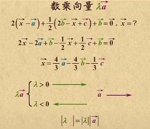
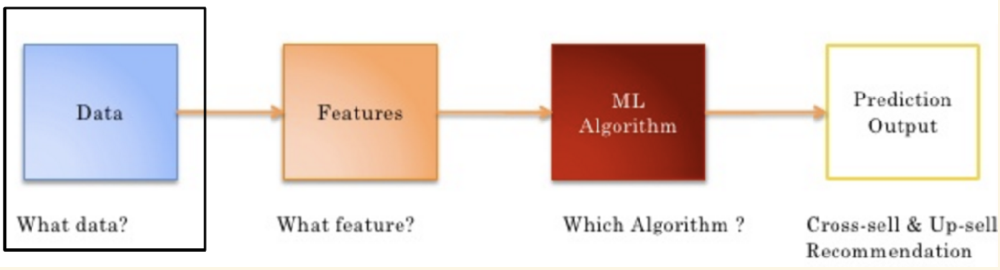
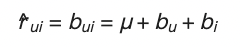

# 一、基本概念

## 1. 平面向量

向量：既有大小，又有方向。

长度是向量的模，方向是从A指向B。

大小相同、方向相同，是相等向量。

大小相同，方向相反，是相反向量。

0和任何向量都共线。

向量没有除法。

向量加法：遵循平行四边形法则，or三角形法则。

向量减法：先写成加法，然后挤掉相同的字母。向量-OB 等于 向量BO。

数字乘向量：数字正负决定数乘向量和向量a的方向是否相同，数字绝对值决定是几倍长的a。

向量乘向量：计算结果是一个数值。

向量的坐标运算：

## 2. 词向量

自然语言是一套表达含义的复杂系统。在这套系统中，词是表达意思的基本单元。

而在计算机中，计算机更喜欢数字，所以用向量来表示词，所以叫词向量，通常可以将这样向量认为是词的特征向量。现在词向量已经成为自然语言处理的基础知识。

词转换成词向量有两种方法：1）one-hot编码；2）word2vec。其他模型有：NNLM，CBOW，SkipGrant，MF等

## 3. 距离

欧氏距离			两点之间线段最短

曼哈顿距离		实际距离

切比雪夫距离		最少走几步

余弦距离			夹角余弦可用来衡量两个向量方向的差异,余弦越大表示两个向量的夹角越小

杰卡德距离		两个集合中不同元素占所有元素的比例

马氏距离			分散性的距离判断，是基于样本分布的一种距离，表示数据的协方差距离

杰卡德相似度		0和1数据的相关系数，并集 / 交集

皮尔逊相似度		常见的相关系数

### 方差

样本用n-1，总体用n

### 标准差

标准差描述的是“散布度”，之所以除以n-1而不是除以n，是因为这样能以较小的样本集更好的逼近总体的标准差，即统计上所谓的“无偏估计”。而方差则仅仅是标准差的平方

Note that it is important that we use the so-called divisor (n – 1) formula for the standard deviation in this test statistic and not the divisor n formula favoured by some teachers, text books and some of you!

### 协方差

如果结果为正值，则说明两者是正相关的；结果为负值就说明负相关的；如果为0，也是就是统计上说的“相互独立”。从协方差可以引出“相关系数”的定义。

### 标准化变量

### 皮尔逊相关系数

杰卡德相似系数(Jaccard similarity coefficient)

# 二、推荐系统

Data(数据)->Features(特征)->ML Algorithm(机器学习算法)->Prediction Output(预测输出)

1. 数据来源

   - 显性数据
     - Rating 打分
     - Comments 评论/评价
   - 隐形数据
     - Order history 历史订单
     - Cart events 加购物车
     - Page views 页面浏览
     - Click-thru 点击
     - Search log 搜索记录

   * 数据量/数据能否满足要求
2. 特征工程

   * 从数据中筛选特征（行为）
   * 用数据表示特征
3. 推荐算法：协同过滤、相似度计算、矩阵分解

## 协同过滤

## 相似度计算

## 矩阵分解（基于模型）

# 三、推荐算法

Model-Based 协同过滤算法做一个大致的分类：

* 基于分类算法、回归算法、聚类算法
* 基于矩阵分解的推荐
* 基于神经网络算法
* 基于图模型算法

重点掌握：1）K最邻近；2）回归模型；3）矩阵分解。

## 1. 基于 K 最近邻的协同过滤推荐

基于 K 最近邻的协同过滤推荐其实本质上就是 MemoryBased CF，只不过在选取近邻的时候，加上 K 最近邻的限制。根据相似度来选取 K 个最近邻

## 2. 基于回归模型的协同过滤推荐

如果将评分看作是一个连续的值而不是离散的值，那么就可以借助线性回归思想，来预测目标用户对某物品的评分。

其中一种实现策略被称为 Baseline（基准预测）。

### Baseline策略：

从用户、物品两个角度，调整偏置值（bias，截距，y=ax+b的b），寻找最优的偏置值。最优偏置值有两种方法：1）随机梯度下降；2）交替最小二乘法。

baseline策略步骤

1. 计算所有物品的平均评分；
2. 计算每个用户的平均评分、平均偏置值；
3. 计算每个物品的平均评分、平均偏置值；
4. 寻找最优的bu和bi。
5. 预测用户对电影的评分：预测评分 = 平均值 + 用户评分偏置 + 物品评分偏置

比如Baseline 来预测用户 A 对电影“阿甘正传”的评分：

1. 那么首先计算出整个评分数据集的平均评分$\mu$是 3.5 分；
2. 而用户 A 是一个比较苛刻的用户，他的评分比较严格，普遍比平均评分低 0.5 分，即用户 A 的偏置值b是-0.5；
3. 而电影“阿甘正传”是一部比较热门而且备受好评的电影，它的评分普遍比平均评分要高 1.2 分，那么电影“阿甘正传”的偏置值b是+1.2，
4. 因此就可以预测出用户 A 对电影“阿甘正传”的评分为：$3.5+(-0.5)+1.2$，也就是 4.2 分。

## 3. 基于矩阵分解的 CF 算法

通常SVD 矩阵分解指的是 SVD（奇异值）分解技术

***Traditional SVD***

前提是要求矩阵是稠密的，即矩阵里的元素要非空，否则就不能运用 SVD 分解。

1. 先用均值或者其他统计学方法来填充矩阵
2. 再运用 Traditional SVD 分解降维

很显然实际的数据其实绝大多数情况下都是稀疏的，因此如果要使用 Traditional SVD，一般的做法是先用均值或者其他统计学方法来填充矩阵，然后再运用 Traditional SVD 分解降维，但这样做明显对数据的原始性造成一定影响。Traditional SVD 分解的形式为 3 个矩阵相乘，中间矩阵为奇异值矩阵。

**FunkSVD（LFM，latent factor model）**

思想：借鉴线性回归，通过最小化观察数据的平方来寻求最优的用户和项目的隐含向量表示。

Funk SVD 的方法将矩阵分解为 2 个用户-隐含特征、项目-隐含特征的矩阵，Funk SVD 也被称为最原始的 LFM 模型。

**BiasSVD:**

假设：和 Baseline 基准预测一样，但这里将 Baseline 的偏置引入到了矩阵分解中。

在 FunkSVD 提出来之后，出现了很多变形版本，其中一个相对成功的方法是 BiasSVD。

**SVD++:**

假设：在 BiasSVD 基础上，认为用户对于项目的历史浏览记录、购买记录、收听记录等可以从侧面反映用户的偏好。

人们后来又提出了改进的 BiasSVD，被称为 SVD++，该算法是在 BiasSVD 的基础上添加了用户的隐式反馈信息。

显示反馈指的用户的评分这样的行为，隐式反馈指用户的浏览记录、购买记录、收听记录等。
