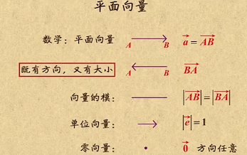

## 1. 平面向量

向量：既有大小，又有方向。

长度是向量的模，方向是从A指向B。

大小相同、方向相同，是相等向量。

大小相同，方向相反，是相反向量。

0和任何向量都共线。

向量没有除法。

向量加法：遵循平行四边形法则，or三角形法则。

向量减法：先写成加法，然后挤掉相同的字母。向量-OB 等于 向量BO。

数字乘向量：数字正负决定数乘向量和向量a的方向是否相同，数字绝对值决定是几倍长的a。

向量乘向量：计算结果是一个数值。

向量的坐标运算：

## 2. 词向量

自然语言是一套表达含义的复杂系统。在这套系统中，词是表达意思的基本单元。

而在计算机中，计算机更喜欢数字，所以用向量来表示词，所以叫词向量，通常可以将这样向量认为是词的特征向量。现在词向量已经成为自然语言处理的基础知识。

词转换成词向量有两种方法：1）one-hot编码；2）word2vec。其他模型有：NNLM，CBOW，SkipGrant，MF等

## 3. 距离

欧氏距离			两点之间线段最短

曼哈顿距离		实际距离

切比雪夫距离		最少走几步

余弦距离			夹角余弦可用来衡量两个向量方向的差异,余弦越大表示两个向量的夹角越小

杰卡德距离		两个集合中不同元素占所有元素的比例

马氏距离			分散性的距离判断，是基于样本分布的一种距离，表示数据的协方差距离

杰卡德相似度		0和1数据的相关系数，并集 / 交集

皮尔逊相似度		常见的相关系数

#### 方差

样本用n-1，总体用n

#### 标准差

标准差描述的是“散布度”，之所以除以n-1而不是除以n，是因为这样能以较小的样本集更好的逼近总体的标准差，即统计上所谓的“无偏估计”。而方差则仅仅是标准差的平方

Note that it is important that we use the so-called divisor (n – 1) formula for the standard deviation in this test statistic and not the divisor n formula favoured by some teachers, text books and some of you!

#### 协方差

如果结果为正值，则说明两者是正相关的；结果为负值就说明负相关的；如果为0，也是就是统计上说的“相互独立”。从协方差可以引出“相关系数”的定义。

#### 皮尔逊相关系数

#### 标准化变量

#### 杰卡德相似系数(Jaccard similarity coefficient)

